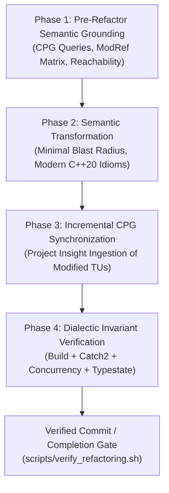

# iRODS Engineering Guidelines & Dialectic Refactoring Protocol

This document defines the mandatory, enforceable engineering protocol for modifying, modernizing, and refactoring the iRODS codebase. All autonomous AI agents and pair-programming sessions operating in this repository are strictly bound by these rules.

---

## 1. The 4-Phase Dialectic Refactoring Lifecycle

Every non-trivial modification, modernization task, or bugfix in iRODS must progress through four sequential, non-skippable phases:



### Phase 1: Pre-Refactor Semantic Grounding
- **Requirement**: Never modify code based solely on string matching or localized assumptions.
- **Action**: Query the canonical Code Property Graph (CPG) stored in `.insight/l3kvg` using Project Insight MCP tools or CLI (`insight query`, `insight slice`, `insight_find_usages`, `insight_slice_subgraph`).
- **Invariant**: Determine all callers, callees, memory definitions/uses, and global ModRef affiliations before proposing changes.

### Phase 2: Semantic Transformation with Minimal Blast Radius
- **Requirement**: Modernize code to current iRODS architectural standards:
  - Eliminate ad-hoc raw ODBC calls (`SQLAllocHandle`, `SQLPrepare`, `SQLExecute`, manual `SQLDisconnect`).
  - Unify all database queries under `irods::experimental::nanodbc_executor`.
  - Use `irods::database_session` and statement caching for repeated queries.
  - Adhere to C++20 idioms, RAII, strict `std::unique_ptr` / `std::shared_ptr` ownership, and `const` correctness.
  - Keep the blast radius strictly bounded to the assigned component.

### Phase 3: Incremental CPG Synchronization
- **Requirement**: The Code Property Graph must mirror the working tree state at all times.
- **Action**: Immediately after editing translation units (`.cpp`) or headers (`.hpp`), invoke incremental ingestion:
  ```bash
  /home/darkfell/dev/project_insight/build/insight ingest build/compile_commands.json --db .insight/l3kvg --files <modified_files...>
  ```
  or call MCP tool `insight_notify_files_changed`.
- **Invariant**: Ingestion must complete with 0 failed translation units (`failed_tus == 0`).

### Phase 4: Dialectic Invariant Verification
- **Requirement**: No victory declaration, commit, or PR proposal without mathematical and empirical proof of correctness.
- **Verification Gates**:
  1. **Build Gate**: Clean compilation via `ninja -C build` with zero compiler warnings/errors (`-Werror`).
  2. **Unit Test Gate**: 100% assertions passing across relevant unit test suites (e.g. Catch2 `irods_nanodbc_executor`).
  3. **Concurrency Safety Gate**: Zero data races, zero deadlocks (ABBA lock order cycles), zero unbalanced locks/unlocks detected by Project Insight:
     ```bash
     /home/darkfell/dev/project_insight/build/insight check --db .insight/l3kvg --concurrency
     ```
  4. **Typestate Safety Gate**: Zero resource leaks, zero invalid state transitions, zero dangling sessions detected by Project Insight:
     ```bash
     /home/darkfell/dev/project_insight/build/insight check --db .insight/l3kvg --typestate
     ```

---

## 2. Automated Verification Gate (`scripts/verify_refactoring.sh`)

The automated script [`scripts/verify_refactoring.sh`](file:///home/darkfell/dev/irods/scripts/verify_refactoring.sh) runs all Phase 4 checks deterministically.

```bash
# Verify entire working tree:
./scripts/verify_refactoring.sh

# Verify specific modified components:
./scripts/verify_refactoring.sh plugins/database/src/database_session.cpp

# Skip build if already compiled:
./scripts/verify_refactoring.sh --skip-build
```

---

## 3. Enforcement Mechanisms

1. **Pre-Commit Hook**:
   Git rejects commits unless `scripts/verify_refactoring.sh` exits with code 0.
2. **Agent Behavioral Invariant**:
   AI agents MUST execute `scripts/verify_refactoring.sh` and present the output verbatim before concluding any refactoring or bugfix request.
