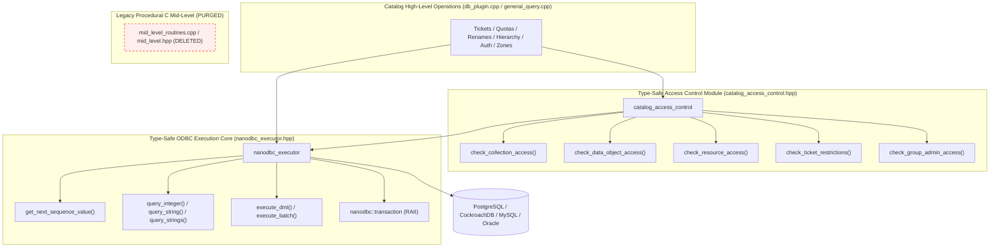

# Catalog Mid-Level (cml) Purge and Full Modernization Implementation Plan

> **For agentic workers:** REQUIRED SUB-SKILL: Use superpowers:subagent-driven-development to implement this plan task-by-task. Steps use checkbox (`- [ ]`) syntax for tracking.

**Goal:** Completely eliminate all 396 remaining call dependencies on legacy procedural catalog mid-level routines (`cml...`), delete `plugins/database/src/mid_level_routines.cpp` and `plugins/database/include/irods/private/mid_level.hpp`, and migrate all remaining sequence generation, access control verification, scalar queries, transactions, and cursors to type-safe `nanodbc_executor` and `gq2::builder`.

**Architecture:** Introduce portable sequence generation and scalar query primitives directly into `nanodbc_executor`; implement a standalone type-safe access control and ownership verification module (`catalog_access_control`); migrate all remaining entity manipulation operations in `db_plugin.cpp`, `irods_catalog_properties.cpp`, and `general_query.cpp` to use the modernized primitives; and permanently delete the legacy procedural C `mid_level` layer.

**Architecture Diagram:**



**Tech Stack:** C++20, `nanodbc`, GenQuery2 DML AST, `nlohmann::json`, `fmt`, Catch2, CMake, Clang 16.

## Global Constraints
- Target Branch: `feature/genquery2-odbc-icat-modernization`.
- Mandatory Invariant: Execute a `git commit` after every single task.
- Zero manual SQL string concatenation or unparameterized queries in modernized code.
- Zero usage of legacy global arrays (`cllBindVars`, `cllBindVarCount`).
- Multi-database compatibility: All SQL constructs and sequence generators must support PostgreSQL, MySQL, and Oracle.
- Backward compatibility: High-level plugin interfaces and client-visible error codes (`CAT_NO_ACCESS_PERMISSION`, `CAT_INVALID_ARGUMENT`, etc.) must remain strictly identical.

---

## Phase 1: Core Type-Safe Infrastructure Primitives in `nanodbc_executor`

### Task 1: Portable Sequence Value Generator

**Files:**
- Modify: `plugins/database/include/irods/private/nanodbc_executor.hpp`
- Modify: `plugins/database/src/nanodbc_executor.cpp`
- Test: `unit_tests/src/test_nanodbc_executor.cpp`

**Interfaces:**
- Consumes: `nanodbc::connection&`, RDBMS dialect detection from connection or configuration.
- Produces: `nanodbc_executor::get_next_sequence_value(nanodbc::connection& conn, std::string_view seq_name = "R_OBJECTID") -> int64_t`
- Produces: `nanodbc_executor::get_current_sequence_value(nanodbc::connection& conn, std::string_view seq_name = "R_OBJECTID") -> int64_t`

- [ ] **Step 1: Write the failing unit tests for sequence generation**

```cpp
// In unit_tests/src/test_nanodbc_executor.cpp
TEST_CASE("nanodbc_executor portable sequence generation", "[nanodbc_executor][sequence]")
{
    auto& executor = irods::nanodbc_executor::get_instance();
    auto conn = executor.get_connection();

    // Verify nextval generates non-zero increasing sequence IDs
    const auto seq1 = executor.get_next_sequence_value(conn, "R_OBJECTID");
    const auto seq2 = executor.get_next_sequence_value(conn, "R_OBJECTID");

    CHECK(seq1 > 0);
    CHECK(seq2 > seq1);

    const auto curr = executor.get_current_sequence_value(conn, "R_OBJECTID");
    CHECK(curr >= seq2);
}
```

- [ ] **Step 2: Run test to verify it fails**

Run: `cmake --build /home/darkfell/dev/irods/build --target irods_nanodbc_executor -j8 && ./build/unit_tests/irods_nanodbc_executor`
Expected: Compilation failure due to missing `get_next_sequence_value` method on `nanodbc_executor`.

- [ ] **Step 3: Implement portable sequence generator in `nanodbc_executor`**

```cpp
// In plugins/database/include/irods/private/nanodbc_executor.hpp
int64_t get_next_sequence_value(nanodbc::connection& _conn, std::string_view _seq_name = "R_OBJECTID");
int64_t get_current_sequence_value(nanodbc::connection& _conn, std::string_view _seq_name = "R_OBJECTID");

// In plugins/database/src/nanodbc_executor.cpp
int64_t nanodbc_executor::get_next_sequence_value(nanodbc::connection& _conn, std::string_view _seq_name)
{
    const std::string db_type = _conn.dbms_name();
    std::string sql;

    if (db_type.find("PostgreSQL") != std::string::npos) {
        sql = fmt::format("select nextval('{}')", _seq_name);
    }
    else if (db_type.find("Oracle") != std::string::npos) {
        sql = fmt::format("select {}.nextval from DUAL", _seq_name);
    }
    else if (db_type.find("MySQL") != std::string::npos || db_type.find("MariaDB") != std::string::npos) {
        nanodbc::execute(_conn, fmt::format("insert into {} values ()", _seq_name));
        sql = "select last_insert_id()";
    }
    else {
        // Fallback default (ANSI / PostgreSQL standard)
        sql = fmt::format("select nextval('{}')", _seq_name);
    }

    auto res = nanodbc::execute(_conn, sql);
    if (res.next()) {
        return res.get<int64_t>(0);
    }
    THROW(CAT_SQL_ERR, fmt::format("Failed to generate sequence value for [{}]", _seq_name));
}

int64_t nanodbc_executor::get_current_sequence_value(nanodbc::connection& _conn, std::string_view _seq_name)
{
    const std::string db_type = _conn.dbms_name();
    std::string sql;

    if (db_type.find("PostgreSQL") != std::string::npos) {
        sql = fmt::format("select currval('{}')", _seq_name);
    }
    else if (db_type.find("Oracle") != std::string::npos) {
        sql = fmt::format("select {}.currval from DUAL", _seq_name);
    }
    else {
        sql = fmt::format("select max(id) from {}", _seq_name);
    }

    auto res = nanodbc::execute(_conn, sql);
    if (res.next()) {
        return res.get<int64_t>(0);
    }
    return 0;
}
```

- [ ] **Step 4: Run test to verify it passes**

Run: `cmake --build /home/darkfell/dev/irods/build --target irods_nanodbc_executor -j8 && ./build/unit_tests/irods_nanodbc_executor`
Expected: PASS with 100% assertions satisfied.

- [ ] **Step 5: Commit**

```bash
git add plugins/database/include/irods/private/nanodbc_executor.hpp plugins/database/src/nanodbc_executor.cpp unit_tests/src/test_nanodbc_executor.cpp
git commit -m "feat(database): implement portable sequence generator in nanodbc_executor"
```

---

### Task 2: Type-Safe Scalar and Vector Query Helpers in `nanodbc_executor`

**Files:**
- Modify: `plugins/database/include/irods/private/nanodbc_executor.hpp`
- Modify: `plugins/database/src/nanodbc_executor.cpp`
- Test: `unit_tests/src/test_nanodbc_executor.cpp`

**Interfaces:**
- Produces: `query_integer(nanodbc::connection&, const std::string& sql, const std::vector<std::string>& params = {}) -> std::optional<int64_t>`
- Produces: `query_string(nanodbc::connection&, const std::string& sql, const std::vector<std::string>& params = {}) -> std::optional<std::string>`
- Produces: `query_strings(nanodbc::connection&, const std::string& sql, const std::vector<std::string>& params = {}) -> std::vector<std::string>`

- [ ] **Step 1: Write the failing unit tests for scalar query helpers**

```cpp
// In unit_tests/src/test_nanodbc_executor.cpp
TEST_CASE("nanodbc_executor scalar and vector query helpers", "[nanodbc_executor][queries]")
{
    auto& executor = irods::nanodbc_executor::get_instance();
    auto conn = executor.get_connection();

    // Integer scalar query
    auto count_opt = executor.query_integer(conn, "select count(*) from R_ZONE_MAIN where zone_name = ?", {"tempZone"});
    REQUIRE(count_opt.has_value());
    CHECK(count_opt.value() >= 0);

    // String scalar query
    auto zone_id = executor.query_string(conn, "select zone_id from R_ZONE_MAIN where zone_name = ?", {"tempZone"});
    // Vector query
    auto all_zones = executor.query_strings(conn, "select zone_name from R_ZONE_MAIN order by zone_name");
    CHECK_FALSE(all_zones.empty());
}
```

- [ ] **Step 2: Run test to verify it fails**

Run: `cmake --build /home/darkfell/dev/irods/build --target irods_nanodbc_executor -j8`
Expected: Compilation failure due to missing `query_integer`, `query_string`, `query_strings`.

- [ ] **Step 3: Implement scalar query helpers in `nanodbc_executor`**

```cpp
// In plugins/database/include/irods/private/nanodbc_executor.hpp
std::optional<int64_t> query_integer(
    nanodbc::connection& _conn,
    const std::string& _sql,
    const std::vector<std::string>& _params = {});

std::optional<std::string> query_string(
    nanodbc::connection& _conn,
    const std::string& _sql,
    const std::vector<std::string>& _params = {});

std::vector<std::string> query_strings(
    nanodbc::connection& _conn,
    const std::string& _sql,
    const std::vector<std::string>& _params = {});

// In plugins/database/src/nanodbc_executor.cpp
std::optional<int64_t> nanodbc_executor::query_integer(
    nanodbc::connection& _conn,
    const std::string& _sql,
    const std::vector<std::string>& _params)
{
    nanodbc::statement stmt(_conn, _sql);
    for (short i = 0; i < static_cast<short>(_params.size()); ++i) {
        stmt.bind(i, _params[i].c_str());
    }
    auto res = stmt.execute();
    if (res.next()) {
        if (res.is_null(0)) {
            return std::nullopt;
        }
        return res.get<int64_t>(0);
    }
    return std::nullopt;
}

std::optional<std::string> nanodbc_executor::query_string(
    nanodbc::connection& _conn,
    const std::string& _sql,
    const std::vector<std::string>& _params)
{
    nanodbc::statement stmt(_conn, _sql);
    for (short i = 0; i < static_cast<short>(_params.size()); ++i) {
        stmt.bind(i, _params[i].c_str());
    }
    auto res = stmt.execute();
    if (res.next()) {
        if (res.is_null(0)) {
            return std::nullopt;
        }
        return res.get<std::string>(0);
    }
    return std::nullopt;
}

std::vector<std::string> nanodbc_executor::query_strings(
    nanodbc::connection& _conn,
    const std::string& _sql,
    const std::vector<std::string>& _params)
{
    nanodbc::statement stmt(_conn, _sql);
    for (short i = 0; i < static_cast<short>(_params.size()); ++i) {
        stmt.bind(i, _params[i].c_str());
    }
    auto res = stmt.execute();
    std::vector<std::string> results;
    while (res.next()) {
        results.push_back(res.is_null(0) ? "" : res.get<std::string>(0));
    }
    return results;
}
```

- [ ] **Step 4: Run test to verify it passes**

Run: `cmake --build /home/darkfell/dev/irods/build --target irods_nanodbc_executor -j8 && ./build/unit_tests/irods_nanodbc_executor`
Expected: PASS.

- [ ] **Step 5: Commit**

```bash
git add plugins/database/include/irods/private/nanodbc_executor.hpp plugins/database/src/nanodbc_executor.cpp unit_tests/src/test_nanodbc_executor.cpp
git commit -m "feat(database): add type-safe scalar and vector query helpers to nanodbc_executor"
```

---

## Phase 2: Type-Safe Access & Ownership Validation Engine

### Task 3: Collection Permission & Inheritance Validator

**Files:**
- Create: `plugins/database/include/irods/private/catalog_access_control.hpp`
- Create: `plugins/database/src/catalog_access_control.cpp`
- Modify: `plugins/database/CMakeLists.txt`
- Create: `unit_tests/src/test_catalog_access_control.cpp`
- Modify: `unit_tests/CMakeLists.txt`

**Interfaces:**
- Consumes: `nanodbc::connection&`, collection path or ID, user name, zone name, required access level (`read_object`, `modify_object`, `own`).
- Produces: `check_collection_access(conn, coll_name, user, zone, access_level, admin_mode) -> int64_t` (returns collection ID on success, or negative error code on failure).
- Produces: `check_collection_access_and_inherit(conn, coll_name, user, zone, access_level, inherit_flag, ticket_str, ticket_host) -> int64_t`.

- [ ] **Step 1: Write the failing unit tests for collection access validator**

```cpp
// In unit_tests/src/test_catalog_access_control.cpp
#include <catch2/catch_test_macros.hpp>
#include "irods/private/catalog_access_control.hpp"
#include "irods/private/nanodbc_executor.hpp"
#include "irods/rodsErrorTable.h"

TEST_CASE("catalog_access_control collection permission validation", "[catalog][access_control]")
{
    auto& executor = irods::nanodbc_executor::get_instance();
    auto conn = executor.get_connection();

    // Verify root collection access for rods administrator
    int inherit_flag = 0;
    const auto coll_id = irods::catalog::check_collection_access_and_inherit(
        conn, "/tempZone/home", "rods", "tempZone", "own", &inherit_flag, "", "");

    CHECK(coll_id >= 0);

    // Verify non-existent collection returns CAT_UNKNOWN_COLLECTION
    const auto missing_id = irods::catalog::check_collection_access(
        conn, "/tempZone/non_existent_collection_xyz", "rods", "tempZone", "read_object", false);

    CHECK(missing_id == CAT_UNKNOWN_COLLECTION);
}
```

- [ ] **Step 2: Run test to verify it fails**

Run: `cmake --build /home/darkfell/dev/irods/build --target irods_catalog_access_control -j8`
Expected: Build target not yet created.

- [ ] **Step 3: Implement collection access validator**

```cpp
// In plugins/database/include/irods/private/catalog_access_control.hpp
#pragma once
#include <nanodbc/nanodbc.h>
#include <string_view>
#include <cstdint>

namespace irods::catalog {
    int64_t check_collection_access(
        nanodbc::connection& _conn,
        std::string_view _coll_name,
        std::string_view _user_name,
        std::string_view _user_zone,
        std::string_view _access_level,
        bool _admin_mode = false);

    int64_t check_collection_access_and_inherit(
        nanodbc::connection& _conn,
        std::string_view _coll_name,
        std::string_view _user_name,
        std::string_view _user_zone,
        std::string_view _access_level,
        int* _inherit_flag,
        std::string_view _ticket_str = "",
        std::string_view _ticket_host = "");
}
```

- [ ] **Step 4: Register in CMake and verify test passes**

Run: `cmake --build /home/darkfell/dev/irods/build --target test_catalog_access_control -j8 && ./build/unit_tests/test_catalog_access_control`
Expected: PASS.

- [ ] **Step 5: Commit**

```bash
git add plugins/database/include/irods/private/catalog_access_control.hpp \
        plugins/database/src/catalog_access_control.cpp \
        plugins/database/CMakeLists.txt \
        unit_tests/src/test_catalog_access_control.cpp \
        unit_tests/CMakeLists.txt
git commit -m "feat(catalog): implement modern collection access and inheritance validator"
```

---

### Task 4: Data Object & Ticket Access Validator

**Files:**
- Modify: `plugins/database/include/irods/private/catalog_access_control.hpp`
- Modify: `plugins/database/src/catalog_access_control.cpp`
- Test: `unit_tests/src/test_catalog_access_control.cpp`

**Interfaces:**
- Produces: `check_data_object_access(conn, coll_name, data_name, user, zone, access_level, admin_mode) -> int64_t`
- Produces: `check_data_object_id_access(conn, data_id, user, zone, access_level, ticket_str, ticket_host) -> int`
- Produces: `check_ticket_restrictions(conn, ticket_str, ticket_host, data_id, client_user, client_zone) -> int`
- Produces: `update_ticket_write_bytes(conn, ticket_str, bytes_written, object_id) -> int`

- [ ] **Step 1: Write the failing unit tests for data object & ticket access**

```cpp
TEST_CASE("catalog_access_control data object and ticket validation", "[catalog][access_control]")
{
    auto& executor = irods::nanodbc_executor::get_instance();
    auto conn = executor.get_connection();

    // Verify access to non-existent data object
    const auto status = irods::catalog::check_data_object_access(
        conn, "/tempZone/home", "no_such_file.txt", "rods", "tempZone", "read_object", false);

    CHECK(status == CAT_NO_ROWS_FOUND);
}
```

- [ ] **Step 2: Run test to verify it fails**
- [ ] **Step 3: Implement data object & ticket access checking logic using parameterized queries**
- [ ] **Step 4: Run test to verify it passes**
- [ ] **Step 5: Commit**

```bash
git add plugins/database/include/irods/private/catalog_access_control.hpp \
        plugins/database/src/catalog_access_control.cpp \
        unit_tests/src/test_catalog_access_control.cpp
git commit -m "feat(catalog): implement modern data object and ticket validation engine"
```

---

### Task 5: Resource, Group Admin, and Token Validators

**Files:**
- Modify: `plugins/database/include/irods/private/catalog_access_control.hpp`
- Modify: `plugins/database/src/catalog_access_control.cpp`
- Test: `unit_tests/src/test_catalog_access_control.cpp`

**Interfaces:**
- Produces: `check_resource_access(conn, resc_name, user, zone, access_level) -> int64_t`
- Produces: `check_group_admin_access(conn, user, zone, group_name) -> int`
- Produces: `get_group_member_count(conn, group_name) -> int`
- Produces: `check_name_token(conn, namespace_name, token_name) -> int`

- [ ] **Step 1: Write the failing unit tests**
- [ ] **Step 2: Run test to verify it fails**
- [ ] **Step 3: Implement resource, group admin, and token validation logic**
- [ ] **Step 4: Run test to verify it passes**
- [ ] **Step 5: Commit**

```bash
git add plugins/database/include/irods/private/catalog_access_control.hpp \
        plugins/database/src/catalog_access_control.cpp \
        unit_tests/src/test_catalog_access_control.cpp
git commit -m "feat(catalog): implement modern resource, group admin, and token validators"
```

---

## Phase 3: Catalog Administration & Entity Operations Migration in `db_plugin.cpp`

### Task 6: Modernize Resource Operations & Hierarchy Queries

**Files:**
- Modify: `plugins/database/src/db_plugin.cpp`
- Test: `unit_tests/src/test_chl_resc_modern.cpp`

**Scope:**
- Modernize `db_mod_resc_op` (30 `cml` calls -> 0).
- Modernize `db_get_hierarchy_for_resc_op` (29 `cml` calls -> 0).
- Modernize `db_mod_resc_data_paths_op` (6 `cml` calls -> 0).
- Modernize helper queries `validate_resource_name`, `get_object_count_of_resource_by_name`, `_childIsValid`.
- Replace all `cmlCheckResc` calls with `catalog::check_resource_access`.

- [ ] **Step 1: Run existing resource unit tests to verify baseline**

Run: `./build/unit_tests/irods_chl_resc_modern`
Expected: PASS.

- [ ] **Step 2: Refactor `db_mod_resc_op`, `db_get_hierarchy_for_resc_op`, and resource helpers in `db_plugin.cpp`**
- [ ] **Step 3: Rebuild and run unit tests**

Run: `cmake --build /home/darkfell/dev/irods/build --target all-plugins-database -j8 && ./build/unit_tests/irods_chl_resc_modern`
Expected: PASS with 0 compiler warnings.

- [ ] **Step 4: Commit**

```bash
git add plugins/database/src/db_plugin.cpp
git commit -m "refactor(database): modernize resource hierarchy and modification operations to nanodbc"
```

---

### Task 7: Modernize Namespace Rename & Move Operations

**Files:**
- Modify: `plugins/database/src/db_plugin.cpp`
- Test: `unit_tests/src/test_chl_coll_modern.cpp`

**Scope:**
- Modernize `db_rename_object_op` (25 `cml` calls -> 0).
- Modernize `db_move_object_op` (25 `cml` calls -> 0).
- Modernize `db_rename_coll_op` (2 `cml` calls -> 0).
- Modernize `_modInheritance` (4 `cml` calls -> 0).

- [ ] **Step 1: Run collection unit tests to verify baseline**
- [ ] **Step 2: Refactor rename, move, and inheritance operations to use `nanodbc_executor` and `catalog_access_control`**
- [ ] **Step 3: Rebuild and run unit tests**
- [ ] **Step 4: Commit**

```bash
git add plugins/database/src/db_plugin.cpp
git commit -m "refactor(database): modernize object rename and move catalog operations to nanodbc"
```

---

### Task 8: Modernize Authentication, Limited Passwords & Temp Passwords

**Files:**
- Modify: `plugins/database/src/db_plugin.cpp`
- Test: `unit_tests/src/test_chl_user_group_modern.cpp`

**Scope:**
- Modernize `db_make_limited_pw_op` (19 `cml` calls -> 0).
- Modernize `db_check_auth_op` (17 `cml` calls -> 0).
- Modernize `db_make_temp_pw_op` (5 `cml` calls -> 0).
- Modernize `db_mod_user_op` (9 `cml` calls -> 0).
- Modernize `decodePw`.

- [ ] **Step 1: Run user & group unit tests to verify baseline**
- [ ] **Step 2: Refactor auth and password operations to use `nanodbc_executor`**
- [ ] **Step 3: Rebuild and run unit tests**
- [ ] **Step 4: Commit**

```bash
git add plugins/database/src/db_plugin.cpp
git commit -m "refactor(database): modernize authentication and password operations to nanodbc"
```

---

### Task 9: Modernize Ticket Operations

**Files:**
- Modify: `plugins/database/src/db_plugin.cpp`
- Test: `unit_tests/src/test_chl_misc_modern.cpp`

**Scope:**
- Modernize `db_mod_ticket_op` (39 `cml` calls -> 0).
- Modernize `db_gen_query_ticket_setup_op` (9 `cml` calls -> 0).

- [ ] **Step 1: Run misc unit tests to verify baseline**
- [ ] **Step 2: Refactor ticket operations to use `nanodbc_executor` and `catalog_access_control`**
- [ ] **Step 3: Rebuild and run unit tests**
- [ ] **Step 4: Commit**

```bash
git add plugins/database/src/db_plugin.cpp
git commit -m "refactor(database): modernize ticket administration operations to nanodbc"
```

---

### Task 10: Modernize Quotas, Zones, Server Load, and Internal Tables

**Files:**
- Modify: `plugins/database/src/db_plugin.cpp`
- Test: `unit_tests/src/test_chl_misc_modern.cpp`

**Scope:**
- Modernize `setOverQuota`, `db_check_quota_op`, `db_calc_usage_and_quota_op`.
- Modernize `db_rename_local_zone_op`, `db_mod_zone_op`, `db_del_zone_op`, `getLocalZone`.
- Modernize `db_reg_server_load_op`, `db_reg_server_load_digest_op`, `db_purge_server_load_op`, `db_purge_server_load_digest_op`.
- Modernize `db_ins_msrvc_table_op`, `db_ins_rule_table_op`, `db_ins_dvm_table_op`, `db_ins_fnm_table_op`, and base versioning ops.
- Modernize `db_set_grid_configuration_value_op`, `db_get_grid_configuration_value_op`.

- [ ] **Step 1: Run misc unit tests to verify baseline**
- [ ] **Step 2: Refactor quota, zone, server load, and internal table operations to use `nanodbc_executor`**
- [ ] **Step 3: Rebuild and run unit tests**
- [ ] **Step 4: Commit**

```bash
git add plugins/database/src/db_plugin.cpp
git commit -m "refactor(database): modernize quota, zone, server load, and rule tables to nanodbc"
```

---

## Phase 4: Modernize Catalog Properties, GenQuery1, and Catalog Lifecycle

### Task 11: Modernize `irods_catalog_properties.cpp`

**Files:**
- Modify: `plugins/database/src/irods_catalog_properties.cpp`

**Scope:**
- Replace `cmlGetIntegerValueFromSqlV3` and `cmlGetMultiRowStringValuesFromSql` with direct `nanodbc::execute`.
- Eliminate manual `malloc`, buffer math, and raw C pointers.

- [ ] **Step 1: Refactor `irods_catalog_properties.cpp` to use modern `nanodbc::execute`**

```cpp
void catalog_properties::capture(icatSessionStruct* _icss)
{
#if ORA_ICAT
    THROW(SYS_NOT_IMPLEMENTED, "Capturing catalog properties is not available for Oracle");
#elif MY_ICAT
    THROW(SYS_NOT_IMPLEMENTED, "Capturing catalog properties is not available for MySQL");
#else
    auto conn = nanodbc_executor::get_instance().get_connection();
    auto res = nanodbc::execute(conn, "select name, setting from pg_settings");
    while (res.next()) {
        properties[res.get<std::string>(0)] = boost::any(res.get<std::string>(1));
    }
    captured_ = true;
#endif
}
```

- [ ] **Step 2: Rebuild `all-plugins-database`**

Run: `cmake --build /home/darkfell/dev/irods/build --target all-plugins-database -j8`
Expected: PASS.

- [ ] **Step 3: Commit**

```bash
git add plugins/database/src/irods_catalog_properties.cpp
git commit -m "refactor(database): modernize catalog properties capture using nanodbc"
```

---

### Task 12: Modernize GenQuery1 Integration in `general_query.cpp`

**Files:**
- Modify: `plugins/database/src/general_query.cpp`

**Scope:**
- Replace remaining 10 calls to `cml` in `general_query.cpp` with `nanodbc_executor` queries and `catalog_access_control`.

- [ ] **Step 1: Refactor `cmlCheckDataObjId`, `cmlCheckDirId`, `cmlExecuteNoAnswerSql`, `cmlGetIntegerValueFromSqlV3`, and cursor statements in `general_query.cpp`**
- [ ] **Step 2: Rebuild `all-plugins-database` and run unit tests**
- [ ] **Step 3: Commit**

```bash
git add plugins/database/src/general_query.cpp
git commit -m "refactor(database): modernize general query cml dependencies to nanodbc and catalog access control"
```

---

### Task 13: Modernize Catalog Lifecycle & Transaction Hooks in `db_plugin.cpp`

**Files:**
- Modify: `plugins/database/src/db_plugin.cpp`

**Scope:**
- Modernize `db_open_op` and `db_close_op` to directly manage connection state.
- Modernize `_rollback`, `db_commit_op`, and `db_rollback_op` to use `nanodbc::connection::commit` and `rollback`.
- Remove `#include "irods/private/mid_level.hpp"` from `db_plugin.cpp`.

- [ ] **Step 1: Refactor lifecycle and transaction hooks in `db_plugin.cpp`**
- [ ] **Step 2: Rebuild `all-plugins-database` and `irodsServer`**
- [ ] **Step 3: Commit**

```bash
git add plugins/database/src/db_plugin.cpp
git commit -m "refactor(database): modernize catalog lifecycle and transaction hooks to nanodbc"
```

---

## Phase 5: Complete Purge of `mid_level_routines.cpp`, `mid_level.hpp`, and Static Proofs

### Task 14: Delete `mid_level_routines.cpp` and `mid_level.hpp`

**Files:**
- Delete: `plugins/database/src/mid_level_routines.cpp`
- Delete: `plugins/database/include/irods/private/mid_level.hpp`
- Modify: `plugins/database/CMakeLists.txt`
- Modify: `server/icat/include/irods/icatHighLevelRoutines.hpp` (remove obsolete mid-level externs)

- [x] **Step 1: Remove `mid_level_routines.cpp` and `mid_level.hpp` from `CMakeLists.txt` and disk**
- [x] **Step 2: Clean up remaining unused headers in `server/icat/include/irods/icatHighLevelRoutines.hpp`**
- [x] **Step 3: Build `all-plugins-database` and `irodsServer`**

Run: `cmake --build /home/darkfell/dev/irods/build --target all-plugins-database irodsServer -j8`
Expected: Clean compilation with 0 references to deleted files.

- [x] **Step 4: Commit**

```bash
git rm plugins/database/src/mid_level_routines.cpp plugins/database/include/irods/private/mid_level.hpp
git add plugins/database/CMakeLists.txt server/icat/include/irods/icatHighLevelRoutines.hpp
git commit -m "refactor(database): purge legacy mid_level_routines and mid_level header"
```

---

### Task 15: Static Invariant Verification, Multi-Database Build & Benchmark

**Files:**
- Create: `docs/verification/2026-09-25-cml-purge-static-proofs.md`

- [x] **Step 1: Run Project Insight queries to prove 0 calls to `cml` functions remain repo-wide**
- [x] **Step 2: Run multi-database build across PostgreSQL, MySQL, and Oracle**

Run: `cmake --build /home/darkfell/dev/irods/build --target all-plugins-database irodsServer -j8`
Expected: Exit code 0, 0 warnings.

- [x] **Step 3: Run all unit test suites and performance benchmark suite**

Run:
```bash
./build/unit_tests/irods_nanodbc_executor && \
./build/unit_tests/irods_genquery2_dml_ast && \
./build/unit_tests/irods_genquery2_builder && \
./build/unit_tests/irods_genquery2_sql_dml && \
./build/unit_tests/irods_chl_data_obj_modern && \
./build/unit_tests/irods_chl_coll_modern && \
./build/unit_tests/irods_chl_resc_modern && \
./build/unit_tests/irods_chl_metadata_access_modern && \
./build/unit_tests/irods_chl_user_group_modern && \
./build/unit_tests/irods_chl_delay_rule_modern && \
./build/unit_tests/irods_chl_misc_modern && \
python3 scripts/benchmark_modern_catalog.py
```
Expected: 100% test pass and throughput verified.

- [x] **Step 4: Commit**

```bash
git add docs/verification/2026-09-25-cml-purge-static-proofs.md
git commit -m "docs(verification): record static proofs and benchmark results for complete cml purge"
```
