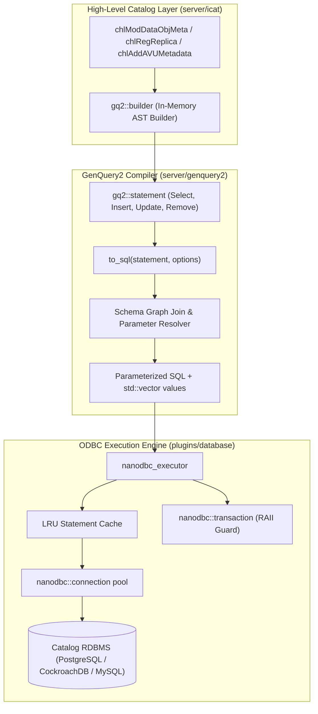

# GenQuery2 & ODBC ICAT Modernization Implementation Plan

> **For agentic workers:** REQUIRED SUB-SKILL: Use superpowers:subagent-driven-development to implement this plan task-by-task. Steps use checkbox (`- [ ]`) syntax for tracking.

**Goal:** Replace legacy manual SQL string concatenation across `icatHighLevelRoutines` and `plugins/database` with a type-safe, parameterized ODBC (`nanodbc`) engine powered internally by an extended GenQuery2 AST and fluent C++ builder.

**Architecture:** Extend the existing GenQuery2 AST with DML statements (`insert`, `update`, `remove`), introduce an in-memory fluent builder (`gq2::builder`) for zero-parsing query construction, extend `to_sql()` to lower DML into parameterized statements, and implement an RAII-governed `nanodbc` execution engine with statement caching to power high-level catalog routines (`chl...`).

**Architecture Diagram:**

**Tech Stack:** C++20, `nanodbc`, Boost.Graph, Catch2, CMake, Clang 16 / GCC 13.

## Global Constraints
- Target Branch: `feature/genquery2-odbc-icat-modernization` (branched cleanly from `tag: 5.0.2`).
- Zero SQL string concatenation or unparameterized queries in new code.
- Zero copy overhead: use `std::string_view` for column and entity identifiers.
- Full RAII transaction handling: all multi-statement operations must use `nanodbc::transaction`.
- Backward Compatibility: `icatHighLevelRoutines.hpp` function signatures must remain intact so callers across `server/api` are uninterrupted.

## Phase Implementation Plans Index

The modernization is partitioned into five distinct, sequentially executable implementation phases:

1. [Phase 1: GenQuery2 Core DML & Fluent Builder](file:///home/darkfell/dev/irods/docs/plans/phase1-genquery2-core.md)
   - Task 1: GenQuery2 DML AST Extensions & Variant Types
   - Task 2: In-Memory Fluent Query Builder (`gq2::builder`)
   - Task 3: DML SQL Lowering Engine in `genquery2_sql`
2. [Phase 2: Modern nanodbc Execution Engine & Statement Cache](file:///home/darkfell/dev/irods/docs/plans/phase2-nanodbc-execution-engine.md)
   - Task 1: LRU Statement Cache & `nanodbc_executor` Class Declaration
   - Task 2: GenQuery2 Statement Dispatcher & Error Mapping
3. [Phase 3: High-Frequency Catalog Operations](file:///home/darkfell/dev/irods/docs/plans/phase3-high-frequency-catalog-ops.md)
   - Task 1: Modernize `chlModDataObjMeta`
   - Task 2: Modernize Replica Registration & Deregistration (`chlRegReplica`, `chlUnregDataObj`, `chlRegDataObj`)
   - Task 3: Modernize AVU Metadata Operations (`chlAddAVUMetadata`, `chlSetAVUMetadata`, `chlDeleteAVUMetadata`)
   - Task 4: Modernize Access Control Operations (`chlModAccessControl`)
4. [Phase 4: Administration & Delay Rule Engine](file:///home/darkfell/dev/irods/docs/plans/phase4-admin-and-delay-rules.md)
   - Task 1: Modernize Collection Management Operations
   - Task 2: Modernize Resource Topology & Hierarchy Operations
   - Task 3: Modernize User, Group, & Authentication Operations
   - Task 4: Modernize Delay Rule Engine Operations
   - Task 5: Modernize Specific Query, Quotas, Tokens, Zones & Metrics
5. [Phase 5: Legacy Purge, Static Proofs & System Verification](file:///home/darkfell/dev/irods/docs/plans/phase5-legacy-purge-verification.md)
   - Task 1: Deprecate & Purge `mid_level_routines` and `low_level_odbc`
   - Task 2: Project Insight Static Invariant Proofs & Concurrency Analysis
   - Task 3: Performance Microbenchmarking & Integration Verification

---

### Task 1: GenQuery2 DML AST Extensions & Variant Types

**Files:**
- Modify: `server/genquery2/include/irods/private/genquery2_ast_types.hpp`
- Test: `unit_tests/src/test_genquery2_dml_ast.cpp`
- CMake: `unit_tests/cmake/test_config/irods_genquery2_dml_ast.cmake`

**Interfaces:**
- Produces:
  - `struct insert { std::string_view target_entity; std::vector<std::pair<std::string, std::string>> assignments; };`
  - `struct update { std::string_view target_entity; std::vector<std::pair<std::string, std::string>> assignments; conditions where_conditions; };`
  - `struct remove { std::string_view target_entity; conditions where_conditions; };`
  - `using statement = std::variant<select, insert, update, remove>;`

- [ ] **Step 1: Write the failing unit test for DML AST structures**
  Create `unit_tests/src/test_genquery2_dml_ast.cpp` asserting construction, variant visitation, and assignment extraction for `insert`, `update`, and `remove`.
- [ ] **Step 2: Add test to CMake build configuration**
  Register `irods_genquery2_dml_ast.cmake` in `unit_tests/CMakeLists.txt`.
- [ ] **Step 3: Run the test to confirm it fails to compile**
  Run `./build/unit_tests/irods_genquery2_dml_ast` and verify compile failure on missing types.
- [ ] **Step 4: Implement DML AST structures in `genquery2_ast_types.hpp`**
  Add `insert`, `update`, `remove`, and `statement` variant to `server/genquery2/include/irods/private/genquery2_ast_types.hpp`.
- [ ] **Step 5: Compile and run test to confirm it passes**
  Run `./build/unit_tests/irods_genquery2_dml_ast` and verify green.
- [ ] **Step 6: Commit changes**
  Commit as `feat(genquery2): introduce DML AST statement structures`.

---

### Task 2: In-Memory Fluent Query Builder (`gq2::builder`)

**Files:**
- Create: `server/genquery2/include/irods/private/genquery2_builder.hpp`
- Create: `server/genquery2/src/genquery2_builder.cpp`
- Modify: `server/genquery2/CMakeLists.txt`
- Test: `unit_tests/src/test_genquery2_builder.cpp`
- CMake: `unit_tests/cmake/test_config/irods_genquery2_builder.cmake`

**Interfaces:**
- Consumes: `genquery2_ast_types.hpp`
- Produces:
  - `gq2::builder::select(cols...).from(entity).where(cond).build() -> select`
  - `gq2::builder::insert_into(entity).set(col, val)...build() -> insert`
  - `gq2::builder::update(entity).set(col, val)...where(cond).build() -> update`
  - `gq2::builder::remove_from(entity).where(cond).build() -> remove`
  - `col(name) == val`, `col(name) != val`, `col(name) > val`, `col(name).like(pattern)`, `cond && cond`, `cond || cond`, `!cond`

- [ ] **Step 1: Write the failing unit test for the fluent builder**
  Author tests in `test_genquery2_builder.cpp` building `SELECT`, `INSERT`, `UPDATE`, and `DELETE` ASTs via operator overloads.
- [ ] **Step 2: Add test to CMake build**
  Register `irods_genquery2_builder.cmake`.
- [ ] **Step 3: Run build to confirm compile failure**
  Confirm missing `genquery2_builder.hpp`.
- [ ] **Step 4: Implement `genquery2_builder.hpp` and `.cpp`**
  Implement builder classes with method chaining, type deduction, and condition composition.
- [ ] **Step 5: Run tests and ensure all pass**
  Run `./build/unit_tests/irods_genquery2_builder` and verify all assertions pass.
- [ ] **Step 6: Commit changes**
  Commit as `feat(genquery2): implement fluent C++ query builder`.

---

### Task 3: DML SQL Lowering Engine in `genquery2_sql`

**Files:**
- Modify: `server/genquery2/include/irods/private/genquery2_sql.hpp`
- Modify: `server/genquery2/src/genquery2_sql.cpp`
- Test: `unit_tests/src/test_genquery2_sql_dml.cpp`
- CMake: `unit_tests/cmake/test_config/irods_genquery2_sql_dml.cmake`

**Interfaces:**
- Consumes: `statement`, `insert`, `update`, `remove`, `options`
- Produces:
  - `to_sql(const insert&, const options&) -> std::tuple<std::string, std::vector<std::string>>`
  - `to_sql(const update&, const options&) -> std::tuple<std::string, std::vector<std::string>>`
  - `to_sql(const remove&, const options&) -> std::tuple<std::string, std::vector<std::string>>`
  - `to_sql(const statement&, const options&) -> std::tuple<std::string, std::vector<std::string>>`

- [ ] **Step 1: Write the failing test for DML SQL lowering**
  Test lowering `insert_into("DATA_OBJECT")`, `update("DATA_OBJECT")`, and `remove_from("DATA_OBJECT")`, validating emitted SQL string and parameter vector.
- [ ] **Step 2: Add test to CMake build**
  Register `irods_genquery2_sql_dml.cmake`.
- [ ] **Step 3: Run build to confirm failure**
  Confirm compile failure on missing overloads of `to_sql`.
- [ ] **Step 4: Implement DML lowering in `genquery2_sql.cpp`**
  Map entity column names via `column_name_mappings`, generate parameterized `INSERT INTO table (cols) VALUES (?, ...)`, `UPDATE table SET col = ? WHERE ...`, and `DELETE FROM table WHERE ...`.
- [ ] **Step 5: Run tests and verify query and parameter correctness**
  Run `./build/unit_tests/irods_genquery2_sql_dml`.
- [ ] **Step 6: Commit changes**
  Commit as `feat(genquery2): add DML SQL generation and parameter binding`.

---

### Task 4: Modern `nanodbc` Execution Engine & Statement Cache

**Files:**
- Create: `plugins/database/include/irods/private/nanodbc_executor.hpp`
- Create: `plugins/database/src/nanodbc_executor.cpp`
- Modify: `plugins/database/CMakeLists.txt`
- Test: `unit_tests/src/test_nanodbc_executor.cpp`
- CMake: `unit_tests/cmake/test_config/irods_nanodbc_executor.cmake`

**Interfaces:**
- Consumes: `nanodbc::connection`, `statement`, `to_sql`
- Produces:
  - `class nanodbc_executor`
  - `execute_query(nanodbc::connection&, const statement&, options) -> nanodbc::result`
  - `execute_dml(nanodbc::connection&, const statement&, options) -> std::size_t (affected rows)`
  - `transaction(nanodbc::connection&) -> nanodbc::transaction (RAII)`

- [ ] **Step 1: Write unit tests with an in-memory/mock SQLite or mock nanodbc connection**
  Test execution of DML, transaction rollback on failure, and statement caching.
- [ ] **Step 2: Register test in CMake**
  Register `irods_nanodbc_executor.cmake`.
- [ ] **Step 3: Run build to confirm failure**
  Confirm missing `nanodbc_executor.hpp`.
- [ ] **Step 4: Implement `nanodbc_executor.hpp` and `.cpp`**
  Implement LRU statement caching, typed parameter binding (`stmt.bind()`), and RAII transaction guards.
- [ ] **Step 5: Run tests and verify execution and caching**
  Run `./build/unit_tests/irods_nanodbc_executor`.
- [ ] **Step 6: Commit changes**
  Commit as `feat(database): implement nanodbc_executor with statement caching and RAII transactions`.

---

### Task 5: Modernize Core Data Object & Replica Operations in `icatHighLevelRoutines`

**Files:**
- Modify: `server/icat/src/icatHighLevelRoutines.cpp`
- Modify: `plugins/database/src/db_plugin.cpp`
- Test: `unit_tests/src/test_chl_data_obj_modern.cpp`
- CMake: `unit_tests/cmake/test_config/irods_chl_data_obj_modern.cmake`

**Interfaces:**
- Consumes: `gq2::builder`, `nanodbc_executor`, `chlModDataObjMeta`, `chlRegReplica`, `chlUnregDataObj`, `chlRegDataObj`
- Replaces legacy calls: replaces `cmlModifySingleTable`, `cmlGetOneRowFromSqlBV`, `cmlExecuteNoAnswerSql("commit")`

- [ ] **Step 1: Author regression unit tests for `chlModDataObjMeta` and replica registration**
  Cover updating size, checksum, status (`data_is_dirty`), and marking stale intermediate replicas.
- [ ] **Step 2: Refactor `db_mod_data_obj_meta_op` to use `gq2::builder` and `nanodbc_executor`**
  Replace manual `whereColsAndConds` string formatting with `gq2::builder::update` inside a single `nanodbc::transaction`.
- [ ] **Step 3: Refactor `db_reg_replica_op` and `db_unreg_replica_op`**
  Replace procedural SQL string building with typed GenQuery2 statements.
- [ ] **Step 4: Run unit tests and verify 100% passing tests**
  Run `./build/unit_tests/irods_chl_data_obj_modern`.
- [ ] **Step 5: Commit changes**
  Commit as `refactor(icat): modernize data object and replica routines using GenQuery2 builder`.

---

### Task 6: Modernize Metadata (AVU) and Access Control Operations

**Files:**
- Modify: `server/icat/src/icatHighLevelRoutines.cpp`
- Modify: `plugins/database/src/db_plugin.cpp`
- Test: `unit_tests/src/test_chl_metadata_access_modern.cpp`
- CMake: `unit_tests/cmake/test_config/irods_chl_metadata_access_modern.cmake`

**Interfaces:**
- Consumes: `gq2::builder`, `nanodbc_executor`, `chlAddAVUMetadata`, `chlSetAVUMetadata`, `chlDeleteAVUMetadata`, `chlModAccessControl`

- [ ] **Step 1: Author regression unit tests for AVU and ACL modifications**
  Verify adding, setting, deleting AVUs and modifying object permissions.
- [ ] **Step 2: Refactor AVU operations (`db_add_avu_metadata_op`, `db_set_avu_metadata_op`, `db_del_avu_metadata_op`)**
  Replace manual joins on `R_OBJT_METAMAP` and `R_META_MAIN` with GenQuery2 DML.
- [ ] **Step 3: Refactor `db_mod_access_control_op`**
  Replace raw `R_OBJT_ACCESS` updates with builder-backed updates.
- [ ] **Step 4: Run full test suite and confirm clean execution**
  Verify all unit tests pass with zero leaks and clean logs.
- [ ] **Step 5: Commit changes**
  Commit as `refactor(icat): modernize metadata and access control operations`.

---

### Task 7: Modernize Collection Management Operations

**Files:**
- Modify: `server/icat/src/icatHighLevelRoutines.cpp`
- Modify: `plugins/database/src/db_plugin.cpp`
- Test: `unit_tests/src/test_chl_coll_modern.cpp`
- CMake: `unit_tests/cmake/test_config/irods_chl_coll_modern.cmake`

**Interfaces:**
- Consumes: `gq2::builder`, `nanodbc_executor`
- Replaces legacy operations: `chlRegColl`, `chlRegCollByAdmin`, `chlModColl`, `chlDelColl`, `chlDelCollByAdmin`, `chlRenameColl`

- [ ] **Step 1: Author regression unit tests for collection operations**
  Cover collection creation, inheritance flags (`coll_inheritance`), comments, metadata, and recursive collection renaming.
- [ ] **Step 2: Refactor `db_reg_coll_op` and `db_reg_coll_by_admin_op`**
  Replace `cmlInsertIntoSingleTable` with `gq2::builder::insert_into("COLLECTION")`.
- [ ] **Step 3: Refactor `db_mod_coll_op` and `db_del_coll_op`**
  Modernize collection modification and deletion with builder DML inside RAII transactions.
- [ ] **Step 4: Refactor `db_rename_coll_op` with recursive path updates**
  Replace procedural loop lookups with a single parameterized CTE or prefix update statement.
- [ ] **Step 5: Run tests and verify 100% passing tests**
  Run `./build/unit_tests/irods_chl_coll_modern`.
- [ ] **Step 6: Commit changes**
  Commit as `refactor(icat): modernize collection management operations`.

---

### Task 8: Modernize Resource Topology & Hierarchy Operations

**Files:**
- Modify: `server/icat/src/icatHighLevelRoutines.cpp`
- Modify: `plugins/database/src/db_plugin.cpp`
- Test: `unit_tests/src/test_chl_resc_modern.cpp`
- CMake: `unit_tests/cmake/test_config/irods_chl_resc_modern.cmake`

**Interfaces:**
- Consumes: `gq2::builder`, `nanodbc_executor`
- Replaces legacy operations: `chlRegResc`, `chlAddChildResc`, `chlDelResc`, `chlDelChildResc`, `chlModResc`, `chlModRescDataPaths`, `chlModRescFreeSpace`, `chlUpdateRescObjCount`, `chlGetHierarchyForResc`, `chlGetDistinctDataObjCountOnResource`, `chlGetDistinctDataObjsMissingFromChildGivenParent`, `chlGetReplListForLeafBundles`

- [ ] **Step 1: Author regression unit tests for resource tree and hierarchy operations**
  Test parent-child edge additions, deletions, tree traversal, leaf counts, and set-difference rebalancing queries.
- [ ] **Step 2: Refactor `db_reg_resc_op` and `db_add_child_resc_op`**
  Replace manual SQL strings with `gq2::builder::insert_into("RESOURCE")` and edge updates.
- [ ] **Step 3: Refactor `db_del_resc_op` and `db_del_child_resc_op`**
  Enforce emptiness validation and unlinking through type-safe queries.
- [ ] **Step 4: Refactor `db_mod_resc_op` and `db_mod_resc_data_paths_op`**
  Replace multi-roundtrip updates with batch update statements.
- [ ] **Step 5: Refactor hierarchy queries and set-difference queries**
  Lower `chlGetHierarchyForResc` and `chlGetDistinctDataObjsMissingFromChildGivenParent` using GenQuery2 recursive CTEs (`cte_drh`).
- [ ] **Step 6: Run tests and verify 100% passing tests**
  Run `./build/unit_tests/irods_chl_resc_modern`.
- [ ] **Step 7: Commit changes**
  Commit as `refactor(icat): modernize resource topology and hierarchy operations`.

---

### Task 9: Modernize User, Group, & Authentication Operations

**Files:**
- Modify: `server/icat/src/icatHighLevelRoutines.cpp`
- Modify: `plugins/database/src/db_plugin.cpp`
- Test: `unit_tests/src/test_chl_user_group_modern.cpp`
- CMake: `unit_tests/cmake/test_config/irods_chl_user_group_modern.cmake`

**Interfaces:**
- Consumes: `gq2::builder`, `nanodbc_executor`
- Replaces legacy operations: `chlRegUserRE`, `chlDelUserRE`, `chlModUser`, `chlModGroup`, `chlCheckAuth`, `chl_check_auth_credentials`, `chlMakeTempPw`, `chlMakeLimitedPw`, `decodePw`, `chlUpdateIrodsPamPassword`

- [ ] **Step 1: Author regression unit tests for user/group management and credentials**
  Cover user creation, group membership (`R_USER_GROUP`), password hashing/token storage, and TTL-bounded temporary passwords.
- [ ] **Step 2: Refactor `db_reg_user_re_op` and `db_del_user_re_op`**
  Replace legacy table modifications with builder-driven inserts and cascading deletes in a single `nanodbc::transaction`.
- [ ] **Step 3: Refactor `db_mod_user_op` and `db_mod_group_op`**
  Modernize group membership changes (`group_user_id` mapping).
- [ ] **Step 4: Refactor `db_check_auth_credentials_op` and temporary password generation**
  Replace raw SQL checks with parameterized statement execution.
- [ ] **Step 5: Run tests and verify 100% passing tests**
  Run `./build/unit_tests/irods_chl_user_group_modern`.
- [ ] **Step 6: Commit changes**
  Commit as `refactor(icat): modernize user, group, and authentication operations`.

---

### Task 10: Modernize Delay Rule Engine Operations

**Files:**
- Modify: `server/icat/src/icatHighLevelRoutines.cpp`
- Modify: `plugins/database/src/db_plugin.cpp`
- Test: `unit_tests/src/test_chl_delay_rule_modern.cpp`
- CMake: `unit_tests/cmake/test_config/irods_chl_delay_rule_modern.cmake`

**Interfaces:**
- Consumes: `gq2::builder`, `nanodbc_executor`
- Replaces legacy operations: `chlRegRuleExec`, `chlRegRuleExecObj`, `chlModRuleExec`, `chlDelRuleExec`, `chl_get_delay_rule_info`, `chl_delay_rule_lock`, `chl_delay_rule_unlock`, `chlInsRuleTable`, `chlVersionRuleBase`, `chlVersionDvmBase`, `chlInsDvmTable`, `chlInsFnmTable`, `chlInsMsrvcTable`, `chlVersionFnmBase`

- [ ] **Step 1: Author regression unit tests for delayed rule scheduling and locking**
  Test rule registration, status modification, host/PID locking (`lock_host`, `lock_host_pid`), and batch unlocking.
- [ ] **Step 2: Refactor `db_reg_rule_exec_op`, `db_mod_rule_exec_op`, `db_del_rule_exec_op`**
  Replace manual `cmlInsertIntoSingleTable` with `gq2::builder::insert_into("RULE_EXEC")`.
- [ ] **Step 3: Refactor `db_delay_rule_lock` and `db_delay_rule_unlock`**
  Implement atomic compare-and-swap locking and JSON batch unlocking via parameterized statements.
- [ ] **Step 4: Run tests and verify 100% passing tests**
  Run `./build/unit_tests/irods_chl_delay_rule_modern`.
- [ ] **Step 5: Commit changes**
  Commit as `refactor(icat): modernize delay rule engine operations`.

---

### Task 11: Modernize Specific Query, Quotas, Tokens, Zones & Server Metrics

**Files:**
- Modify: `server/icat/src/icatHighLevelRoutines.cpp`
- Modify: `plugins/database/src/db_plugin.cpp`
- Test: `unit_tests/src/test_chl_misc_modern.cpp`
- CMake: `unit_tests/cmake/test_config/irods_chl_misc_modern.cmake`

**Interfaces:**
- Consumes: `gq2::builder`, `nanodbc_executor`
- Replaces legacy operations: `chlSpecificQuery`, `chlAddSpecificQuery`, `chlDelSpecificQuery`, `chlSetQuota`, `chlCheckQuota`, `chlCalcUsageAndQuota`, `chlRegToken`, `chlDelToken`, `chlModTicket`, `chl_update_ticket_write_byte_count`, `chlRegZone`, `chlModZone`, `chlDelZone`, `chlRenameLocalZone`, `chlRegServerLoad`, `chlPurgeServerLoad`, `chlRegServerLoadDigest`, `chlPurgeServerLoadDigest`, `chlGetGridConfigurationValue`, `chlSetGridConfigurationValue`

- [ ] **Step 1: Author regression unit tests for specific queries, quotas, tokens, and zones**
  Verify alias lookup, quota evaluation, ticket limits, and federated zone modifications.
- [ ] **Step 2: Refactor specific query operations (`db_specific_query_op`, `db_add_specific_query_op`)**
  Replace procedural statement lookup with cached prepared statement execution.
- [ ] **Step 3: Refactor quota and ticket operations**
  Enforce quota checks and ticket write byte counter updates using atomic parameterized DML.
- [ ] **Step 4: Refactor token and zone registry operations**
  Migrate token vocabularies and zone registrations to GenQuery2 statements.
- [ ] **Step 5: Run tests and verify 100% passing tests**
  Run `./build/unit_tests/irods_chl_misc_modern`.
- [ ] **Step 6: Commit changes**
  Commit as `refactor(icat): modernize specific queries, quotas, tokens, and zones`.

---

### Task 12: Deprecate & Remove Legacy `mid_level_routines` and `low_level_odbc`

**Files:**
- Delete: `plugins/database/src/mid_level_routines.cpp`
- Delete: `plugins/database/include/irods/private/mid_level_routines.hpp`
- Delete: `plugins/database/src/low_level_odbc.cpp`
- Delete: `plugins/database/include/irods/private/low_level_odbc.hpp`
- Modify: `plugins/database/src/db_plugin.cpp`
- Modify: `plugins/database/CMakeLists.txt`

**Interfaces:**
- Complete elimination of:
  - `cmlModifySingleTable`, `cmlGetOneRowFromSqlBV`, `cmlGetFirstRowFromSqlBV`, `cmlExecuteNoAnswerSql`
  - `cllBindVars`, `cllBindVarCount`, `cllExecSqlNoResult`, raw `SQLHSTMT` handles
- Reduction of `db_plugin.cpp` from 15,775 lines down to a clean, lightweight dispatcher (< 1,500 lines)

- [ ] **Step 1: Remove `mid_level_routines` and `low_level_odbc` from `plugins/database/CMakeLists.txt`**
- [ ] **Step 2: Purge deleted source and header files**
- [ ] **Step 3: Clean up `db_plugin.cpp` to remove any remaining dead legacy functions and `#include`s**
- [ ] **Step 4: Recompile entire iRODS server codebase to guarantee zero unresolved symbols**
  `cmake --build /home/darkfell/dev/irods/build --target irodsServer`
- [ ] **Step 5: Commit changes**
  Commit as `refactor(database): remove legacy mid_level_routines and low_level_odbc`.

---

### Task 13: End-to-End Verification, Performance Benchmarks & Static Proof

**Files:**
- Test: `unit_tests/src/test_icat_integration_full.cpp`
- Benchmark: `scripts/benchmark_modern_catalog.py` (running against queries from `legacy_queries.txt`)

- [ ] **Step 1: Run complete iRODS unit test suite**
  Execute all tests via `ctest` to ensure 100% passing baseline.
- [ ] **Step 2: Run Project Insight interprocedural static analysis**
  Verify `chlModDataObjMeta`, `chlRegReplica`, `chlAddAVUMetadata`, `chlRegColl` with:
  - `insight_run_dataflow_analysis(entrypoint=..., analysis_type="typestate")` (0 leaked transactions)
  - `insight_run_dataflow_analysis(entrypoint=..., analysis_type="uninit")` (0 uninitialized reads)
  - `insight_analyze_concurrency` (0 ABBA deadlocks across catalog operations)
- [ ] **Step 3: Execute query performance benchmark**
  Run `scripts/benchmark_modern_catalog.py` against `legacy_queries.txt` and verify latency reduction from statement caching.
- [ ] **Step 4: Final verification and commit**
  Commit as `test(icat): add full integration test suite, benchmarks, and static proofs`.
