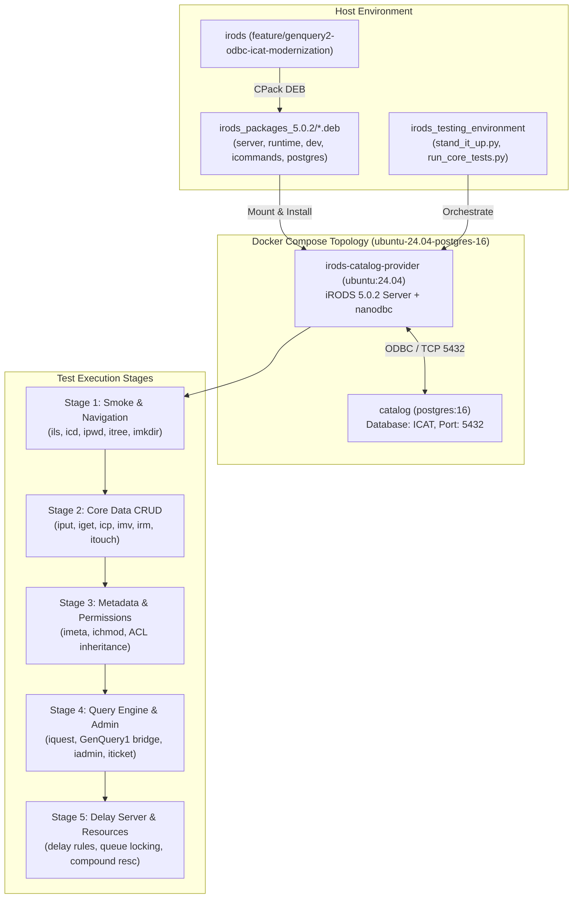

# Modernized ICAT & GenQuery2 PostgreSQL Qualification Plan

> **For agentic workers:** REQUIRED SUB-SKILL: Use superpowers:subagent-driven-development to implement this plan task-by-task. Steps use checkbox (`- [ ]`) syntax for tracking.

**Goal:** Thoroughly validate the locally built modernized iRODS 5.0.2 ICAT database architecture (`feature/genquery2-odbc-icat-modernization`) against a PostgreSQL 16 catalog on Ubuntu 24.04 using `irods_testing_environment`.

**Architecture:** The test campaign deploys a containerized PostgreSQL 16 + Ubuntu 24.04 (Noble) topology managed by Docker Compose. The newly built 5.0.2 Debian packages (with nanodbc executor, persistent statement caching, GenQuery2 builder/DML AST, and modernized catalog operations) are installed into the container, bootstrapped via `setup_irods.py`, and systematically tested from Catch2 unit tests through core Python integration test suites (CRUD, ACLs, Metadata, GenQuery, Administration, and Delay Server).

**Architecture Diagram:**



**Tech Stack:** 
- iRODS 5.0.2 (C++20, nanodbc, GenQuery2 AST & SQL DML compiler)
- PostgreSQL 16 (`odbc-postgresql` / `PostgreSQL ANSI` driver)
- Ubuntu 24.04 LTS (Noble Numbat)
- Docker Compose & Python 3.12 test runner (`unittest-xml-reporting`)

## Global Constraints
- Target platform: Ubuntu 24.04 (`projects/ubuntu-24.04/ubuntu-24.04-postgres-16`)
- Database engine: PostgreSQL 16 (`postgres:16`)
- Package directory: `/home/darkfell/dev/irods_packages_5.0.2`
- All tests must run against live server instances inside isolated containers.
- Evidence before assertions: every test step must capture exit codes and log assertions.

---

### Task 1: Stand Up Live PostgreSQL 16 + Ubuntu 24.04 Zone

**Files:**
- Packages: `/home/darkfell/dev/irods_packages_5.0.2/*.deb`
- Project: `/home/darkfell/dev/irods_testing_environment/projects/ubuntu-24.04/ubuntu-24.04-postgres-16/docker-compose.yml`
- Script: `/home/darkfell/dev/irods_testing_environment/stand_it_up.py`

**Interfaces:**
- Consumes: Staged 5.0.2 Debian packages
- Produces: Running Docker container `ubuntu-2404-postgres-16_irods-catalog-provider_1` with functional ICAT on PostgreSQL 16

- [ ] **Step 1: Tear down any stale compose projects**

```bash
docker-compose --project-directory /home/darkfell/dev/irods_testing_environment/projects/ubuntu-24.04/ubuntu-24.04-postgres-16 down -v --remove-orphans
```

- [ ] **Step 2: Stand up the iRODS Zone with local packages**

```bash
python3 /home/darkfell/dev/irods_testing_environment/stand_it_up.py \
    --project-directory /home/darkfell/dev/irods_testing_environment/projects/ubuntu-24.04/ubuntu-24.04-postgres-16 \
    --irods-package-directory /home/darkfell/dev/irods_packages_5.0.2
```
Expected: Script completes with exit code 0; iRODS catalog provider and PostgreSQL 16 containers running.

- [ ] **Step 3: Verify server initialization in server log**

```bash
docker exec ubuntu-2404-postgres-16_irods-catalog-provider_1 head -n 100 /var/lib/irods/log/irods.log
```
Expected: Log confirms server boot without fatal SQL or schema initialization errors.

- [ ] **Step 4: Execute basic smoke command**

```bash
docker exec -u irods ubuntu-2404-postgres-16_irods-catalog-provider_1 ils -A /tempZone/home/rods
```
Expected: Output shows `/tempZone/home/rods` collection with `own` permission for user `rods#tempZone`.

---

### Task 2: In-Container Unit Testing Suite Execution

**Files:**
- Binaries: `/var/lib/irods/unit_tests/*` (installed via `irods-dev`)
- Container: `ubuntu-2404-postgres-16_irods-catalog-provider_1`

**Interfaces:**
- Consumes: Running iRODS server and database connection
- Produces: Pass/fail Catch2 test results for modern ICAT routines

- [ ] **Step 1: Execute `irods_chl_user_group_modern` inside container**

```bash
docker exec -u irods ubuntu-2404-postgres-16_irods-catalog-provider_1 /var/lib/irods/unit_tests/irods_chl_user_group_modern
```
Expected: All Catch2 assertions pass.

- [ ] **Step 2: Execute `irods_nanodbc_executor` inside container**

```bash
docker exec -u irods ubuntu-2404-postgres-16_irods-catalog-provider_1 /var/lib/irods/unit_tests/irods_nanodbc_executor
```
Expected: All statement cache and dispatch assertions pass.

- [ ] **Step 3: Execute `irods_genquery2_builder` and `irods_genquery2_sql_dml` inside container**

```bash
docker exec -u irods ubuntu-2404-postgres-16_irods-catalog-provider_1 /var/lib/irods/unit_tests/irods_genquery2_builder
docker exec -u irods ubuntu-2404-postgres-16_irods-catalog-provider_1 /var/lib/irods/unit_tests/irods_genquery2_sql_dml
```
Expected: All query builder and DML SQL generation assertions pass.

---

### Task 3: Core Functional Testing — Navigation & CRUD Operations

**Files:**
- Script: `/home/darkfell/dev/irods_testing_environment/run_core_tests.py`
- Test suites: `test_ils`, `test_imkdir`, `test_iput`, `test_iget`, `test_icp`, `test_imv`, `test_irm`

**Interfaces:**
- Consumes: Running provider container
- Produces: JUnit test results and log verification for collection and data object DML

- [ ] **Step 1: Run Navigation & Collection Management test suite**

```bash
python3 /home/darkfell/dev/irods_testing_environment/run_core_tests.py \
    --project-directory /home/darkfell/dev/irods_testing_environment/projects/ubuntu-24.04/ubuntu-24.04-postgres-16 \
    --irods-package-directory /home/darkfell/dev/irods_packages_5.0.2 \
    --skip-setup \
    --tests test_ils
```
Expected: `test_ils` suite passes without infinite loops or pagination anomalies.

- [ ] **Step 2: Run Collection creation and deletion tests (`imkdir`, `irmdir`)**

```bash
docker exec -u irods ubuntu-2404-postgres-16_irods-catalog-provider_1 python3 /var/lib/irods/scripts/run_tests.py --run_python_suite --test test_imkdir
```
Expected: `imkdir` tests pass.

- [ ] **Step 3: Run Core Data Object CRUD tests (`iput`, `iget`, `icp`, `imv`, `irm`)**

```bash
docker exec -u irods ubuntu-2404-postgres-16_irods-catalog-provider_1 python3 /var/lib/irods/scripts/run_tests.py --run_python_suite --test test_iput test_iget test_icp test_imv test_irm
```
Expected: All data object registration, replica insertion, data modification (`chlModDataObjMeta`), and unregistration tests pass.

---

### Task 4: Core Functional Testing — Metadata, Access Control & Quotas

**Files:**
- Test suites: `test_imeta`, `test_ichmod`, `test_access_control`, `test_iquota`
- Container: `ubuntu-2404-postgres-16_irods-catalog-provider_1`

**Interfaces:**
- Consumes: Data objects and collections created in catalog
- Produces: Verification of AVU metadata persistence, permission matrix enforcement, and quota accounting

- [ ] **Step 1: Run AVU Metadata test suite (`test_imeta`)**

```bash
docker exec -u irods ubuntu-2404-postgres-16_irods-catalog-provider_1 python3 /var/lib/irods/scripts/run_tests.py --run_python_suite --test test_imeta
```
Expected: Metadata add, rm, set, copy, and modify operations pass using nanodbc.

- [ ] **Step 2: Run Access Control & Permissions test suite (`test_ichmod`)**

```bash
docker exec -u irods ubuntu-2404-postgres-16_irods-catalog-provider_1 python3 /var/lib/irods/scripts/run_tests.py --run_python_suite --test test_ichmod
```
Expected: ACL changes (`read`, `write`, `own`, `inherit`) update catalog tables correctly.

- [ ] **Step 3: Run Quota Accounting test suite (`test_iquota`)**

```bash
docker exec -u irods ubuntu-2404-postgres-16_irods-catalog-provider_1 python3 /var/lib/irods/scripts/run_tests.py --run_python_suite --test test_iquota
```
Expected: Modernized quota operations accurately calculate resource and user storage usage.

---

### Task 5: Query Engine & Catalog Administration Testing

**Files:**
- Test suites: `test_iquest`, `test_iadmin`, `test_ticket_administration`, `test_user_administration`
- Container: `ubuntu-2404-postgres-16_irods-catalog-provider_1`

**Interfaces:**
- Consumes: GenQuery1 bridge & GenQuery2 engine
- Produces: Verified query parsing, translation, execution, and catalog admin DML

- [ ] **Step 1: Run GenQuery test suite (`test_iquest`)**

```bash
docker exec -u irods ubuntu-2404-postgres-16_irods-catalog-provider_1 python3 /var/lib/irods/scripts/run_tests.py --run_python_suite --test test_iquest
```
Expected: GenQuery1 queries translate through modern nanodbc routines and return correct column sets and orderings.

- [ ] **Step 2: Run Zone and User Administration test suites (`test_iadmin`, `test_user_administration`)**

```bash
docker exec -u irods ubuntu-2404-postgres-16_irods-catalog-provider_1 python3 /var/lib/irods/scripts/run_tests.py --run_python_suite --test test_iadmin test_user_administration
```
Expected: User creation, password updates, group membership, and zone configuration execute cleanly.

- [ ] **Step 3: Run Ticket Administration test suite (`test_ticket_administration`)**

```bash
docker exec -u irods ubuntu-2404-postgres-16_irods-catalog-provider_1 python3 /var/lib/irods/scripts/run_tests.py --run_python_suite --test test_ticket_administration
```
Expected: Modernized ticket operations issue and enforce access tickets as expected.

---

### Task 6: Delay Server & Resource Hierarchy Testing

**Files:**
- Test suites: `test_delay_server`, `test_resource_types`
- Container: `ubuntu-2404-postgres-16_irods-catalog-provider_1`

**Interfaces:**
- Consumes: Background delay rule execution and resource tree hierarchy
- Produces: Verification of rule engine catalog queuing and resource tree persistence

- [ ] **Step 1: Run Delay Server test suite (`test_delay_server`)**

```bash
docker exec -u irods ubuntu-2404-postgres-16_irods-catalog-provider_1 python3 /var/lib/irods/scripts/run_tests.py --run_python_suite --test test_delay_server
```
Expected: Rule execution queue locking, update, and deletion execute properly under nanodbc.

- [ ] **Step 2: Run Resource Types test suite (`test_resource_types`)**

```bash
docker exec -u irods ubuntu-2404-postgres-16_irods-catalog-provider_1 python3 /var/lib/irods/scripts/run_tests.py --run_python_suite --test test_resource_types
```
Expected: Resource hierarchy operations (compound, passthru, unixfilesystem) function correctly.

---

### Task 7: Comprehensive Regression Triage & Report Harvesting

**Files:**
- Output directory: `/tmp/irods_test_results`
- Server logs: `/var/lib/irods/log/irods.log`

**Interfaces:**
- Consumes: Test artifacts and container logs
- Produces: Aggregated test summary report and issue triage

- [ ] **Step 1: Extract all test reports and logs from container**

```bash
mkdir -p /home/darkfell/dev/irods/build/test_reports
docker cp ubuntu-2404-postgres-16_irods-catalog-provider_1:/var/lib/irods/log/ /home/darkfell/dev/irods/build/test_reports/
```

- [ ] **Step 2: Scan server logs for SQL exceptions or catalog warnings**

```bash
grep -iE "error|exception|sql|nanodbc" /home/darkfell/dev/irods/build/test_reports/log/irods.log | head -n 100
```
Expected: No unhandled SQL exceptions or fatal statement execution errors.

- [ ] **Step 3: Generate Summary Report**
Document total tests executed, passing rate, and any edge-case failures observed during testing.
