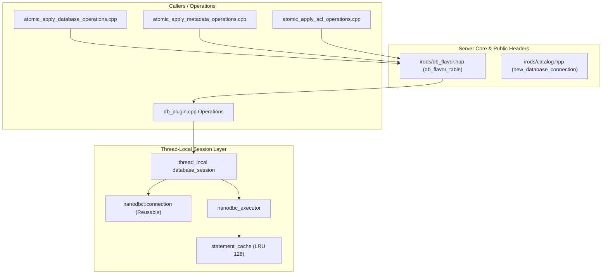

# Direct nanodbc Unification & Statement Cache Persistence Implementation Plan

> **For agentic workers:** REQUIRED SUB-SKILL: Use superpowers:subagent-driven-development to implement this plan task-by-task. Steps use checkbox (`- [ ]`) syntax for tracking.

**Goal:** Unify direct, ad-hoc `nanodbc` usages across the database plugin, server core, and API plugins using the new `nanodbc_executor` and `db_flavor` architecture, eliminate repetitive SQL dialect branching for sequences and parameter bindings, and introduce thread-local connection and statement cache persistence to achieve true prepared statement reuse.

**Architecture:** 
1. **Plugin Modernization:** Refactor direct `nanodbc::statement` and `nanodbc::execute` calls in `plugins/database` (such as `get_auth_config` and `catalog_properties`) into `nanodbc_executor` calls.
2. **Promotion to Server Core:** Move `db_flavor_table.hpp` to public server core (`server/core/include/irods/db_flavor.hpp`), replacing repeated 3-way RDBMS branching (`postgres`/`oracle`/`mysql`) in `atomic_apply_database_operations.cpp`, `atomic_apply_metadata_operations.cpp`, and `catalog_utilities.cpp` with lookup table expressions.
3. **Session & Statement Cache Persistence:** Introduce a thread-local database session context holding a persistent `nanodbc::connection` and `nanodbc_executor` with its LRU `statement_cache`, so prepared statements are retained across operations rather than discarded on stack pop.

**Architecture Diagram:**

**Tech Stack:** C++17/C++20, `nanodbc`, ODBC (unixODBC), `fmt::format`, CMake, Catch2.

## Global Constraints

- Preserve complete backward compatibility for all API behaviors and database plugins.
- Thread safety: connection and statement cache reuse must be strictly thread-safe (`thread_local`).
- Clean error recovery: if a connection is severed or reset, the session and statement cache must reset transparently.
- All unit tests and server targets must compile and pass without warnings.

---

### Task 1: Immediate / Low-Hanging Cleanup in `plugins/database/`

**Files:**
- Modify: `plugins/database/src/db_plugin.cpp:140-160`
- Modify: `plugins/database/src/irods_catalog_properties.cpp:30-55`
- Modify: `plugins/database/src/nanodbc_executor.cpp:150-192`
- Modify: `plugins/api/src/data_object_finalize.cpp:225-245`

**Interfaces:**
- Consumes: `nanodbc_executor::execute_query`, `nanodbc_executor::query_string`, `irods::experimental::catalog::get_db_flavor`
- Produces: Cleaned direct calls using statement caching and flavor lookups

- [ ] **Step 1: Modernize `get_auth_config` in `db_plugin.cpp`**
  Replace manual `nanodbc::statement`, `prepare`, and `bind` with `executor.execute_query` in `get_auth_config`.
  
- [ ] **Step 2: Modernize `catalog_properties::capture` in `irods_catalog_properties.cpp`**
  Use `nanodbc_executor` to execute `select name, setting from pg_settings`.

- [ ] **Step 3: Direct Flavor Lookup in `nanodbc_executor.cpp`**
  Update `get_next_sequence_value` and `get_current_sequence_value` to support direct database type or instance name resolution avoiding redundant `_conn.dbms_name()` roundtrips when known.

- [ ] **Step 4: Clean up dangling `new_database_connection` in `data_object_finalize.cpp`**
  Remove the unused `std::tie(db_instance_name, db_conn) = ic::new_database_connection();` block.

- [ ] **Step 5: Verify build of `plugins/database` and `data_object_finalize`**
  Run `make -C build -j$(nproc) all-plugins-database irods_data_object_finalize`.

---

### Task 2: Promote `db_flavor.hpp` to Server Core & Unify API Plugins

**Files:**
- Create: `server/core/include/irods/db_flavor.hpp`
- Modify: `server/core/CMakeLists.txt:64-125`
- Modify: `plugins/database/include/irods/private/db_flavor_table.hpp` (forwarding include to `irods/db_flavor.hpp`)
- Modify: `server/core/src/atomic_apply_database_operations.cpp`
- Modify: `plugins/api/src/atomic_apply_metadata_operations.cpp`
- Modify: `plugins/api/src/atomic_apply_acl_operations.cpp`
- Modify: `server/core/src/catalog_utilities.cpp`

**Interfaces:**
- Consumes: `irods::experimental::catalog::get_db_flavor`, `get_db_type_from_name`
- Produces: Unification of sequence formatting and parameter binding across core and API plugins

- [ ] **Step 1: Create `server/core/include/irods/db_flavor.hpp`**
  Define `struct db_flavor`, `db_flavor_table`, `get_db_flavor(int)`, and `get_db_type_from_name(std::string_view)`.
  Update `server/core/CMakeLists.txt` to register it in `IRODS_SERVER_CORE_HEADERS_PUBLIC`.
  Make `plugins/database/include/irods/private/db_flavor_table.hpp` include `irods/db_flavor.hpp` for seamless compatibility.

- [ ] **Step 2: Replace Ad-hoc Dialect Sequences in `atomic_apply_database_operations.cpp`**
  Replace the 5 repetitive `if (_db_instance_name == "postgres") ... else if (_db_instance_name == "oracle") ...` blocks in `insert_collection`, `insert_replica`, `insert_metadata`, `insert_resource`, and `insert_ticket` using `flavor.next_sequence_expr`.

- [ ] **Step 3: Unify Sequence Generation in `atomic_apply_metadata_operations.cpp`**
  Replace the 3-way `_db_instance_name` branch in `insert_metadata` with `flavor.next_sequence_expr`.

- [ ] **Step 4: Unify 64-bit Parameter Binding in `atomic_apply_acl_operations.cpp` and `catalog_utilities.cpp`**
  Consolidate parameter binding to use uniform string representation (`std::to_string` or string binding) across all database flavors, removing duplicate branch code.

- [ ] **Step 5: Verify build of core, server, and all unit tests**
  Run `make -C build -j$(nproc) irodsServer all-plugins-database all-unit_tests`.

---

### Task 3: Implement Persistent Thread-Local Database Session & Statement Cache

**Files:**
- Create/Modify: `plugins/database/include/irods/private/database_session.hpp`
- Modify: `plugins/database/CMakeLists.txt`
- Modify: `plugins/database/src/db_plugin.cpp`

**Interfaces:**
- Consumes: `new_database_connection`, `nanodbc_executor`, `statement_cache`
- Produces: `get_database_session() -> database_session&` maintaining connected `nanodbc::connection` and `nanodbc_executor` per thread.

- [ ] **Step 1: Implement `database_session` Class**
  Create `database_session` which encapsulates:
  - `nanodbc::connection conn_`: cached active connection.
  - `nanodbc_executor executor_`: cached executor with persistent `statement_cache`.
  - `std::string db_instance_name_`: catalog technology name.
  - `int db_type_`: catalog technology integer id (`DB_TYPE_*`).
  - `connection()`: returns connected `conn_`, lazily connecting or reconnecting if disconnected.
  - `executor()`: returns `executor_`.
  - `reset()`: clears cache and disconnects.

- [ ] **Step 2: Expose `get_database_session()`**
  Provide a thread-local accessor `get_database_session()` so each worker thread maintains its own persistent connection and prepared statement cache across catalog plugin calls.

- [ ] **Step 3: Integrate `get_database_session()` into `db_plugin.cpp`**
  Replace `auto [db_instance, db_conn] = irods::experimental::catalog::new_database_connection(); irods::experimental::catalog::nanodbc_executor executor;` in catalog operations with the persistent session accessor.

- [ ] **Step 4: Verify Unit Tests and Statement Cache Hit Rate**
  Build and run unit tests (`irods_chl_*_modern` and `test_nanodbc_executor`), verifying that statement cache hits occur across multiple calls on the same thread without errors.

- [ ] **Step 5: Full Verification**
  Run the complete unit test suite and verify absence of warnings, memory leaks, or transaction anomalies.
