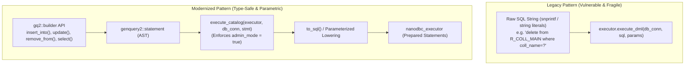

# Implementation Plan: Purging Manual SQL String Construction in `db_plugin.cpp`

**Goal:** Systematically replace all remaining raw SQL strings and manual string formatting (`snprintf`, raw `execute_dml("delete from...")`, inline string buffers) in [`plugins/database/src/db_plugin.cpp`](file:///home/darkfell/dev/irods/plugins/database/src/db_plugin.cpp) with type-safe [`gq2::builder`](file:///home/darkfell/dev/irods/server/genquery2/include/irods/private/genquery2_builder.hpp) queries executed through [`nanodbc_executor`](file:///home/darkfell/dev/irods/plugins/database/src/nanodbc_executor.cpp).

---

## 1. Architectural Strategy



### Key Invariants
1. **Zero Raw SQL Strings**: No SQL keywords (`SELECT`, `INSERT`, `UPDATE`, `DELETE`, `FROM`, `WHERE`) constructed manually via C strings or `std::string` concatenation.
2. **Strict Parameter Binding**: All values bound via positional `?` placeholders generated by the compiler.
3. **Privileged Catalog Execution**: Internal catalog operations pass `genquery2::options{.admin_mode = true}`, complying with the Tier 3 executor gate.
4. **100% Invariant Verification**: Verified at each step by `scripts/verify_refactoring.sh`.

---

## 2. Execution Phases & Task Breakdown

### Phase 2.1: Infrastructure & Catalog Execution Helper
- **File:** [`plugins/database/include/irods/private/nanodbc_executor.hpp`](file:///home/darkfell/dev/irods/plugins/database/include/irods/private/nanodbc_executor.hpp)
- **Action:** Introduce an explicit `execute_catalog` helper for catalog internal operations:
  ```cpp
  inline auto execute_catalog(
      nanodbc_executor& _exec,
      nanodbc::connection& _conn,
      const genquery2::statement& _stmt) -> execution_result
  {
      static constexpr genquery2::options catalog_admin_opts{.admin_mode = true};
      return execute(_exec, _conn, _stmt, catalog_admin_opts);
  }
  ```
- **Benefit:** Clean, readable, and prevents boilerplate `admin_opts` construction at every call site.

---

### Phase 2.2: AVU & Metadata Mapping Operations
- **Target Functions:**
  - `removeMetaMapAndAVU(const char* _id)` (line 547):
    - Replace `"delete from R_OBJT_METAMAP where object_id=?"` with:
      ```cpp
      auto stmt = gq2::builder::remove_from("METADATA_MAP")
          .where(col("object_id") == _id)
          .build();
      execute_catalog(executor, db_conn, stmt);
      ```
  - `db_del_data_obj_op` (AVU unlinking, lines 2080-2120):
    - Purge string-based AVU cleanup and table deletions.
  - `db_mod_avu_metadata_op` (lines 7000-7400):
    - Transition metadata table lookups and inserts to `gq2::builder`.

---

### Phase 2.3: Collection Hierarchy Operations
- **Target Functions:**
  - `db_del_coll_op` (lines 880-900):
    - Replace `"delete from R_COLL_MAIN where coll_name=? and coll_id=?"`:
      ```cpp
      auto del_coll = gq2::builder::remove_from("COLLECTION")
          .where(col("coll_name") == collInfo->collName && col("coll_id") == collIdNum)
          .build();
      execute_catalog(executor, db_conn, del_coll);
      ```
    - Replace `"delete from R_OBJT_ACCESS where object_id=?"`:
      ```cpp
      auto del_access = gq2::builder::remove_from("ACCESS")
          .where(col("object_id") == collIdNum)
          .build();
      execute_catalog(executor, db_conn, del_access);
      ```
  - `db_reg_coll_op` / `chlRegCollByAdmin` (lines 3830-3860, 3970-4010):
    - Replace `insert_coll_sql` and `insert_access_sql` with `gq2::builder::insert_into("COLLECTION")` and `insert_into("ACCESS")`.
  - `db_rename_coll_op` (lines 4700-4750):
    - Replace raw updates with `gq2::builder::update("COLLECTION")`.

---

### Phase 2.4: User, Group, & Authentication Operations
- **Target Functions:**
  - `db_del_user_re_op` (lines 3680-3710):
    - Replace `del_user_sql`, `del_pw_sql`, `del_access_sql`, `del_ug_sql`, `del_auth_sql` with:
      ```cpp
      // R_USER_MAIN
      execute_catalog(executor, db_conn, gq2::builder::remove_from("USER")
          .where(col("user_name") == userName2 && col("zone_name") == zoneToUse).build());
      // R_USER_PASSWORD
      execute_catalog(executor, db_conn, gq2::builder::remove_from("USER_PASSWORD")
          .where(col("user_id") == iValStr).build());
      // R_OBJT_ACCESS
      execute_catalog(executor, db_conn, gq2::builder::remove_from("ACCESS")
          .where(col("user_id") == iValStr).build());
      // R_USER_GROUP
      execute_catalog(executor, db_conn, gq2::builder::remove_from("USER_GROUP")
          .where(col("user_id") == iValStr || col("group_user_id") == iValStr).build());
      // R_USER_AUTH
      execute_catalog(executor, db_conn, gq2::builder::remove_from("USER_AUTH")
          .where(col("user_id") == iValStr).build());
      ```
  - `db_reg_user_re_op` (lines 6200-6300):
    - Replace raw string inserts on `R_USER_MAIN` and `R_USER_PASSWORD` with `gq2::builder::insert_into("USER")`.
  - `db_mod_group_op` (lines 6400-6500):
    - Replace raw string group assignments with `gq2::builder::insert_into("USER_GROUP")`.

---

### Phase 2.5: Resource Topology Operations
- **Target Functions:**
  - `db_del_resc_op` (lines 3520-3540):
    - Replace `"delete from R_RESC_MAIN where resc_name=?"` with:
      ```cpp
      auto stmt = gq2::builder::remove_from("RESOURCE")
          .where(col("resc_name") == _resc_name)
          .build();
      const auto res = execute_catalog(executor, db_conn, stmt);
      ```
  - `db_reg_resc_op` (lines 3200-3350):
    - Replace raw string inserts with `gq2::builder::insert_into("RESOURCE")`.
  - `db_add_child_resc_op` / `db_del_child_resc_op` (lines 700-720, 7900-8000):
    - Replace parent-child updates and inserts on `R_RESC_PARENTS` with `gq2::builder::update("RESOURCE_PARENT")` and `insert_into("RESOURCE_PARENT")`.

---

### Phase 2.6: Delay Rules & Execution Tracking Operations
- **Target Functions:**
  - `db_del_rule_exec_op` (lines 3040-3055):
    - Replace `"delete from R_RULE_EXEC where rule_exec_id = ?"` with:
      ```cpp
      auto stmt = gq2::builder::remove_from("RULE_EXEC")
          .where(col("rule_exec_id") == _re_id)
          .build();
      execute_catalog(executor, db_conn, stmt);
      ```
  - `db_reg_rule_exec_op` / `db_mod_rule_exec_op` (lines 2850-3030):
    - Replace raw rule inserts and updates with `gq2::builder::insert_into("RULE_EXEC")` and `gq2::builder::update("RULE_EXEC")`.

---

### Phase 2.7: Quota & Storage Accounting Operations
- **Target Functions:**
  - `db_calc_usage_and_quota_op` (lines 1360-1450):
    - Replace `"update R_QUOTA_MAIN set quota_over = -quota_limit"` with:
      ```cpp
      auto stmt = gq2::builder::update("QUOTA")
          .set("quota_over", "-quota_limit")
          .build();
      execute_catalog(executor, db_conn, stmt);
      ```
    - Replace quota inserts and resets with `gq2::builder`.

---

## 3. Verification Protocol

For each modernized domain:
1. **Compilation**: `cmake --build build --target irods_database_plugin-postgres irods_nanodbc_executor -j$(nproc)`
2. **Unit Tests**: Execute all modern catalog test suites (`test_chl_*_modern`, `test_nanodbc_executor`).
3. **Dialectic Verification Gate**: Run `scripts/verify_refactoring.sh plugins/database/src/db_plugin.cpp` to ensure 0 concurrency regressions and 0 typestate violations.
