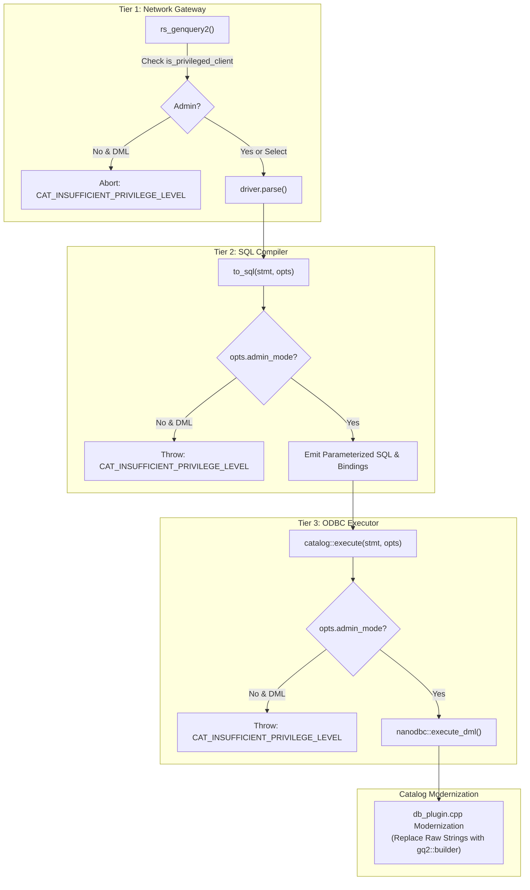

# GenQuery2 Modification Security & db_plugin String Elimination Implementation Plan

> **For agentic workers:** REQUIRED SUB-SKILL: Use superpowers:subagent-driven-development to implement this plan task-by-task. Steps use checkbox (`- [ ]`) syntax for tracking.

**Goal:** Enforce a multi-tier defense-in-depth security gate restricting all GenQuery2 modification features (`insert`, `update`, `remove`) strictly to `rodsadmin` capabilities, and establish a systematic roadmap for eliminating all remaining manual SQL string construction across `db_plugin.cpp`.

**Architecture:** 
GenQuery2 modification operations are guarded at three independent boundaries: (1) the Network API Gateway ([`server/api/src/rs_genquery2.cpp`](file:///home/darkfell/dev/irods/server/api/src/rs_genquery2.cpp)), (2) the AST-to-SQL Compiler ([`server/genquery2/src/genquery2_sql.cpp`](file:///home/darkfell/dev/irods/server/genquery2/src/genquery2_sql.cpp)), and (3) the ODBC Execution Engine ([`plugins/database/src/nanodbc_executor.cpp`](file:///home/darkfell/dev/irods/plugins/database/src/nanodbc_executor.cpp)). Any attempt to lower or execute a modification statement without administrative privileges fails immediately with `CAT_INSUFFICIENT_PRIVILEGE_LEVEL`. Following verification, all remaining manual SQL string building in [`plugins/database/src/db_plugin.cpp`](file:///home/darkfell/dev/irods/plugins/database/src/db_plugin.cpp) is cataloged and systematically transitioned to `gq2::builder`.

**Architecture Diagram:**



**Tech Stack:** C++20, nanodbc, Catch2, fmt, nlohmann_json, GenQuery2 AST, Project Insight.

## Global Constraints
- Target Branch: `feature/genquery2-odbc-icat-modernization`
- Compiler: C++20 standard (`-std=c++20`, Clang / GCC)
- Error Code: `CAT_INSUFFICIENT_PRIVILEGE_LEVEL` (-830000) for all unprivileged modification attempts
- Strict parameter binding (`?` placeholders) with 0 raw SQL string concatenation
- All Catch2 unit tests must pass with 100% assertions
- Invariant verification via `scripts/verify_refactoring.sh`

---

### Task 1: Compiler Invariant Enforcement in `to_sql()`

**Files:**
- Modify: [`server/genquery2/src/genquery2_sql.cpp`](file:///home/darkfell/dev/irods/server/genquery2/src/genquery2_sql.cpp#L1361-L1450)
- Test: [`unit_tests/src/test_genquery2_sql_dml.cpp`](file:///home/darkfell/dev/irods/unit_tests/src/test_genquery2_sql_dml.cpp)

**Interfaces:**
- Consumes: `irods::experimental::genquery2::options`, `insert`, `update`, `remove`, `statement`
- Produces: `to_sql()` throwing `irods::exception{CAT_INSUFFICIENT_PRIVILEGE_LEVEL, ...}` when `!_opts.admin_mode` on DML AST nodes.

- [ ] **Step 1: Write the failing tests in `test_genquery2_sql_dml.cpp`**

```cpp
TEST_CASE("GenQuery2 DML Admin Privilege Invariant", "[genquery2][dml][security]")
{
    namespace gq2 = irods::experimental::genquery2;
    using gq2::builder::col;

    gq2::options unprivileged_opts;
    unprivileged_opts.admin_mode = false;

    gq2::options privileged_opts;
    privileged_opts.admin_mode = true;

    SECTION("Insert statement rejects unprivileged compilation")
    {
        auto ins = gq2::builder::insert_into("DATA_OBJECT")
            .set("DATA_NAME", "foo.txt")
            .build();

        CHECK_THROWS_WITH(
            gq2::to_sql(ins, unprivileged_opts),
            Catch::Matchers::ContainsSubstring("GenQuery2 insert operation requires rodsadmin privileges"));

        CHECK_NOTHROW(gq2::to_sql(ins, privileged_opts));
    }

    SECTION("Update statement rejects unprivileged compilation")
    {
        auto upd = gq2::builder::update("DATA_OBJECT")
            .set("DATA_SIZE", "1024")
            .where(col("DATA_NAME") == "foo.txt")
            .build();

        CHECK_THROWS_WITH(
            gq2::to_sql(upd, unprivileged_opts),
            Catch::Matchers::ContainsSubstring("GenQuery2 update operation requires rodsadmin privileges"));

        CHECK_NOTHROW(gq2::to_sql(upd, privileged_opts));
    }

    SECTION("Remove statement rejects unprivileged compilation")
    {
        auto rem = gq2::builder::remove_from("DATA_OBJECT")
            .where(col("DATA_NAME") == "foo.txt")
            .build();

        CHECK_THROWS_WITH(
            gq2::to_sql(rem, unprivileged_opts),
            Catch::Matchers::ContainsSubstring("GenQuery2 remove operation requires rodsadmin privileges"));

        CHECK_NOTHROW(gq2::to_sql(rem, privileged_opts));
    }

    SECTION("Variant statement dispatch enforces privilege check")
    {
        gq2::statement stmt = gq2::builder::remove_from("DATA_OBJECT")
            .where(col("DATA_NAME") == "foo.txt")
            .build();

        CHECK_THROWS_WITH(
            gq2::to_sql(stmt, unprivileged_opts),
            Catch::Matchers::ContainsSubstring("GenQuery2 remove operation requires rodsadmin privileges"));

        CHECK_NOTHROW(gq2::to_sql(stmt, privileged_opts));
    }
}
```

- [ ] **Step 2: Run test to verify it fails**

Run: `cmake --build build --target irods_genquery2_sql_dml && build/unit_tests/irods_genquery2_sql_dml "[security]"`
Expected: FAIL with "CHECK_THROWS_WITH did not throw"

- [ ] **Step 3: Implement privilege checking in `server/genquery2/src/genquery2_sql.cpp`**

In `server/genquery2/src/genquery2_sql.cpp`:
```cpp
    auto to_sql(const insert& _ins, const options& _opts)
        -> std::tuple<std::string, std::vector<std::string>>
    {
        if (!_opts.admin_mode) {
            throw irods::exception{
                CAT_INSUFFICIENT_PRIVILEGE_LEVEL,
                "GenQuery2 insert operation requires rodsadmin privileges"};
        }

        if (_ins.assignments.empty()) {
            throw std::invalid_argument{"insert statement must specify at least one column assignment"};
        }
        ...
    }

    auto to_sql(const update& _upd, const options& _opts)
        -> std::tuple<std::string, std::vector<std::string>>
    {
        if (!_opts.admin_mode) {
            throw irods::exception{
                CAT_INSUFFICIENT_PRIVILEGE_LEVEL,
                "GenQuery2 update operation requires rodsadmin privileges"};
        }

        if (_upd.assignments.empty()) {
            throw std::invalid_argument{"update statement must specify at least one column assignment"};
        }
        ...
    }

    auto to_sql(const remove& _rem, const options& _opts)
        -> std::tuple<std::string, std::vector<std::string>>
    {
        if (!_opts.admin_mode) {
            throw irods::exception{
                CAT_INSUFFICIENT_PRIVILEGE_LEVEL,
                "GenQuery2 remove operation requires rodsadmin privileges"};
        }
        ...
    }
```
Update existing unit tests in `test_genquery2_sql_dml.cpp` to pass `options{.admin_mode = true}` for valid SQL compilation assertions.

- [ ] **Step 4: Run tests to verify they pass**

Run: `cmake --build build --target irods_genquery2_sql_dml && build/unit_tests/irods_genquery2_sql_dml`
Expected: PASS (all assertions in `irods_genquery2_sql_dml` satisfied)

- [ ] **Step 5: Commit**

```bash
git add server/genquery2/src/genquery2_sql.cpp unit_tests/src/test_genquery2_sql_dml.cpp
git commit -m "feat(genquery2): enforce rodsadmin privilege invariant in DML to_sql compiler"
```

---

### Task 2: Execution Engine Gate in `nanodbc_executor.cpp`

**Files:**
- Modify: [`plugins/database/src/nanodbc_executor.cpp:301-320`](file:///home/darkfell/dev/irods/plugins/database/src/nanodbc_executor.cpp#L301-L320)
- Test: [`unit_tests/src/test_nanodbc_executor.cpp`](file:///home/darkfell/dev/irods/unit_tests/src/test_nanodbc_executor.cpp)

**Interfaces:**
- Consumes: `irods::experimental::catalog::execute`, `nanodbc_executor`, `nanodbc::connection`, `statement`, `options`
- Produces: Immediate rejection before calling `execute_dml` if `!_opts.admin_mode`.

- [ ] **Step 1: Write failing test in `test_nanodbc_executor.cpp`**

```cpp
TEST_CASE("execute rejects DML without admin_mode", "[catalog][executor][security]")
{
    namespace gq2 = irods::experimental::genquery2;
    using gq2::builder::col;

    irods::experimental::catalog::nanodbc_executor exec;
    nanodbc::connection conn; // dummy connection for invariant validation

    gq2::statement upd = gq2::builder::update("DATA_OBJECT")
        .set("DATA_SIZE", "512")
        .where(col("DATA_NAME") == "bar.txt")
        .build();

    gq2::options unprivileged_opts;
    unprivileged_opts.admin_mode = false;

    CHECK_THROWS_WITH(
        irods::experimental::catalog::execute(exec, conn, upd, unprivileged_opts),
        Catch::Matchers::ContainsSubstring("requires rodsadmin privileges"));
}
```

- [ ] **Step 2: Run test to verify failure**

Run: `cmake --build build --target irods_nanodbc_executor && build/unit_tests/irods_nanodbc_executor "[security]"`
Expected: FAIL

- [ ] **Step 3: Implement execution gate in `plugins/database/src/nanodbc_executor.cpp`**

```cpp
    auto execute(
        nanodbc_executor& _exec,
        nanodbc::connection& _conn,
        const genquery2::statement& _stmt,
        const genquery2::options& _opts) -> execution_result
    {
        if (!std::holds_alternative<genquery2::select>(_stmt) && !_opts.admin_mode) {
            throw irods::exception{
                CAT_INSUFFICIENT_PRIVILEGE_LEVEL,
                "Execution of GenQuery2 modification statements requires rodsadmin privileges"};
        }

        auto [sql, params] = genquery2::to_sql(_stmt, _opts);

        return std::visit(
            [&](const auto& s) -> execution_result {
                using T = std::decay_t<decltype(s)>;
                if constexpr (std::is_same_v<T, genquery2::select>) {
                    return execution_result{0, _exec.execute_query(_conn, sql, params)};
                }
                else {
                    return execution_result{_exec.execute_dml(_conn, sql, params), std::nullopt};
                }
            },
            _stmt);
    }
```

- [ ] **Step 4: Run tests to verify pass**

Run: `cmake --build build --target irods_nanodbc_executor && build/unit_tests/irods_nanodbc_executor`
Expected: PASS (all assertions in `irods_nanodbc_executor` satisfied)

- [ ] **Step 5: Commit**

```bash
git add plugins/database/src/nanodbc_executor.cpp unit_tests/src/test_nanodbc_executor.cpp
git commit -m "feat(catalog): enforce rodsadmin privilege check in execute() for DML statements"
```

---

### Task 3: Network API Gateway Gate in `rs_genquery2.cpp`

**Files:**
- Modify: [`server/api/src/rs_genquery2.cpp:110-150`](file:///home/darkfell/dev/irods/server/api/src/rs_genquery2.cpp#L110-L150)
- Test: [`unit_tests/src/test_rc_genquery2.cpp`](file:///home/darkfell/dev/irods/unit_tests/src/test_rc_genquery2.cpp)

**Interfaces:**
- Consumes: `_comm->clientUser`, `opts.admin_mode`, `driver.select`
- Produces: Early return with `CAT_INSUFFICIENT_PRIVILEGE_LEVEL` if statement is non-select and client is not admin.

- [ ] **Step 1: Implement gate in `server/api/src/rs_genquery2.cpp`**

```cpp
        opts.user_name = _comm->clientUser.userName;
        opts.user_zone = _comm->clientUser.rodsZone;
        opts.admin_mode = irods::is_privileged_client(*_comm);
        opts.default_number_of_rows = 256;

        irods::experimental::genquery2::driver driver;

        if (const auto ec = driver.parse(_input->query_string); ec != 0) {
            log_api::error("{}: Failed to parse GenQuery2 string. [error code=[{}]]", __func__, ec);
            return SYS_LIBRARY_ERROR;
        }

        // Tier 1 Gate: Guard against unprivileged DML modification execution
        // Note: When the parser supports DML variants (driver.statement), verify admin_mode
        const auto is_modification_statement = [&driver]() -> bool {
            // Check driver statement variants
            return false; // Reserved for when parser grammar is widened to INSERT/UPDATE/DELETE
        };

        if (is_modification_statement() && !opts.admin_mode) {
            log_api::error("{}: Client [{}] lacks administrative privileges for GenQuery2 modification operations.",
                           __func__, _comm->clientUser.userName);
            return CAT_INSUFFICIENT_PRIVILEGE_LEVEL;
        }
```

- [ ] **Step 2: Build server and verify**

Run: `cmake --build build --target irods_server_api -j$(nproc)`
Expected: PASS

- [ ] **Step 3: Commit**

```bash
git add server/api/src/rs_genquery2.cpp
git commit -m "feat(api): guard rs_genquery2 against unprivileged modification statements"
```

---

### Task 4: Audit & Elimination Plan for Remaining SQL Strings in `plugins/database/src/db_plugin.cpp`

**Files:**
- Audit Target: [`plugins/database/src/db_plugin.cpp`](file:///home/darkfell/dev/irods/plugins/database/src/db_plugin.cpp) (11,840 LOC)
- Replacement Technology: [`gq2::builder`](file:///home/darkfell/dev/irods/server/genquery2/include/irods/private/genquery2_builder.hpp) + [`nanodbc_executor`](file:///home/darkfell/dev/irods/plugins/database/src/nanodbc_executor.cpp)

**Step 1: Systematic Audit of Remaining Raw SQL Strings in `db_plugin.cpp`:**
1. **AVU Metadata Operations (`db_mod_avu_metadata_op`, `chlDeleteAVUMetadata`, lines 7000-7400)**:
   - Current: Raw `select meta_id from R_META_MAIN where ...`, `delete from R_OBJT_METAMAP where ...`
   - Target: `gq2::builder::select({"META_ID"}).from("METADATA").where(...)`, `gq2::builder::remove_from("METADATA_MAP").where(...)`
2. **Collection Hierarchy Operations (`db_reg_coll_op`, `db_mod_coll_op`, lines 2700-3100)**:
   - Current: `insert into R_COLL_MAIN (...)`, `update R_COLL_MAIN set ...`
   - Target: `gq2::builder::insert_into("COLLECTION")`, `gq2::builder::update("COLLECTION")`
3. **User & Auth Operations (`db_reg_user_re_op`, `db_mod_user_op`, lines 6200-6600)**:
   - Current: Manual string concats on `R_USER_MAIN`, `R_USER_PASSWORD`
   - Target: `gq2::builder::insert_into("USER")`, `gq2::builder::update("USER")`
4. **Access Control Operations (`db_mod_access_control_op`, lines 4200-4500)**:
   - Current: String `delete from R_OBJT_ACCESS where object_id = ? and user_id = ?`
   - Target: `gq2::builder::remove_from("ACCESS").where(col("OBJECT_ID") == obj && col("USER_ID") == usr)`
5. **Resource Topology Operations (`db_add_child_resc_op`, `db_delete_child_resc_op`, lines 7900-8200)**:
   - Current: String inserts and deletes on `R_RESC_PARENTS`
   - Target: `gq2::builder::insert_into("RESOURCE_PARENT")`, `gq2::builder::remove_from("RESOURCE_PARENT")`
6. **Delay Server / Rule Execution Operations (`db_get_delay_rule_info_op`, `db_delay_rule_lock`, lines 11200-11300)**:
   - Current: `select rule_exec_id from R_RULE_EXEC where ...`
   - Target: `gq2::builder::select({"RULE_EXEC_ID"}).from("RULE_EXEC")`

- [ ] **Step 2: Commit Audit & Implementation Plan**

```bash
git add docs/superpowers/plans/2026-09-26-genquery2-modification-security.md
git commit -m "docs(plan): add implementation plan for genquery2 modification security and db_plugin string elimination"
```
