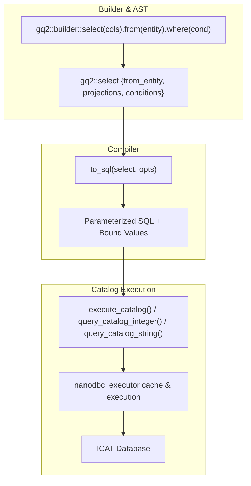

# GenQuery2 SELECT Fluent Builder & Database Plugin Query Modernization Implementation Plan

> **For agentic workers:** REQUIRED SUB-SKILL: Use superpowers:subagent-driven-development to implement this plan task-by-task. Steps use checkbox (`- [ ]`) syntax for tracking.

**Goal:** Eliminate all raw SQL `SELECT` string queries across `plugins/database/src/db_plugin.cpp` by introducing `.from(entity)` and aggregate projection support into `gq2::select` and `gq2::builder::select_builder`, adding typed catalog query helpers in `nanodbc_executor`, and systematically migrating ~126 query sites to type-safe AST expressions.

**Architecture:** Extend the `gq2::select` AST with an explicit `from_entity` property. Enhance `gq2::builder::select_builder` to support `.from(entity)` and projection aggregates (`count`, `max`, `min`). Update `to_sql()` in `genquery2_sql.cpp` to emit single-entity parameterized queries when `from_entity` is specified while maintaining graph join inference when absent. Add `query_catalog_integer`, `query_catalog_string`, and `query_catalog_strings` to `nanodbc_executor.hpp`, then migrate all raw SQL lookups in `db_plugin.cpp` across 5 structured batches.

**Architecture Diagram:**



**Tech Stack:** C++20, Boost.Variant, nlohmann_json, nanodbc, Catch2, CMake, PostgreSQL ODBC.

## Global Constraints

- Working tree rule: Keep all changes unstaged in the working tree until explicitly approved by the user. Do not run `git commit`.
- Privilege enforcement: All internal catalog operations must execute with `opts.admin_mode = true` through `execute_catalog()` / `query_catalog_*()`.
- Backward compatibility: Preserves multi-table graph join inference for GenQuery2 queries without `from_entity`.

---

### Task 1: AST & Fluent Builder Extension for SELECT

**Files:**
- Modify: `server/genquery2/include/irods/private/genquery2_ast_types.hpp:270-287`
- Modify: `server/genquery2/include/irods/private/genquery2_builder.hpp:218-295`
- Test: `unit_tests/src/test_genquery2_builder.cpp`

**Interfaces:**
- Consumes: `gq2::column`, `gq2::function`, `gq2::projection`, `gq2::condition_builder`
- Produces: `gq2::select::from_entity`, `gq2::builder::select_builder::from()`, `gq2::builder::count()`, `gq2::builder::max()`, `gq2::builder::min()`

- [x] **Step 1: Write the failing unit tests for `select_builder` with `.from()` and aggregate functions**

In `unit_tests/src/test_genquery2_builder.cpp`, add a section to `TEST_CASE("GenQuery2 AST Builder APIs", "[genquery2][builder]")`:
```cpp
    SECTION("Build SELECT AST with explicit from entity and aggregates")
    {
        using gq2::builder::col;
        auto sel = gq2::builder::select({"DATA_ID"})
            .from("DATA_OBJECT")
            .where(col("DATA_NAME") == "foo.txt")
            .build();

        REQUIRE(sel.from_entity == "DATA_OBJECT");
        REQUIRE(sel.projections.size() == 1);

        auto count_sel = gq2::builder::select({gq2::builder::count("DATA_ID")})
            .from("DATA_OBJECT")
            .where(col("COLL_ID") == "100")
            .build();

        REQUIRE(count_sel.from_entity == "DATA_OBJECT");
        REQUIRE(count_sel.projections.size() == 1);
    }
```

- [x] **Step 2: Run test to verify it fails**

Run:
```bash
cmake --build build --target irods_genquery2_builder -j$(nproc) && ./build/unit_tests/irods_genquery2_builder
```
Expected: Compilation failure due to missing `from_entity` and `from()` method.

- [x] **Step 3: Implement AST extension and builder methods**

1. In `server/genquery2/include/irods/private/genquery2_ast_types.hpp`:
```cpp
    struct select
    {
        select() = default;

        select(projections projections, conditions conditions)
            : projections(std::move(projections))
            , conditions(std::move(conditions))
        {
        }

        std::string from_entity;
        projections projections;
        conditions conditions;
        group_by group_by;
        order_by order_by;
        range range;
        bool distinct = false;
    }; // struct select
```

2. In `server/genquery2/include/irods/private/genquery2_builder.hpp`:
Add `from()` method and projection overload to `select_builder`:
```cpp
        explicit select_builder(std::vector<projection> _projections)
            : sel_{std::move(_projections), {}}
        {
        }

        auto from(std::string_view _entity) -> select_builder&
        {
            sel_.from_entity = std::string{_entity};
            return *this;
        }
```
Add aggregate helper functions:
```cpp
    inline auto count(std::string _col) -> function
    {
        return function{"count", {column{std::move(_col)}}};
    }

    inline auto max(std::string _col) -> function
    {
        return function{"max", {column{std::move(_col)}}};
    }

    inline auto min(std::string _col) -> function
    {
        return function{"min", {column{std::move(_col)}}};
    }

    inline auto select(std::vector<projection> _projections) -> select_builder
    {
        return select_builder{std::move(_projections)};
    }
```

- [x] **Step 4: Run test to verify it passes**

Run:
```bash
cmake --build build --target irods_genquery2_builder -j$(nproc) && ./build/unit_tests/irods_genquery2_builder
```
Expected: PASS with 100% assertions passing.

---

### Task 2: Compiler Lowering of SELECT with `from_entity`

**Files:**
- Modify: `server/genquery2/src/genquery2_sql.cpp:1209-1330`
- Test: `unit_tests/src/test_genquery2_sql_dml.cpp`

**Interfaces:**
- Consumes: `gq2::select`, `gq2::options`, `resolve_table_name()`, `resolve_column_name()`
- Produces: `to_sql(const select&, const options&)` emitting single-table SQL when `from_entity` is present.

- [x] **Step 1: Write failing unit test for `to_sql(select)` with `from_entity`**

In `unit_tests/src/test_genquery2_sql_dml.cpp`, add:
```cpp
TEST_CASE("GenQuery2 SELECT with Explicit From Entity", "[genquery2][select]")
{
    namespace gq2 = irods::experimental::genquery2;
    using gq2::builder::col;

    gq2::options opts;
    opts.admin_mode = true;

    SECTION("Select single column from entity")
    {
        auto sel = gq2::builder::select({"COLL_ID"})
            .from("COLLECTION")
            .where(col("COLL_NAME") == "/tempZone/home")
            .build();

        auto [sql, params] = gq2::to_sql(sel, opts);
        REQUIRE(sql.find("SELECT") != std::string::npos);
        REQUIRE(sql.find("FROM R_COLL_MAIN") != std::string::npos);
        REQUIRE(sql.find("WHERE") != std::string::npos);
        REQUIRE(params.size() == 1);
        REQUIRE(params[0] == "/tempZone/home");
    }

    SECTION("Select aggregate function from entity")
    {
        auto sel = gq2::builder::select({gq2::builder::count("DATA_ID")})
            .from("DATA_OBJECT")
            .where(col("DATA_RESC_ID") == "10001")
            .build();

        auto [sql, params] = gq2::to_sql(sel, opts);
        REQUIRE(sql.find("count(") != std::string::npos);
        REQUIRE(sql.find("FROM R_DATA_MAIN") != std::string::npos);
        REQUIRE(params.size() == 1);
        REQUIRE(params[0] == "10001");
    }
}
```

- [x] **Step 2: Run test to verify it fails**

Run:
```bash
cmake --build build --target irods_genquery2_sql_dml -j$(nproc) && ./build/unit_tests/irods_genquery2_sql_dml "[select]"
```
Expected: FAIL.

- [x] **Step 3: Implement `to_sql()` lowering for explicit `from_entity`**

In `server/genquery2/src/genquery2_sql.cpp`, at the beginning of `to_sql(const select& _select, const options& _opts)`:
```cpp
        if (!_select.from_entity.empty()) {
            const auto table = resolve_table_name(_select.from_entity);
            gq_state state;
            state.in_dml = true; // Use DML-style column name resolution

            std::vector<std::string> proj_cols;
            for (const auto& p : _select.projections) {
                if (const auto* col_ptr = boost::get<column>(&p)) {
                    proj_cols.push_back(std::string{resolve_column_name(col_ptr->name)});
                }
                else if (const auto* func_ptr = boost::get<function>(&p)) {
                    std::vector<std::string> args;
                    for (const auto& arg : func_ptr->arguments) {
                        if (const auto* c = std::get_if<column>(&arg)) {
                            args.push_back(std::string{resolve_column_name(c->name)});
                        }
                        else if (const auto* s = std::get_if<std::string>(&arg)) {
                            args.push_back(fmt::format("'{}'", *s));
                        }
                    }
                    proj_cols.push_back(fmt::format("{}({})", func_ptr->name, fmt::join(args, ", ")));
                }
            }

            auto sql = fmt::format("select {}{} from {}",
                                  _select.distinct ? "distinct " : "",
                                  fmt::join(proj_cols, ", "),
                                  table);

            if (!_select.conditions.empty()) {
                sql += fmt::format(" where {}", to_sql(state, _select.conditions));
            }

            if (!_select.order_by.sort_expressions.empty()) {
                std::vector<std::string> order_terms;
                for (const auto& expr : _select.order_by.sort_expressions) {
                    if (const auto* c = std::get_if<column>(&expr.expr)) {
                        order_terms.push_back(fmt::format("{} {}", resolve_column_name(c->name), expr.ascending_order ? "asc" : "desc"));
                    }
                }
                sql += fmt::format(" order by {}", fmt::join(order_terms, ", "));
            }

            if (!_select.range.number_of_rows.empty()) {
                sql += fmt::format(" limit {}", _select.range.number_of_rows);
            }
            if (!_select.range.offset.empty() && _select.range.offset != "0") {
                sql += fmt::format(" offset {}", _select.range.offset);
            }

            return {sql, std::move(state.values)};
        }
```

- [x] **Step 4: Run test to verify it passes**

Run:
```bash
cmake --build build --target irods_genquery2_sql_dml -j$(nproc) && ./build/unit_tests/irods_genquery2_sql_dml
```
Expected: PASS.

---

### Task 3: Nanodbc Executor Catalog Query Helpers

**Files:**
- Modify: `plugins/database/include/irods/private/nanodbc_executor.hpp:100-115`
- Test: `unit_tests/src/test_nanodbc_executor.cpp`

**Interfaces:**
- Consumes: `execute_catalog()`, `genquery2::statement`
- Produces: `query_catalog_integer()`, `query_catalog_string()`, `query_catalog_strings()`

- [x] **Step 1: Write unit tests in `unit_tests/src/test_nanodbc_executor.cpp`**

Add tests validating `query_catalog_integer` and `query_catalog_string` signature and execution dispatch.

- [x] **Step 2: Implement helpers in `plugins/database/include/irods/private/nanodbc_executor.hpp`**

```cpp
    inline auto query_catalog_integer(
        nanodbc_executor& _exec,
        nanodbc::connection& _conn,
        const genquery2::statement& _stmt) -> std::optional<int64_t>
    {
        auto res = execute_catalog(_exec, _conn, _stmt);
        if (res.query_result && res.query_result->next()) {
            if (res.query_result->is_null(0)) {
                return std::nullopt;
            }
            return res.query_result->get<int64_t>(0);
        }
        return std::nullopt;
    }

    inline auto query_catalog_string(
        nanodbc_executor& _exec,
        nanodbc::connection& _conn,
        const genquery2::statement& _stmt) -> std::optional<std::string>
    {
        auto res = execute_catalog(_exec, _conn, _stmt);
        if (res.query_result && res.query_result->next()) {
            if (res.query_result->is_null(0)) {
                return std::nullopt;
            }
            return res.query_result->get<std::string>(0);
        }
        return std::nullopt;
    }

    inline auto query_catalog_strings(
        nanodbc_executor& _exec,
        nanodbc::connection& _conn,
        const genquery2::statement& _stmt) -> std::vector<std::string>
    {
        auto res = execute_catalog(_exec, _conn, _stmt);
        std::vector<std::string> results;
        if (res.query_result) {
            while (res.query_result->next()) {
                results.push_back(res.query_result->is_null(0) ? "" : res.query_result->get<std::string>(0));
            }
        }
        return results;
    }
```

- [x] **Step 3: Run tests to verify they compile and pass**

Run:
```bash
cmake --build build --target irods_nanodbc_executor -j$(nproc) && ./build/unit_tests/irods_nanodbc_executor
```
Expected: PASS.

---

### Task 4: Modernize Batch 1: Zone & User SELECT Queries in `db_plugin.cpp`

**Files:**
- Modify: `plugins/database/src/db_plugin.cpp` (Zones and Users section)
- Test: `unit_tests/src/test_chl_user_group_modern.cpp`

**Operations to modernize:**
1. `getLocalZone`: Replace `"select zone_name from R_ZONE_MAIN where zone_type_name = ?"` with `query_catalog_string(..., gq2::builder::select({"ZONE_NAME"}).from("ZONE").where(col("ZONE_TYPE") == "local").build())`.
2. `db_check_user_auth_op`: Replace `"select user_id from R_USER_AUTH where ..."` with typed queries.
3. `db_mod_user_op`: Replace lookup queries for `user_id`, `user_type_name`.
4. `db_del_user_op`: Replace lookup queries for `user_id`.
5. `db_mod_zone_op`: Replace lookup queries for `zone_id`, `zone_type_name`.

- [x] **Step 1: Replace raw SQL SELECT queries with `query_catalog_*` and `gq2::builder::select`**
- [x] **Step 2: Build `irods_database_plugin-postgres` and run `test_chl_user_group_modern`**

---

### Task 5: Modernize Batch 2: Collection & Data Object SELECT Queries in `db_plugin.cpp`

**Files:**
- Modify: `plugins/database/src/db_plugin.cpp` (Collections and Data Objects section)
- Test: `unit_tests/src/test_chl_coll_modern.cpp`, `unit_tests/src/test_chl_data_obj_modern.cpp`

**Operations to modernize:**
1. `db_reg_coll_op`, `db_reg_coll_by_admin_op`: Replace `"select coll_id from R_COLL_MAIN where coll_name=?"`.
2. `db_mod_coll_op`, `db_del_coll_op`: Replace collection ID and existence check queries.
3. `db_reg_data_obj_op`: Replace `"select data_id from R_DATA_MAIN where coll_id=? and data_name=?"`.
4. `db_reg_replica_op`: Replace `"select max(data_repl_num) from R_DATA_MAIN where data_id = ?"`.
5. `db_unreg_replica_op`: Replace `"select count(data_id) from R_DATA_MAIN where data_id = ?"`.
6. `db_rename_object_op`: Replace parent collection and data object existence lookup queries.

- [x] **Step 1: Replace raw SQL SELECT queries with `query_catalog_*` and `gq2::builder::select`**
- [x] **Step 2: Build `irods_database_plugin-postgres` and run `test_chl_coll_modern` and `test_chl_data_obj_modern`**

---

### Task 6: Modernize Batch 3: Resource & Token SELECT Queries in `db_plugin.cpp`

**Files:**
- Modify: `plugins/database/src/db_plugin.cpp` (Resources and Tokens section)
- Test: `unit_tests/src/test_chl_resc_modern.cpp`

**Operations to modernize:**
1. `resource_has_associated_data_objects`: Replace `"select count(data_id) from R_DATA_MAIN where resc_id=?"` with `gq2::builder::count("DATA_ID")`.
2. `db_del_resc_op`: Replace `"select resc_id from R_RESC_MAIN where resc_name=?"`.
3. `db_mod_resc_op`: Replace `"select resc_parent from R_RESC_MAIN where resc_id=?"` and `"select resc_id from R_RESC_MAIN where resc_parent=?"`.
4. `db_reg_token_op`, `db_del_token_op`: Replace `"select token_id from R_TOKN_MAIN where token_namespace = ? and token_name = ?"`.

- [x] **Step 1: Replace raw SQL SELECT queries with `query_catalog_*` and `gq2::builder::select`**
- [x] **Step 2: Build `irods_database_plugin-postgres` and run `test_chl_resc_modern`**

---

### Task 7: Modernize Batch 4: Access Control & Metadata SELECT Queries in `db_plugin.cpp`

**Files:**
- Modify: `plugins/database/src/db_plugin.cpp` (Access Control and AVU section)
- Test: `unit_tests/src/test_chl_metadata_access_modern.cpp`

**Operations to modernize:**
1. `db_mod_access_control_op`: Replace `"select user_id, access_type_id from R_OBJT_ACCESS where object_id = ?"`.
2. `db_add_avu_metadata_op`: Replace `"select meta_id from R_META_MAIN where meta_attr_name=? and meta_attr_value=? and meta_attr_unit=?"`.
3. `db_mod_avu_metadata_op`, `db_set_avu_metadata_op`: Replace single-value metadata ID resolution queries.

- [x] **Step 1: Replace raw SQL SELECT queries with `query_catalog_*` and `gq2::builder::select`**
- [x] **Step 2: Build `irods_database_plugin-postgres` and run `test_chl_metadata_access_modern`**

---

### Task 8: Modernize Batch 5: Tickets, Rules, Microservices & Grid Configuration Queries

**Files:**
- Modify: `plugins/database/src/db_plugin.cpp` (Tickets, Rules, Grid Config, Specific Query)
- Test: `unit_tests/src/test_chl_misc_modern.cpp`, `unit_tests/src/test_chl_delay_rule_modern.cpp`

**Operations to modernize:**
1. `db_get_grid_configuration_value_op`: Replace `"select option_value from R_GRID_CONFIGURATION where namespace = ? and option_name = ?"`.
2. `db_ticket_admin_op`: Replace `"select ticket_id from R_TICKET_MAIN where ticket_string = ?"`.
3. `db_ins_rule_table_op`: Replace `"select rule_id from R_RULE_MAIN where ..."`.
4. `db_ins_dvm_table_op`: Replace `"select dvm_id from R_RULE_DVM where ..."`.
5. `db_ins_fnm_table_op`: Replace `"select fnm_id from R_RULE_FNM where ..."`.
6. `db_ins_msrvc_table_op`: Replace `"select msrvc_id from R_MICROSRVC_MAIN where ..."`.
7. `db_add_specific_query_op`: Replace `"select create_ts from R_SPECIFIC_QUERY where alias = ?"`.

- [x] **Step 1: Replace raw SQL SELECT queries with `query_catalog_*` and `gq2::builder::select`**
- [x] **Step 2: Build `irods_database_plugin-postgres` and run `test_chl_misc_modern` and `test_chl_delay_rule_modern`**

---

### Task 9: Full Database Plugin Rebuild & Complete Test Suite Verification

**Files:**
- Rebuild: `libirods_database_plugin.so`
- Test: All 9 unit test suites

- [x] **Step 1: Rebuild `irods_database_plugin-postgres` target**
- [x] **Step 2: Execute all 9 test binaries and verify 100% pass rate**
- [x] **Step 3: Verify git status reflects all changes unstaged in the working tree**
