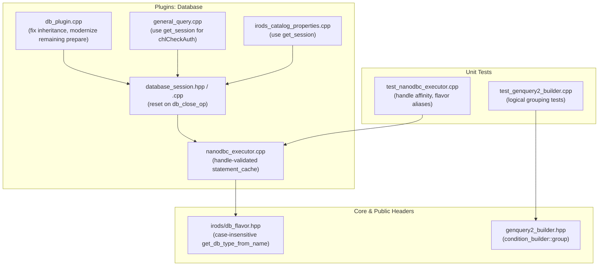

# Implementation Plan: ICAT Modernization Review Remediation

> **For agentic workers:** REQUIRED SUB-SKILL: Use superpowers:subagent-driven-development to implement this plan task-by-task. Steps use checkbox (`- [ ]`) syntax for tracking.

**Goal:** Resolve all correctness bugs, reliability issues, connection storms, and architectural inconsistencies identified in the code review of `feature/genquery2-odbc-icat-modernization`, and commit them cleanly into the branch.

**Architecture:** 
1. Fix the collection inheritance status bug in `db_plugin.cpp` (`_modInheritance` return code handling).
2. Harden `statement_cache::get` to validate native connection handles (`native_dbc_handle`), preventing cross-connection statement collisions.
3. Eliminate the GenQuery1 per-row connection storm in `general_query.cpp` by migrating row auth checks to `get_session()`.
4. Ensure thread-local session cleanup on `db_close_op`.
5. Support case-insensitive and driver product name matching in `get_db_type_from_name` across `db_flavor.hpp` and `nanodbc_executor.cpp`.
6. Add condition grouping (`.group()` / `group(...)`) to `genquery2::builder::condition_builder` for proper SQL operator precedence.
7. Modernize remaining manual `nanodbc::prepare` calls in `db_plugin.cpp` and `irods_catalog_properties.cpp`.
8. Safely convert string views to null-terminated C strings in legacy GenQuery string manipulation.

**Architecture Diagram:**

**Tech Stack:** C++20, `nanodbc`, unixODBC, Catch2, CMake.

## Global Constraints

- Complete backward compatibility with existing catalog APIs.
- Zero memory leaks, dangling pointers, or unbound statement references.
- All unit tests and server targets must compile and pass cleanly without warnings.
- All changes must be committed to `feature/genquery2-odbc-icat-modernization`.

---

### Task 1: Fix Critical Bugs (Inheritance Status, Cache Handle Validation, Session Reset)

**Files:**
- Modify: `plugins/database/src/db_plugin.cpp:1670-1695, 7490-7500`
- Modify: `plugins/database/src/nanodbc_executor.cpp:16-45`
- Test: `unit_tests/src/test_nanodbc_executor.cpp`

**Interfaces:**
- Consumes: `_modInheritance`, `statement_cache::get`, `get_database_session().reset()`
- Produces: Correct success returns for inheritance, connection-validated statement caching, session cleanup on disconnect

- [x] **Step 1: Fix inheritance return status in `db_plugin.cpp`**
  Update line 7494 to return `SUCCESS()` when `status == 0` instead of unconditionally returning `ERROR`.

- [x] **Step 2: Add connection handle validation in `statement_cache::get`**
  In `plugins/database/src/nanodbc_executor.cpp`, ensure cached statements are only returned if `cached_stmt.connection().native_dbc_handle() == _conn.native_dbc_handle()`.

- [x] **Step 3: Call `get_database_session().reset()` in `db_close_op`**
  In `plugins/database/src/db_plugin.cpp:1688`, invoke `irods::experimental::catalog::get_database_session().reset()` on catalog close.

- [x] **Step 4: Add unit test in `test_nanodbc_executor.cpp` for statement cache connection affinity**
  Verify that when a statement was cached on connection A, querying on connection B does not return connection A's statement.

- [x] **Step 5: Run tests**
  Execute `./build/unit_tests/irods_nanodbc_executor`.

---

### Task 2: Eliminate GenQuery1 Connection Storm & Secure C-String Conversions

**Files:**
- Modify: `plugins/database/src/general_query.cpp:30-45, 830-845, 1570-1590, 2180-2235`

**Interfaces:**
- Consumes: `irods::experimental::catalog::get_session()`
- Produces: Persistent connection reuse during row authentication checks, safe null-terminated string concatenation

- [x] **Step 1: Include `database_session.hpp` in `general_query.cpp`**
  Include `"irods/private/database_session.hpp"` in `plugins/database/src/general_query.cpp`.

- [x] **Step 2: Replace `new_database_connection` in `chlCheckAuth`**
  In `plugins/database/src/general_query.cpp` lines 2184 and 2217, replace `new_database_connection()` with `get_session()`.

- [x] **Step 3: Safely null-terminate `string_view` before `rstrcat`**
  Convert `flavor.cast_decimal_or_number` and `flavor.length_fn` to temporary `std::string` or ensure null-termination before passing to `rstrcat`.

---

### Task 3: Case-Insensitive Database Flavor & Alias Normalization

**Files:**
- Modify: `server/core/include/irods/db_flavor.hpp:203-215`
- Modify: `plugins/database/src/nanodbc_executor.cpp:145-165`
- Test: `unit_tests/src/test_nanodbc_executor.cpp`

**Interfaces:**
- Consumes: DBMS product names and config strings ("MySQL", "MariaDB", "Oracle", "PostgreSQL Unicode", etc.)
- Produces: Consistent `int` database type resolution across core and executor

- [x] **Step 1: Update `get_db_type_from_name` in `db_flavor.hpp`**
  Implement case-insensitive matching and alias resolution for `"mysql"`, `"mariadb"`, `"oracle"`, `"postgres"`.

- [x] **Step 2: Simplify `nanodbc_executor.cpp` sequence helpers**
  Route `get_next_sequence_sql(seq, dbms)` and `get_current_sequence_sql(seq, dbms)` directly through `get_db_type_from_name(dbms)`.

- [x] **Step 3: Add unit tests for case-insensitive flavor resolution**
  Verify `"MySQL"`, `"Oracle"`, `"PostgreSQL Unicode"`, `"MariaDB"` all resolve accurately in `test_nanodbc_executor.cpp`.

---

### Task 4: GenQuery2 Condition Grouping & Modernize Remaining Statements

**Files:**
- Modify: `server/genquery2/include/irods/private/genquery2_builder.hpp:35-65, 280-288`
- Modify: `plugins/database/src/db_plugin.cpp:10950-10980, 11135-11160`
- Modify: `plugins/database/src/irods_catalog_properties.cpp:35-45`
- Test: `unit_tests/src/test_genquery2_builder.cpp`

**Interfaces:**
- Consumes: `genquery2::builder::group`, `executor.query_integer`, `executor.execute_query`
- Produces: AST `logical_grouping` parentheses emission, cached execution for delay rule info and auth checks

- [x] **Step 1: Add `.group()` and `group(...)` to `condition_builder`**
  In `server/genquery2/include/irods/private/genquery2_builder.hpp`, implement `.group()` and free function `group(...)` wrapping conditions in `logical_grouping`.

- [x] **Step 2: Add unit test in `test_genquery2_builder.cpp`**
  Verify `group(col("A") == "1" || col("B") == "2") && col("C") == "3"` produces `((A = ? or B = ?) and C = ?)`.

- [x] **Step 3: Modernize `db_check_auth_credentials_op` and `db_get_delay_rule_info_op`**
  Replace direct `nanodbc::statement` and manual prepare with `executor.query_integer` and `executor.execute_query` via `get_session()`.

- [x] **Step 4: Modernize `catalog_properties::capture`**
  Use `get_session()` in `irods_catalog_properties.cpp` instead of `new_database_connection()`.

---

### Task 5: Full Build, Verification, and Commit

- [x] **Step 1: Build all targets**
  Run `make -C build -j$(nproc) irodsServer all-plugins-database all-unit_tests`.

- [x] **Step 2: Run all unit tests**
  Execute Catch2 unit test binaries (`irods_nanodbc_executor`, `irods_genquery2_builder`, `irods_genquery2_sql_dml`, all `irods_chl_*_modern`).

- [x] **Step 3: Commit changes**
  Stage modified files and commit with descriptive commit message.
