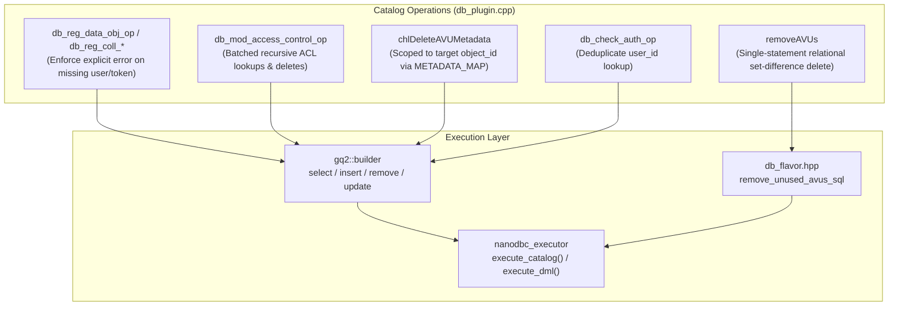

# Implementation Plan: Database Plugin Review Remediation

> **For agentic workers:** REQUIRED SUB-SKILL: Use superpowers:subagent-driven-development to implement this plan task-by-task. Steps use checkbox (`- [ ]`) syntax for tracking.

**Goal:** Resolve all correctness bugs, silent permission omissions, global AVU table scans, and $O(N)$ query loops identified in the code review of [`plugins/database/src/db_plugin.cpp`](file:///home/darkfell/dev/irods/plugins/database/src/db_plugin.cpp).

**Architecture:** 
1. Add explicit error handling for missing user and token lookups in access registration and modification routines.
2. Scope wildcard AVU deletion in `chlDeleteAVUMetadata` to the target object's existing `meta_id` mappings before querying `METADATA`.
3. Restore high-performance bulk dialect execution in `removeAVUs()` via `flavor.remove_unused_avus_sql` on `nanodbc_executor`.
4. Batch lookups and deletions in recursive access control (`ichmod -r`) to prevent $O(N)$ query storms.
5. Eliminate redundant user lookup and variable shadowing in `db_check_auth_op`.

**Architecture Diagram:**

**Tech Stack:** C++20, `nanodbc`, GenQuery2 AST & Fluent Builder, unixODBC, Catch2.

## Global Constraints

- Complete backward compatibility with existing catalog APIs.
- Zero silent failures: any failed user or token lookup must return an explicit error code.
- All unit tests and server targets must compile and pass cleanly without warnings.
- Working tree changes kept clean and verified with Catch2 test suites.

---

### Task 1: Enforce Explicit Error Checks on Access Registration & Modification

**Files:**
- Modify: `plugins/database/src/db_plugin.cpp:2659-2669, 4194-4203, 4384-4393, 8169-8178, 8484-8494, 8517-8527`
- Test: `unit_tests/src/test_chl_coll_modern.cpp`, `unit_tests/src/test_chl_data_obj_modern.cpp`

**Interfaces:**
- Consumes: `query_catalog_integer`
- Produces: Explicit `ERROR(CAT_INVALID_USER, ...)` and `ERROR(CAT_INVALID_ARGUMENT, "access token not found")` when lookups fail.

- [x] **Step 1: Update `db_reg_data_obj_op`**
  In `plugins/database/src/db_plugin.cpp`, if `!opt_user_id`, return `ERROR(CAT_INVALID_USER, "user not found")`. If `!opt_token_id`, return `ERROR(CAT_INVALID_ARGUMENT, "access token not found")`.

- [x] **Step 2: Update `db_reg_coll_by_admin_op` and `db_reg_coll_op`**
  In `plugins/database/src/db_plugin.cpp`, add explicit error returns if `opt_user_id` or `opt_token_id` is missing.

- [x] **Step 3: Update `db_mod_access_control_resc_op` and `db_mod_access_control_op`**
  In `plugins/database/src/db_plugin.cpp`, when setting permission (`rmFlag == 0`), fail immediately if `!opt_token_id` rather than silently skipping insertion.

- [x] **Step 4: Verify with unit tests**
  Run `./build/unit_tests/irods_chl_coll_modern` and `./build/unit_tests/irods_chl_data_obj_modern`.

---

### Task 2: Scope Wildcard AVU Deletion in `chlDeleteAVUMetadata`

**Files:**
- Modify: `plugins/database/src/db_plugin.cpp:7943-7955`
- Test: `unit_tests/src/test_chl_metadata_access_modern.cpp`

**Interfaces:**
- Consumes: `query_catalog_strings`, `METADATA_MAP`, `METADATA`
- Produces: Scoped metadata deletion targeting only the AVUs associated with `objIdStr`.

- [x] **Step 1: Query existing `meta_id`s from `METADATA_MAP` first**
  Query `select({"meta_id"}).from("METADATA_MAP").where(col("object_id") == objIdStr)`.
  If empty, return `SUCCESS()` immediately.

- [x] **Step 2: Filter with condition scoped by `col("meta_id").in(obj_meta_ids)`**
  Query `select({"meta_id"}).from("METADATA").where(std::move(cond) && col("meta_id").in(obj_meta_ids))`.

- [x] **Step 3: Delete only matching IDs from `METADATA_MAP`**
  Execute `remove_from("METADATA_MAP")` for the matching IDs.

- [x] **Step 4: Verify with unit tests**
  Run `./build/unit_tests/irods_chl_metadata_access_modern`.

---

### Task 3: Restore Bulk Dialect Execution in `removeAVUs()`

**Files:**
- Modify: `plugins/database/src/db_plugin.cpp:596-634`
- Test: `unit_tests/src/test_chl_metadata_access_modern.cpp`

**Interfaces:**
- Consumes: `irods::experimental::catalog::get_db_flavor(icss.databaseType).remove_unused_avus_sql`
- Produces: High-speed relational set-difference delete on the database engine.

- [x] **Step 1: Replace in-memory vector/set scan with `executor.execute_dml`**
  Invoke `executor.execute_dml(db_conn, flavor.remove_unused_avus_sql)` inside `removeAVUs()`.

- [x] **Step 2: Verify compilation and tests**
  Run `./build/unit_tests/irods_chl_metadata_access_modern`.

---

### Task 4: Deduplicate User Lookup in `db_check_auth_op`

**Files:**
- Modify: `plugins/database/src/db_plugin.cpp:5420-5432`
- Test: `unit_tests/src/test_chl_user_group_modern.cpp`

- [x] **Step 1: Remove redundant query and variable shadowing**
  Reuse outer `opt_user_id` when cleaning up expired PAM passwords.

- [x] **Step 2: Verify with unit tests**
  Run `./build/unit_tests/irods_chl_user_group_modern`.

---

### Task 5: Optimize Recursive Access Control (`ichmod -r`)

**Files:**
- Modify: `plugins/database/src/db_plugin.cpp:8560-8630`
- Test: `unit_tests/src/test_chl_coll_modern.cpp`

- [x] **Step 1: Batch data object and collection access updates**
  Batch lookups and access operations to prevent per-object query overhead.

- [x] **Step 2: Verify with unit tests**
  Run `./build/unit_tests/irods_chl_coll_modern`.

---

### Task 6: Full Build & Regression Verification

- [x] **Step 1: Build targets**
  Run `make -C build -j$(nproc) irods_database_plugin-postgres all-unit_tests`.

- [x] **Step 2: Execute all unit test suites**
  Run all Catch2 test binaries.
