# Phase 1: GenQuery2 Core DML & Fluent Builder Implementation Plan

> **For agentic workers:** REQUIRED SUB-SKILL: Use superpowers:subagent-driven-development to implement this plan task-by-task. Steps use checkbox (`- [ ]`) syntax for tracking.

**Goal:** Extend the GenQuery2 query language compiler and AST with DML statements (`insert`, `update`, `remove`), implement a type-safe in-memory C++ fluent builder (`gq2::builder`), and extend `to_sql()` to lower DML AST nodes into parameterized SQL.

**Architecture:** GenQuery2 currently models `SELECT` operations. This phase extends the AST with DML statement structures, introduces an in-memory fluent builder API that allows high-throughput server routines to construct typed ASTs without paying a Flex/Bison parsing CPU penalty, and updates the SQL generator (`genquery2_sql.cpp`) to emit parameterized SQL statements with positional bindings (`?`) for PostgreSQL, MySQL, and CockroachDB.

**Architecture Diagram:**

```mermaid
graph TD
    subgraph "C++ Callers (icatHighLevelRoutines)"
        CODE["C++ Catalog Code"] --> BUILDER["gq2::builder (Fluent API)"]
    end

    subgraph "AST Definitions (server/genquery2)"
        BUILDER --> INSERT["insert AST node"]
        BUILDER --> UPDATE["update AST node"]
        BUILDER --> REMOVE["remove AST node"]
        INSERT --> STMT["using statement = std::variant<select, insert, update, remove>"]
        UPDATE --> STMT
        REMOVE --> STMT
    end

    subgraph "SQL Lowering Engine (genquery2_sql)"
        STMT --> LOWER["to_sql(statement, options)"]
        LOWER --> MAPPINGS["Schema Table & Column Mappings"]
        MAPPINGS --> EMIT["SQL: 'INSERT/UPDATE/DELETE ... ?' + params vector"]
    end
```



**Tech Stack:** C++20, Boost.Graph, Catch2, CMake.

## Global Constraints
- Target Branch: `feature/genquery2-odbc-icat-modernization`
- Location: `server/genquery2/include/irods/private/genquery2_ast_types.hpp`, `server/genquery2/include/irods/private/genquery2_builder.hpp`, `server/genquery2/src/genquery2_sql.cpp`
- Zero SQL string interpolation: all literal values must be emitted as parameters in `std::vector<std::string>`.
- Preserves full compatibility with existing `select` AST lowering.

---

### Task 1: GenQuery2 DML AST Extensions & Variant Types

**Files:**
- Modify: `server/genquery2/include/irods/private/genquery2_ast_types.hpp`
- Test: `unit_tests/src/test_genquery2_dml_ast.cpp`
- CMake: `unit_tests/cmake/test_config/irods_genquery2_dml_ast.cmake`
- Modify: `unit_tests/CMakeLists.txt`

**Interfaces:**
- Produces:
  ```cpp
  namespace irods::experimental::genquery2 {
      struct insert {
          std::string_view target_entity;
          std::vector<std::pair<std::string, std::string>> assignments;
      };

      struct update {
          std::string_view target_entity;
          std::vector<std::pair<std::string, std::string>> assignments;
          conditions where_conditions;
      };

      struct remove {
          std::string_view target_entity;
          conditions where_conditions;
      };

      using statement = std::variant<select, insert, update, remove>;
  }
  ```

- [ ] **Step 1: Write the failing Catch2 test for DML AST structures**

Create `unit_tests/src/test_genquery2_dml_ast.cpp`:
```cpp
#include <catch2/catch.hpp>
#include "irods/private/genquery2_ast_types.hpp"
#include <variant>

TEST_CASE("GenQuery2 DML AST Node Construction and Visitation", "[genquery2][ast]")
{
    namespace gq2 = irods::experimental::genquery2;

    SECTION("insert node structure")
    {
        gq2::insert ins;
        ins.target_entity = "DATA_OBJECT";
        ins.assignments.emplace_back("DATA_NAME", "foo.txt");
        ins.assignments.emplace_back("DATA_SIZE", "1024");

        REQUIRE(ins.target_entity == "DATA_OBJECT");
        REQUIRE(ins.assignments.size() == 2);
        REQUIRE(ins.assignments[0].first == "DATA_NAME");
        REQUIRE(ins.assignments[0].second == "foo.txt");

        gq2::statement stmt = ins;
        REQUIRE(std::holds_alternative<gq2::insert>(stmt));
    }

    SECTION("update node structure")
    {
        gq2::update upd;
        upd.target_entity = "DATA_OBJECT";
        upd.assignments.emplace_back("DATA_SIZE", "2048");

        gq2::statement stmt = upd;
        REQUIRE(std::holds_alternative<gq2::update>(stmt));
    }

    SECTION("remove node structure")
    {
        gq2::remove rem;
        rem.target_entity = "DATA_OBJECT";

        gq2::statement stmt = rem;
        REQUIRE(std::holds_alternative<gq2::remove>(stmt));
    }
}
```

- [ ] **Step 2: Add test to CMake build configuration**

Create `unit_tests/cmake/test_config/irods_genquery2_dml_ast.cmake`:
```cmake
set(TARGET_NAME "irods_genquery2_dml_ast")

set(
  IRODS_TEST_SOURCES
  "${CMAKE_CURRENT_SOURCE_DIR}/src/test_genquery2_dml_ast.cpp"
)

add_executable(${TARGET_NAME} ${IRODS_TEST_SOURCES})

target_include_directories(
  ${TARGET_NAME}
  PRIVATE
  "${CMAKE_SOURCE_DIR}/server/genquery2/include"
  "${IRODS_EXTERNALS_FULLPATH_BOOST}/include"
  "${IRODS_EXTERNALS_FULLPATH_CATCH2}/include"
)

target_link_libraries(
  ${TARGET_NAME}
  PRIVATE
  irods_common
)
```

Register in `unit_tests/CMakeLists.txt`:
```diff
+include("cmake/test_config/irods_genquery2_dml_ast.cmake")
```

- [ ] **Step 3: Run the test to confirm it fails to compile**

Run: `cmake --build /home/darkfell/dev/irods/build --target irods_genquery2_dml_ast`
Expected: Compile failure on undefined types `gq2::insert`, `gq2::update`, `gq2::remove`, `gq2::statement`.

- [ ] **Step 4: Implement DML AST structures in `genquery2_ast_types.hpp`**

Update `server/genquery2/include/irods/private/genquery2_ast_types.hpp`:
```cpp
    struct insert
    {
        std::string_view target_entity;
        std::vector<std::pair<std::string, std::string>> assignments;
    };

    struct update
    {
        std::string_view target_entity;
        std::vector<std::pair<std::string, std::string>> assignments;
        conditions where_conditions;
    };

    struct remove
    {
        std::string_view target_entity;
        conditions where_conditions;
    };

    using statement = std::variant<select, insert, update, remove>;
```

- [ ] **Step 5: Compile and run test to confirm it passes**

Run: `cmake --build /home/darkfell/dev/irods/build --target irods_genquery2_dml_ast && ./build/unit_tests/irods_genquery2_dml_ast`
Expected: All assertions pass.

- [ ] **Step 6: Commit changes**

```bash
git add server/genquery2/include/irods/private/genquery2_ast_types.hpp \
        unit_tests/src/test_genquery2_dml_ast.cpp \
        unit_tests/cmake/test_config/irods_genquery2_dml_ast.cmake \
        unit_tests/CMakeLists.txt
git commit -m "feat(genquery2): introduce DML AST statement structures"
```

---

### Task 2: In-Memory Fluent Query Builder (`gq2::builder`)

**Files:**
- Create: `server/genquery2/include/irods/private/genquery2_builder.hpp`
- Create: `server/genquery2/src/genquery2_builder.cpp`
- Modify: `server/genquery2/CMakeLists.txt`
- Test: `unit_tests/src/test_genquery2_builder.cpp`
- CMake: `unit_tests/cmake/test_config/irods_genquery2_builder.cmake`
- Modify: `unit_tests/CMakeLists.txt`

**Interfaces:**
- Produces:
  ```cpp
  namespace irods::experimental::genquery2::builder {
      class col {
      public:
          explicit col(std::string_view name);
          auto operator==(std::string_view val) const -> condition;
          auto operator!=(std::string_view val) const -> condition;
          auto operator>(std::string_view val) const -> condition;
          auto operator<(std::string_view val) const -> condition;
          auto like(std::string_view pattern) const -> condition;
      };

      auto insert_into(std::string_view entity) -> insert_builder;
      auto update(std::string_view entity) -> update_builder;
      auto remove_from(std::string_view entity) -> remove_builder;
      auto select(std::vector<std::string> cols) -> select_builder;
  }
  ```

- [ ] **Step 1: Write Catch2 unit test for fluent builder**

Create `unit_tests/src/test_genquery2_builder.cpp`:
```cpp
#include <catch2/catch.hpp>
#include "irods/private/genquery2_builder.hpp"

TEST_CASE("GenQuery2 Fluent Builder API", "[genquery2][builder]")
{
    namespace gq2 = irods::experimental::genquery2;
    using gq2::builder::col;

    SECTION("Build INSERT AST")
    {
        auto ins = gq2::builder::insert_into("DATA_OBJECT")
            .set("DATA_NAME", "file.txt")
            .set("DATA_SIZE", "512")
            .build();

        REQUIRE(ins.target_entity == "DATA_OBJECT");
        REQUIRE(ins.assignments.size() == 2);
    }

    SECTION("Build UPDATE AST with WHERE clause")
    {
        auto upd = gq2::builder::update("DATA_OBJECT")
            .set("DATA_SIZE", "1024")
            .where(col("DATA_ID") == "100" && col("DATA_REPL_NUM") == "0")
            .build();

        REQUIRE(upd.target_entity == "DATA_OBJECT");
        REQUIRE(upd.assignments.size() == 1);
    }

    SECTION("Build REMOVE AST with WHERE clause")
    {
        auto rem = gq2::builder::remove_from("DATA_OBJECT")
            .where(col("DATA_ID") == "100")
            .build();

        REQUIRE(rem.target_entity == "DATA_OBJECT");
    }
}
```

- [ ] **Step 2: Add test to CMake build configuration**

Create `unit_tests/cmake/test_config/irods_genquery2_builder.cmake` and register in `unit_tests/CMakeLists.txt`.

- [ ] **Step 3: Implement `genquery2_builder.hpp` and `genquery2_builder.cpp`**

Implement builder classes with condition composition operators (`&&`, `||`, `!`).

- [ ] **Step 4: Run test to confirm it compiles and passes**

Run: `cmake --build /home/darkfell/dev/irods/build --target irods_genquery2_builder && ./build/unit_tests/irods_genquery2_builder`
Expected: All tests pass.

- [ ] **Step 5: Commit changes**

```bash
git add server/genquery2/include/irods/private/genquery2_builder.hpp \
        server/genquery2/src/genquery2_builder.cpp \
        server/genquery2/CMakeLists.txt \
        unit_tests/src/test_genquery2_builder.cpp \
        unit_tests/cmake/test_config/irods_genquery2_builder.cmake \
        unit_tests/CMakeLists.txt
git commit -m "feat(genquery2): implement fluent C++ query builder"
```

---

### Task 3: DML SQL Lowering Engine in `genquery2_sql`

**Files:**
- Modify: `server/genquery2/include/irods/private/genquery2_sql.hpp`
- Modify: `server/genquery2/src/genquery2_sql.cpp`
- Test: `unit_tests/src/test_genquery2_sql_dml.cpp`
- CMake: `unit_tests/cmake/test_config/irods_genquery2_sql_dml.cmake`
- Modify: `unit_tests/CMakeLists.txt`

**Interfaces:**
- Produces:
  ```cpp
  auto to_sql(const insert& _ins, const options& _opts) -> std::tuple<std::string, std::vector<std::string>>;
  auto to_sql(const update& _upd, const options& _opts) -> std::tuple<std::string, std::vector<std::string>>;
  auto to_sql(const remove& _rem, const options& _opts) -> std::tuple<std::string, std::vector<std::string>>;
  auto to_sql(const statement& _stmt, const options& _opts) -> std::tuple<std::string, std::vector<std::string>>;
  ```

- [ ] **Step 1: Write Catch2 unit tests for DML SQL lowering**

Create `unit_tests/src/test_genquery2_sql_dml.cpp` asserting SQL generation and positional parameter emission for `insert`, `update`, and `remove`.

- [ ] **Step 2: Add test to CMake build configuration**

Create `unit_tests/cmake/test_config/irods_genquery2_sql_dml.cmake` and register in `unit_tests/CMakeLists.txt`.

- [ ] **Step 3: Implement DML lowering overloads in `genquery2_sql.cpp`**

Map target entities to catalog tables (`R_DATA_MAIN`, `R_COLL_MAIN`, etc.) and columns via existing `column_name_mappings`.

- [ ] **Step 4: Run test to confirm it compiles and passes**

Run: `cmake --build /home/darkfell/dev/irods/build --target irods_genquery2_sql_dml && ./build/unit_tests/irods_genquery2_sql_dml`
Expected: PASS.

- [ ] **Step 5: Commit changes**

```bash
git add server/genquery2/include/irods/private/genquery2_sql.hpp \
        server/genquery2/src/genquery2_sql.cpp \
        unit_tests/src/test_genquery2_sql_dml.cpp \
        unit_tests/cmake/test_config/irods_genquery2_sql_dml.cmake \
        unit_tests/CMakeLists.txt
git commit -m "feat(genquery2): add DML SQL generation and parameter binding"
```
