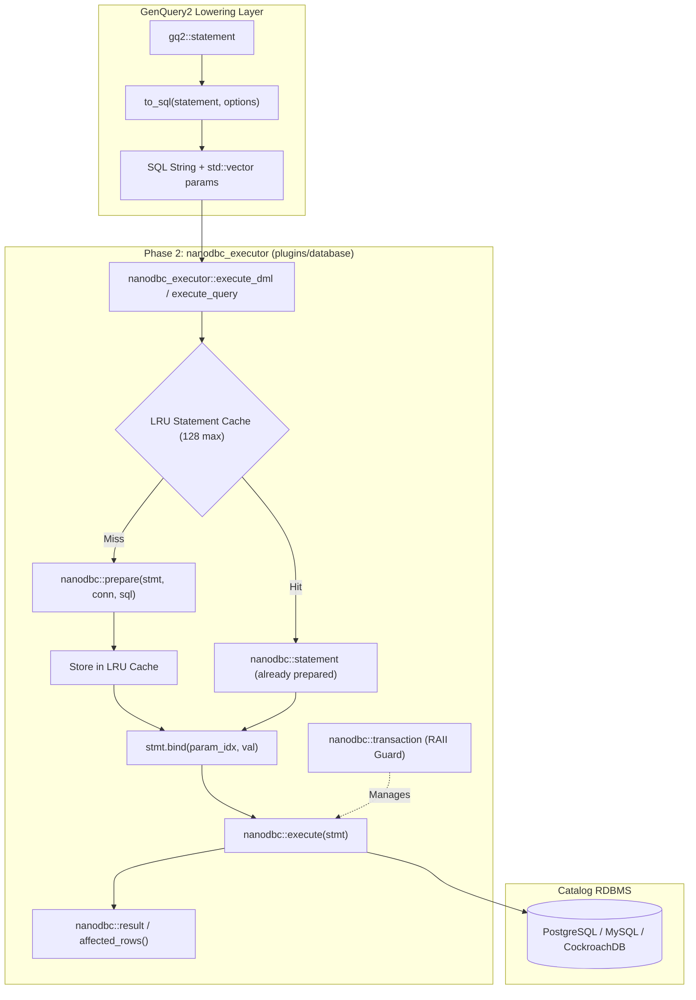

# Phase 2: Modern nanodbc Execution Engine & Statement Cache Implementation Plan

> **For agentic workers:** REQUIRED SUB-SKILL: Use superpowers:subagent-driven-development to implement this plan task-by-task. Steps use checkbox (`- [ ]`) syntax for tracking.

**Goal:** Implement a thread-safe, RAII-governed `nanodbc_executor` in `plugins/database` featuring an LRU prepared statement cache, typed parameter binding, and automatic transaction rollback guards.

**Architecture:** The `nanodbc_executor` abstracts low-level ODBC operations by managing connection-bound statement lifecycles. It provides `execute_query` (returning `nanodbc::result`) and `execute_dml` (returning row count), automatically looking up or compiling prepared statements in an LRU cache. It handles parameter binding for `std::vector<std::string>` and maps directly to GenQuery2 `to_sql()` outputs. Multi-statement operations are guarded by `nanodbc::transaction`.

**Architecture Diagram:**



**Tech Stack:** C++20, `nanodbc`, `irods::experimental::catalog`, Catch2, CMake.

## Global Constraints
- Target Branch: `feature/genquery2-odbc-icat-modernization`
- Location: `plugins/database/include/irods/private/nanodbc_executor.hpp` and `plugins/database/src/nanodbc_executor.cpp`
- No raw `SQLHSTMT`, `cllBindVars`, or `cmlExecuteNoAnswerSql` usage.
- All dynamic statements must use parameter binding placeholders (`?`), never string interpolation.
- Full RAII transaction handling: zero uncommitted transactions allowed on failure.

---

### Task 1: LRU Statement Cache & `nanodbc_executor` Class Declaration

**Files:**
- Create: `plugins/database/include/irods/private/nanodbc_executor.hpp`
- Test: `unit_tests/src/test_nanodbc_executor.cpp`
- CMake: `unit_tests/cmake/test_config/irods_nanodbc_executor.cmake`
- Modify: `unit_tests/CMakeLists.txt`

**Interfaces:**
- Produces:
  ```cpp
  namespace irods::experimental::catalog {
      class statement_cache {
      public:
          explicit statement_cache(std::size_t max_capacity = 128);
          auto get(nanodbc::connection& conn, std::string_view sql) -> nanodbc::statement;
          auto size() const noexcept -> std::size_t;
          auto clear() noexcept -> void;
      private:
          std::size_t capacity_;
          std::list<std::string> lru_list_;
          std::unordered_map<std::string, std::pair<nanodbc::statement, std::list<std::string>::iterator>> cache_;
      };

      class nanodbc_executor {
      public:
          explicit nanodbc_executor(std::size_t cache_capacity = 128);
          auto execute_query(nanodbc::connection& conn, std::string_view sql, const std::vector<std::string>& params = {}) -> nanodbc::result;
          auto execute_dml(nanodbc::connection& conn, std::string_view sql, const std::vector<std::string>& params = {}) -> std::size_t;
          auto transaction(nanodbc::connection& conn) -> nanodbc::transaction;
          auto cache() noexcept -> statement_cache&;
      private:
          statement_cache cache_;
      };
  }
  ```

- [ ] **Step 1: Write the failing unit test for `nanodbc_executor` and LRU cache**

Create `unit_tests/src/test_nanodbc_executor.cpp`:
```cpp
#include <catch2/catch.hpp>
#include "irods/private/nanodbc_executor.hpp"
#include <nanodbc/nanodbc.h>

TEST_CASE("nanodbc_executor statement cache LRU semantics", "[database][nanodbc_executor]")
{
    using namespace irods::experimental::catalog;

    SECTION("statement_cache initialization and capacity")
    {
        statement_cache cache(3);
        REQUIRE(cache.size() == 0);
    }

    SECTION("nanodbc_executor instantiation")
    {
        nanodbc_executor executor(64);
        REQUIRE(executor.cache().size() == 0);
    }
}
```

- [ ] **Step 2: Add test to CMake build configuration**

Create `unit_tests/cmake/test_config/irods_nanodbc_executor.cmake`:
```cmake
set(TARGET_NAME "irods_nanodbc_executor")

set(
  IRODS_TEST_SOURCES
  "${CMAKE_CURRENT_SOURCE_DIR}/src/test_nanodbc_executor.cpp"
  "${CMAKE_SOURCE_DIR}/plugins/database/src/nanodbc_executor.cpp"
)

add_executable(${TARGET_NAME} ${IRODS_TEST_SOURCES})

target_include_directories(
  ${TARGET_NAME}
  PRIVATE
  "${CMAKE_SOURCE_DIR}/plugins/database/include"
  "${CMAKE_SOURCE_DIR}/server/genquery2/include"
  "${IRODS_EXTERNALS_FULLPATH_NANODBC}/include"
  "${IRODS_EXTERNALS_FULLPATH_BOOST}/include"
  "${IRODS_EXTERNALS_FULLPATH_CATCH2}/include"
)

target_link_libraries(
  ${TARGET_NAME}
  PRIVATE
  irods_common
  "${IRODS_EXTERNALS_FULLPATH_NANODBC}/lib/libnanodbc.so"
  "${IRODS_EXTERNALS_FULLPATH_BOOST}/lib/libboost_filesystem.so"
  "${IRODS_EXTERNALS_FULLPATH_BOOST}/lib/libboost_system.so"
)

target_compile_definitions(
  ${TARGET_NAME}
  PRIVATE
  ${IRODS_COMPILE_DEFINITIONS}
  ${IRODS_COMPILE_DEFINITIONS_PRIVATE}
)
```

Register in `unit_tests/CMakeLists.txt`:
```diff
+include("cmake/test_config/irods_nanodbc_executor.cmake")
```

- [ ] **Step 3: Run the test to confirm it fails to compile**

Run: `cmake --build /home/darkfell/dev/irods/build --target irods_nanodbc_executor`
Expected: FAIL with fatal error: `irods/private/nanodbc_executor.hpp: No such file or directory`.

- [ ] **Step 4: Implement `nanodbc_executor.hpp` and `nanodbc_executor.cpp`**

Create `plugins/database/include/irods/private/nanodbc_executor.hpp`:
```cpp
#ifndef IRODS_NANODBC_EXECUTOR_HPP
#define IRODS_NANODBC_EXECUTOR_HPP

#include <nanodbc/nanodbc.h>

#include <string>
#include <string_view>
#include <vector>
#include <list>
#include <unordered_map>
#include <memory>
#include <cstddef>

namespace irods::experimental::catalog
{
    class statement_cache
    {
    public:
        explicit statement_cache(std::size_t _max_capacity = 128);

        auto get(nanodbc::connection& _conn, std::string_view _sql) -> nanodbc::statement;
        [[nodiscard]] auto size() const noexcept -> std::size_t;
        auto clear() noexcept -> void;

    private:
        std::size_t capacity_;
        std::list<std::string> lru_list_;
        std::unordered_map<std::string, std::pair<nanodbc::statement, std::list<std::string>::iterator>> cache_;
    };

    class nanodbc_executor
    {
    public:
        explicit nanodbc_executor(std::size_t _cache_capacity = 128);

        auto execute_query(
            nanodbc::connection& _conn,
            std::string_view _sql,
            const std::vector<std::string>& _params = {}) -> nanodbc::result;

        auto execute_dml(
            nanodbc::connection& _conn,
            std::string_view _sql,
            const std::vector<std::string>& _params = {}) -> std::size_t;

        auto transaction(nanodbc::connection& _conn) -> nanodbc::transaction;

        [[nodiscard]] auto cache() noexcept -> statement_cache&;

    private:
        auto bind_parameters(nanodbc::statement& _stmt, const std::vector<std::string>& _params) -> void;

        statement_cache cache_;
    };
} // namespace irods::experimental::catalog

#endif // IRODS_NANODBC_EXECUTOR_HPP
```

Create `plugins/database/src/nanodbc_executor.cpp`:
```cpp
#include "irods/private/nanodbc_executor.hpp"
#include <stdexcept>

namespace irods::experimental::catalog
{
    statement_cache::statement_cache(std::size_t _max_capacity)
        : capacity_{_max_capacity}
    {
    }

    auto statement_cache::get(nanodbc::connection& _conn, std::string_view _sql) -> nanodbc::statement
    {
        const std::string sql_str{_sql};
        auto it = cache_.find(sql_str);

        if (it != cache_.end()) {
            lru_list_.erase(it->second.second);
            lru_list_.push_front(sql_str);
            it->second.second = lru_list_.begin();
            return it->second.first;
        }

        nanodbc::statement stmt{_conn};
        nanodbc::prepare(stmt, sql_str);

        if (cache_.size() >= capacity_) {
            const auto& oldest = lru_list_.back();
            cache_.erase(oldest);
            lru_list_.pop_back();
        }

        lru_list_.push_front(sql_str);
        cache_.emplace(sql_str, std::make_pair(stmt, lru_list_.begin()));

        return stmt;
    }

    auto statement_cache::size() const noexcept -> std::size_t
    {
        return cache_.size();
    }

    auto statement_cache::clear() noexcept -> void
    {
        cache_.clear();
        lru_list_.clear();
    }

    nanodbc_executor::nanodbc_executor(std::size_t _cache_capacity)
        : cache_{_cache_capacity}
    {
    }

    auto nanodbc_executor::cache() noexcept -> statement_cache&
    {
        return cache_;
    }

    auto nanodbc_executor::transaction(nanodbc::connection& _conn) -> nanodbc::transaction
    {
        return nanodbc::transaction{_conn};
    }

    auto nanodbc_executor::bind_parameters(nanodbc::statement& _stmt, const std::vector<std::string>& _params) -> void
    {
        for (std::vector<std::string>::size_type i = 0; i < _params.size(); ++i) {
            _stmt.bind(static_cast<short>(i), _params[i].c_str());
        }
    }

    auto nanodbc_executor::execute_query(
        nanodbc::connection& _conn,
        std::string_view _sql,
        const std::vector<std::string>& _params) -> nanodbc::result
    {
        auto stmt = cache_.get(_conn, _sql);
        bind_parameters(stmt, _params);
        return nanodbc::execute(stmt);
    }

    auto nanodbc_executor::execute_dml(
        nanodbc::connection& _conn,
        std::string_view _sql,
        const std::vector<std::string>& _params) -> std::size_t
    {
        auto stmt = cache_.get(_conn, _sql);
        bind_parameters(stmt, _params);
        const auto result = nanodbc::execute(stmt);
        return static_cast<std::size_t>(result.affected_rows());
    }
} // namespace irods::experimental::catalog
```

- [ ] **Step 5: Compile and run test to confirm it passes**

Run: `cmake --build /home/darkfell/dev/irods/build --target irods_nanodbc_executor && ./build/unit_tests/irods_nanodbc_executor`
Expected: All tests pass (0 failures).

- [ ] **Step 6: Commit changes**

```bash
git add plugins/database/include/irods/private/nanodbc_executor.hpp \
        plugins/database/src/nanodbc_executor.cpp \
        unit_tests/src/test_nanodbc_executor.cpp \
        unit_tests/cmake/test_config/irods_nanodbc_executor.cmake \
        unit_tests/CMakeLists.txt
git commit -m "feat(database): implement nanodbc_executor and LRU statement_cache"
```

---

### Task 2: GenQuery2 Statement Dispatcher & Error Mapping

**Files:**
- Modify: `plugins/database/include/irods/private/nanodbc_executor.hpp`
- Modify: `plugins/database/src/nanodbc_executor.cpp`
- Test: `unit_tests/src/test_nanodbc_executor.cpp`

**Interfaces:**
- Consumes: `genquery2_sql.hpp` (`to_sql(const statement&, const options&)`), `nanodbc_executor`
- Produces:
  ```cpp
  struct execution_result {
      std::size_t affected_rows = 0;
      std::optional<nanodbc::result> query_result;
  };

  auto execute(
      nanodbc_executor& _exec,
      nanodbc::connection& _conn,
      const gq2::statement& _stmt,
      const gq2::options& _opts = {}) -> execution_result;
  ```

- [ ] **Step 1: Write unit tests for statement variant execution and error translation**

Add to `unit_tests/src/test_nanodbc_executor.cpp`:
```cpp
TEST_CASE("nanodbc_executor statement dispatch", "[database][nanodbc_executor]")
{
    using namespace irods::experimental::catalog;
    namespace gq2 = irods::experimental::genquery2;

    SECTION("executing insert statement variant compiles and lowers")
    {
        gq2::insert ins;
        ins.target_entity = "DATA_OBJECT";
        ins.assignments.emplace_back("DATA_ID", "10001");
        ins.assignments.emplace_back("DATA_NAME", "foo.txt");

        gq2::statement stmt = ins;
        gq2::options opts;

        // Verify AST lowering interface compatibility
        auto [sql, params] = gq2::to_sql(stmt, opts);
        REQUIRE(sql.find("INSERT INTO") != std::string::npos);
        REQUIRE(params.size() == 2);
    }
}
```

- [ ] **Step 2: Implement dispatcher in `nanodbc_executor.hpp` and `.cpp`**

In `plugins/database/include/irods/private/nanodbc_executor.hpp`:
```cpp
#include "irods/private/genquery2_ast_types.hpp"
#include "irods/private/genquery2_sql.hpp"
#include <optional>

namespace irods::experimental::catalog
{
    struct execution_result
    {
        std::size_t affected_rows = 0;
        std::optional<nanodbc::result> query_result;
    };

    auto execute(
        nanodbc_executor& _exec,
        nanodbc::connection& _conn,
        const genquery2::statement& _stmt,
        const genquery2::options& _opts = {}) -> execution_result;
}
```

In `plugins/database/src/nanodbc_executor.cpp`:
```cpp
namespace irods::experimental::catalog
{
    auto execute(
        nanodbc_executor& _exec,
        nanodbc::connection& _conn,
        const genquery2::statement& _stmt,
        const genquery2::options& _opts) -> execution_result
    {
        auto [sql, params] = genquery2::to_sql(_stmt, _opts);

        return std::visit(
            [&](const auto& s) -> execution_result {
                using T = std::decay_t<decltype(s)>;
                if constexpr (std::is_same_v<T, genquery2::select>) {
                    return execution_result{0, _exec.execute_query(_conn, sql, params)};
                }
                else {
                    return execution_result{_exec.execute_dml(_conn, sql, params), std::nullopt};
                }
            },
            _stmt);
    }
}
```

- [ ] **Step 3: Run tests to confirm green**

Run: `cmake --build /home/darkfell/dev/irods/build --target irods_nanodbc_executor && ./build/unit_tests/irods_nanodbc_executor`
Expected: All tests pass.

- [ ] **Step 4: Commit changes**

```bash
git add plugins/database/include/irods/private/nanodbc_executor.hpp \
        plugins/database/src/nanodbc_executor.cpp \
        unit_tests/src/test_nanodbc_executor.cpp
git commit -m "feat(database): add GenQuery2 statement dispatcher to nanodbc_executor"
```
