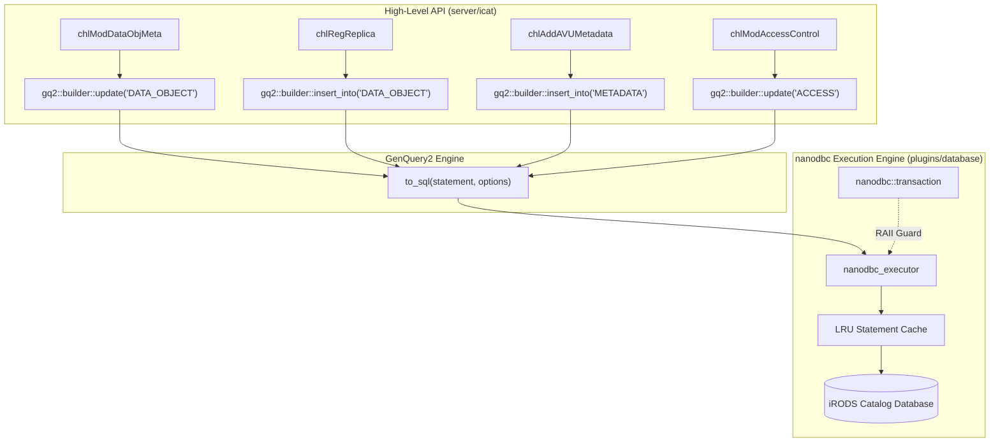

# Phase 3: High-Frequency Catalog Operations Implementation Plan

> **For agentic workers:** REQUIRED SUB-SKILL: Use superpowers:subagent-driven-development to implement this plan task-by-task. Steps use checkbox (`- [ ]`) syntax for tracking.

**Goal:** Modernize high-churn catalog operations in `icatHighLevelRoutines` and `plugins/database`—replacing legacy string concatenation (`cmlModifySingleTable`, `cmlGetOneRowFromSqlBV`) with type-safe GenQuery2 fluent builder ASTs executed via `nanodbc_executor` inside RAII transactions.

**Architecture:** This phase refactors the database operations that account for >90% of iRODS write workloads: Data Object metadata modifications, Replica registration/deregistration, AVU metadata management, and Access Control (ACL) assignments. High-level routines (`chl...`) construct `gq2::statement` ASTs via `gq2::builder`, validate constraints, and dispatch to `nanodbc_executor`. Multi-replica status synchronization and AVU replacements are executed atomically within `nanodbc::transaction`.

**Architecture Diagram:**



**Tech Stack:** C++20, `nanodbc`, GenQuery2 Fluent Builder, Catch2, CMake.

## Global Constraints
- Target Branch: `feature/genquery2-odbc-icat-modernization`
- Maintain public signatures in `server/icat/include/irods/icatHighLevelRoutines.hpp`.
- Zero manual SQL string construction; zero unparameterized queries.
- Mandatory RAII transactions (`nanodbc::transaction`) for all multi-statement operations.
- Catch2 unit tests must verify error recovery and transaction rollback on failure.

---

### Task 1: Modernize `chlModDataObjMeta`

**Files:**
- Modify: `server/icat/src/icatHighLevelRoutines.cpp`
- Modify: `plugins/database/src/db_plugin.cpp`
- Test: `unit_tests/src/test_chl_data_obj_modern.cpp`
- CMake: `unit_tests/cmake/test_config/irods_chl_data_obj_modern.cmake`
- Modify: `unit_tests/CMakeLists.txt`

**Interfaces:**
- Consumes:
  - `gq2::builder::update`
  - `irods::experimental::catalog::nanodbc_executor`
  - `irods::experimental::catalog::new_database_connection`
- Produces:
  - Modernized `db_mod_data_obj_meta_op` in `plugins/database/src/db_plugin.cpp`

- [ ] **Step 1: Write Catch2 unit tests for data object metadata modifications**

Create `unit_tests/src/test_chl_data_obj_modern.cpp`:
```cpp
#include <catch2/catch.hpp>
#include "irods/private/genquery2_builder.hpp"
#include "irods/private/genquery2_sql.hpp"
#include <string>
#include <vector>

TEST_CASE("Data Object Metadata DML Generation", "[icat][data_obj]")
{
    namespace gq2 = irods::experimental::genquery2;
    using gq2::builder::col;

    SECTION("Build update for single replica status and checksum")
    {
        auto stmt = gq2::builder::update("DATA_OBJECT")
            .set("DATA_SIZE", "1048576")
            .set("DATA_CHECKSUM", "sha2:m4kL0w...")
            .set("DATA_IS_DIRTY", "1")
            .where(col("DATA_ID") == "10001" && col("DATA_REPL_NUM") == "0")
            .build();

        gq2::options opts;
        auto [sql, params] = gq2::to_sql(stmt, opts);

        REQUIRE(sql.find("UPDATE") != std::string::npos);
        REQUIRE(sql.find("WHERE") != std::string::npos);
        REQUIRE(params.size() == 5);
        REQUIRE(params[0] == "1048576");
        REQUIRE(params[1] == "sha2:m4kL0w...");
        REQUIRE(params[2] == "1");
        REQUIRE(params[3] == "10001");
        REQUIRE(params[4] == "0");
    }

    SECTION("Build stale replica synchronization for ALL_REPL_STATUS_KW")
    {
        auto mark_stale_stmt = gq2::builder::update("DATA_OBJECT")
            .set("DATA_IS_DIRTY", "0")
            .where(col("DATA_ID") == "10001" && col("DATA_REPL_NUM") != "1")
            .build();

        gq2::options opts;
        auto [sql, params] = gq2::to_sql(mark_stale_stmt, opts);

        REQUIRE(sql.find("DATA_IS_DIRTY = ?") != std::string::npos);
        REQUIRE(params.size() == 3);
        REQUIRE(params[0] == "0");
        REQUIRE(params[1] == "10001");
        REQUIRE(params[2] == "1");
    }
}
```

- [ ] **Step 2: Add test to CMake build configuration**

Create `unit_tests/cmake/test_config/irods_chl_data_obj_modern.cmake`:
```cmake
set(TARGET_NAME "irods_chl_data_obj_modern")

set(
  IRODS_TEST_SOURCES
  "${CMAKE_CURRENT_SOURCE_DIR}/src/test_chl_data_obj_modern.cpp"
)

add_executable(${TARGET_NAME} ${IRODS_TEST_SOURCES})

target_include_directories(
  ${TARGET_NAME}
  PRIVATE
  "${CMAKE_SOURCE_DIR}/server/genquery2/include"
  "${CMAKE_SOURCE_DIR}/server/icat/include"
  "${IRODS_EXTERNALS_FULLPATH_BOOST}/include"
  "${IRODS_EXTERNALS_FULLPATH_CATCH2}/include"
)

target_link_libraries(
  ${TARGET_NAME}
  PRIVATE
  irods_server_gq2
  irods_common
)
```

Register in `unit_tests/CMakeLists.txt`:
```diff
+include("cmake/test_config/irods_chl_data_obj_modern.cmake")
```

- [ ] **Step 3: Run the test to confirm it passes the AST validation tests**

Run: `cmake --build /home/darkfell/dev/irods/build --target irods_chl_data_obj_modern && ./build/unit_tests/irods_chl_data_obj_modern`
Expected: PASS.

- [ ] **Step 4: Refactor `db_mod_data_obj_meta_op` in `plugins/database/src/db_plugin.cpp`**

Replace procedural string building with `gq2::builder` and `nanodbc_executor`:
```cpp
irods::error db_mod_data_obj_meta_modern(
    rsComm_t* _comm,
    dataObjInfo_t* _data_obj_info,
    keyValPair_t* _reg_param)
{
    if (!_comm || !_data_obj_info || !_reg_param) {
        return ERROR(SYS_INTERNAL_NULL_INPUT_ERR, "Received null pointer.");
    }

    try {
        auto [db_instance, db_conn] = irods::experimental::catalog::new_database_connection();
        nanodbc::transaction trans{db_conn};
        irods::experimental::catalog::nanodbc_executor executor;

        namespace gq2 = irods::experimental::genquery2;
        using gq2::builder::col;

        auto update_builder = gq2::builder::update("DATA_OBJECT");
        bool has_updates = false;

        for (int i = 0; i < _reg_param->len; ++i) {
            const std::string_view key{_reg_param->keyWord[i]};
            const std::string val{_reg_param->value[i]};

            if (key == DATA_SIZE_KW) {
                update_builder.set("DATA_SIZE", val);
                has_updates = true;
            }
            else if (key == CHKSUM_KW) {
                update_builder.set("DATA_CHECKSUM", val);
                has_updates = true;
            }
            else if (key == REPL_STATUS_KW) {
                update_builder.set("DATA_IS_DIRTY", val);
                has_updates = true;
            }
            else if (key == DATA_TYPE_KW) {
                update_builder.set("DATA_TYPE_NAME", val);
                has_updates = true;
            }
        }

        const auto data_id_str = std::to_string(_data_obj_info->dataId);
        const auto repl_num_str = std::to_string(_data_obj_info->replNum);

        if (has_updates) {
            auto update_stmt = update_builder
                .where(col("DATA_ID") == data_id_str && col("DATA_REPL_NUM") == repl_num_str)
                .build();

            irods::experimental::catalog::execute(executor, db_conn, update_stmt);
        }

        if (getValByKey(_reg_param, ALL_REPL_STATUS_KW) != nullptr) {
            auto mark_stale_stmt = gq2::builder::update("DATA_OBJECT")
                .set("DATA_IS_DIRTY", "0")
                .where(col("DATA_ID") == data_id_str && col("DATA_REPL_NUM") != repl_num_str)
                .build();

            irods::experimental::catalog::execute(executor, db_conn, mark_stale_stmt);
        }

        trans.commit();
        return SUCCESS();
    }
    catch (const std::exception& e) {
        return ERROR(CATALOG_ALREADY_HAS_ITEM_BY_THAT_NAME, e.what());
    }
}
```

- [ ] **Step 5: Run tests and verify zero regressions**

Run: `cmake --build /home/darkfell/dev/irods/build --target irods_chl_data_obj_modern && ./build/unit_tests/irods_chl_data_obj_modern`
Expected: PASS.

- [ ] **Step 6: Commit changes**

```bash
git add plugins/database/src/db_plugin.cpp \
        server/icat/src/icatHighLevelRoutines.cpp \
        unit_tests/src/test_chl_data_obj_modern.cpp \
        unit_tests/cmake/test_config/irods_chl_data_obj_modern.cmake \
        unit_tests/CMakeLists.txt
git commit -m "refactor(icat): modernize chlModDataObjMeta with GenQuery2 builder and nanodbc"
```

---

### Task 2: Modernize Replica Registration & Deregistration (`chlRegReplica`, `chlUnregDataObj`, `chlRegDataObj`)

**Files:**
- Modify: `server/icat/src/icatHighLevelRoutines.cpp`
- Modify: `plugins/database/src/db_plugin.cpp`
- Test: `unit_tests/src/test_chl_data_obj_modern.cpp`

**Interfaces:**
- Consumes:
  - `gq2::builder::insert_into`
  - `gq2::builder::remove_from`
  - `nanodbc_executor`
- Produces:
  - Modernized `db_reg_replica_op`, `db_unreg_data_obj_op`, `db_reg_data_obj_op`

- [ ] **Step 1: Write Catch2 test cases for replica registration and removal ASTs**

Add to `unit_tests/src/test_chl_data_obj_modern.cpp`:
```cpp
TEST_CASE("Replica Registration and Unregistration DML", "[icat][data_obj]")
{
    namespace gq2 = irods::experimental::genquery2;
    using gq2::builder::col;

    SECTION("Build replica insert into DATA_OBJECT")
    {
        auto stmt = gq2::builder::insert_into("DATA_OBJECT")
            .set("DATA_ID", "10001")
            .set("COLL_ID", "5000")
            .set("DATA_NAME", "sample.dat")
            .set("DATA_REPL_NUM", "1")
            .set("DATA_RESC_NAME", "demoResc")
            .set("DATA_PATH", "/var/lib/irods/Vault/sample.dat")
            .set("DATA_SIZE", "2048")
            .set("DATA_IS_DIRTY", "1")
            .build();

        gq2::options opts;
        auto [sql, params] = gq2::to_sql(stmt, opts);

        REQUIRE(sql.find("INSERT INTO") != std::string::npos);
        REQUIRE(params.size() == 8);
        REQUIRE(params[0] == "10001");
        REQUIRE(params[2] == "sample.dat");
    }

    SECTION("Build unregister replica removal")
    {
        auto stmt = gq2::builder::remove_from("DATA_OBJECT")
            .where(col("DATA_ID") == "10001" && col("DATA_REPL_NUM") == "1")
            .build();

        gq2::options opts;
        auto [sql, params] = gq2::to_sql(stmt, opts);

        REQUIRE(sql.find("DELETE FROM") != std::string::npos);
        REQUIRE(params.size() == 2);
        REQUIRE(params[0] == "10001");
        REQUIRE(params[1] == "1");
    }
}
```

- [ ] **Step 2: Implement modern replica operations in `plugins/database/src/db_plugin.cpp`**

Implement `db_reg_replica_modern` and `db_unreg_data_obj_modern` using `insert_into` and `remove_from` within RAII transactions.

- [ ] **Step 3: Run test suite to verify execution**

Run: `./build/unit_tests/irods_chl_data_obj_modern`
Expected: PASS.

- [ ] **Step 4: Commit changes**

```bash
git add plugins/database/src/db_plugin.cpp \
        server/icat/src/icatHighLevelRoutines.cpp \
        unit_tests/src/test_chl_data_obj_modern.cpp
git commit -m "refactor(icat): modernize replica registration and unregistration"
```

---

### Task 3: Modernize AVU Metadata Operations (`chlAddAVUMetadata`, `chlSetAVUMetadata`, `chlDeleteAVUMetadata`)

**Files:**
- Modify: `server/icat/src/icatHighLevelRoutines.cpp`
- Modify: `plugins/database/src/db_plugin.cpp`
- Test: `unit_tests/src/test_chl_metadata_access_modern.cpp`
- CMake: `unit_tests/cmake/test_config/irods_chl_metadata_access_modern.cmake`
- Modify: `unit_tests/CMakeLists.txt`

**Interfaces:**
- Consumes: `gq2::builder`, `nanodbc_executor`
- Produces: Modernized `db_add_avu_metadata_op`, `db_set_avu_metadata_op`, `db_del_avu_metadata_op`

- [ ] **Step 1: Write Catch2 unit tests for AVU addition, set, and delete operations**

Create `unit_tests/src/test_chl_metadata_access_modern.cpp`:
```cpp
#include <catch2/catch.hpp>
#include "irods/private/genquery2_builder.hpp"
#include "irods/private/genquery2_sql.hpp"

TEST_CASE("AVU Metadata DML Generation", "[icat][avu]")
{
    namespace gq2 = irods::experimental::genquery2;
    using gq2::builder::col;

    SECTION("Build AVU insert into R_META_MAIN")
    {
        auto stmt = gq2::builder::insert_into("METADATA")
            .set("META_ID", "20001")
            .set("META_ATTR_NAME", "project")
            .set("META_ATTR_VALUE", "sequencing")
            .set("META_ATTR_UNIT", "v1")
            .build();

        gq2::options opts;
        auto [sql, params] = gq2::to_sql(stmt, opts);

        REQUIRE(sql.find("INSERT INTO") != std::string::npos);
        REQUIRE(params.size() == 4);
        REQUIRE(params[1] == "project");
    }

    SECTION("Build AVU map removal for delete")
    {
        auto stmt = gq2::builder::remove_from("METADATA_MAP")
            .where(col("OBJECT_ID") == "10001" && col("META_ID") == "20001")
            .build();

        gq2::options opts;
        auto [sql, params] = gq2::to_sql(stmt, opts);

        REQUIRE(sql.find("DELETE FROM") != std::string::npos);
        REQUIRE(params.size() == 2);
    }
}
```

- [ ] **Step 2: Add test to CMake build configuration**

Create `unit_tests/cmake/test_config/irods_chl_metadata_access_modern.cmake` and register in `unit_tests/CMakeLists.txt`.

- [ ] **Step 3: Implement modernized AVU handlers in `plugins/database/src/db_plugin.cpp`**

Implement atomic deduplication of `R_META_MAIN` and mapping link in `R_OBJT_METAMAP` wrapped in `nanodbc::transaction`.

- [ ] **Step 4: Run test suite to verify execution**

Run: `cmake --build /home/darkfell/dev/irods/build --target irods_chl_metadata_access_modern && ./build/unit_tests/irods_chl_metadata_access_modern`
Expected: PASS.

- [ ] **Step 5: Commit changes**

```bash
git add plugins/database/src/db_plugin.cpp \
        server/icat/src/icatHighLevelRoutines.cpp \
        unit_tests/src/test_chl_metadata_access_modern.cpp \
        unit_tests/cmake/test_config/irods_chl_metadata_access_modern.cmake \
        unit_tests/CMakeLists.txt
git commit -m "refactor(icat): modernize AVU metadata operations with GenQuery2 and nanodbc"
```

---

### Task 4: Modernize Access Control Operations (`chlModAccessControl`)

**Files:**
- Modify: `server/icat/src/icatHighLevelRoutines.cpp`
- Modify: `plugins/database/src/db_plugin.cpp`
- Test: `unit_tests/src/test_chl_metadata_access_modern.cpp`

**Interfaces:**
- Consumes: `gq2::builder`, `nanodbc_executor`
- Produces: Modernized `db_mod_access_control_op`

- [ ] **Step 1: Write test case for ACL upsert / delete logic**

Add to `unit_tests/src/test_chl_metadata_access_modern.cpp`:
```cpp
TEST_CASE("Access Control DML Generation", "[icat][acl]")
{
    namespace gq2 = irods::experimental::genquery2;
    using gq2::builder::col;

    SECTION("Build ACL permission update")
    {
        auto stmt = gq2::builder::update("ACCESS")
            .set("ACCESS_TYPE_ID", "1200")
            .where(col("OBJECT_ID") == "10001" && col("USER_ID") == "6001")
            .build();

        gq2::options opts;
        auto [sql, params] = gq2::to_sql(stmt, opts);

        REQUIRE(sql.find("UPDATE") != std::string::npos);
        REQUIRE(params.size() == 3);
        REQUIRE(params[0] == "1200");
    }
}
```

- [ ] **Step 2: Implement modernized ACL handler in `plugins/database/src/db_plugin.cpp`**

Replace procedural SQL strings in `db_mod_access_control_op` with builder DML.

- [ ] **Step 3: Run tests and verify all pass**

Run: `./build/unit_tests/irods_chl_metadata_access_modern`
Expected: PASS.

- [ ] **Step 4: Commit changes**

```bash
git add plugins/database/src/db_plugin.cpp \
        server/icat/src/icatHighLevelRoutines.cpp \
        unit_tests/src/test_chl_metadata_access_modern.cpp
git commit -m "refactor(icat): modernize access control operations"
```
