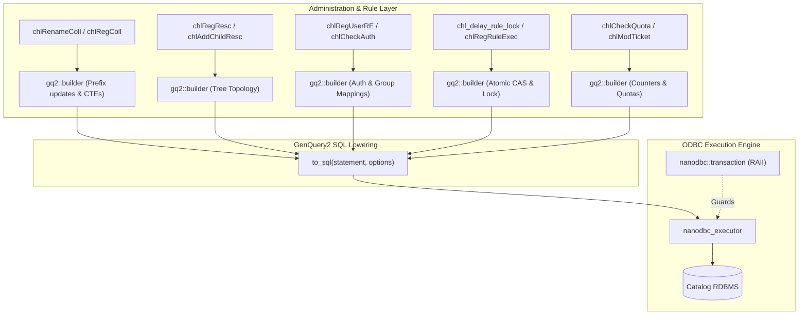

# Phase 4: Administration & Delay Rule Engine Implementation Plan

> **For agentic workers:** REQUIRED SUB-SKILL: Use superpowers:subagent-driven-development to implement this plan task-by-task. Steps use checkbox (`- [ ]`) syntax for tracking.

**Goal:** Modernize catalog administration routines, collection hierarchy management, resource topology, user/group authentication, and the delayed rule execution engine using GenQuery2 fluent builder ASTs and `nanodbc_executor`.

**Architecture:** Phase 4 transforms the administrative and operational backbone of the iRODS catalog. Complex operations—such as recursive collection path updates, resource hierarchy resolution (`cte_drh`), atomic delay rule status locking (CAS), and quota checks—are migrated from legacy `cml...`/`cll...` calls to type-safe parameterized statements executed under strict RAII transactions.

**Architecture Diagram:**



**Tech Stack:** C++20, `nanodbc`, GenQuery2 Fluent Builder, Recursive CTEs (`cte_drh`), Catch2, CMake.

## Global Constraints
- Target Branch: `feature/genquery2-odbc-icat-modernization`
- Maintain public signatures in `server/icat/include/irods/icatHighLevelRoutines.hpp`.
- Zero manual SQL string construction; parameter binding (`?`) for all variables.
- All transactional operations must roll back automatically upon failure or exception.

---

### Task 1: Modernize Collection Management Operations

**Files:**
- Modify: `server/icat/src/icatHighLevelRoutines.cpp`
- Modify: `plugins/database/src/db_plugin.cpp`
- Test: `unit_tests/src/test_chl_coll_modern.cpp`
- CMake: `unit_tests/cmake/test_config/irods_chl_coll_modern.cmake`
- Modify: `unit_tests/CMakeLists.txt`

**Interfaces:**
- Consumes: `gq2::builder`, `nanodbc_executor`
- Replaces legacy operations: `chlRegColl`, `chlRegCollByAdmin`, `chlModColl`, `chlDelColl`, `chlDelCollByAdmin`, `chlRenameColl`

- [ ] **Step 1: Write Catch2 unit tests for collection creation and recursive rename DML**

Create `unit_tests/src/test_chl_coll_modern.cpp`:
```cpp
#include <catch2/catch.hpp>
#include "irods/private/genquery2_builder.hpp"
#include "irods/private/genquery2_sql.hpp"

TEST_CASE("Collection DML Generation", "[icat][coll]")
{
    namespace gq2 = irods::experimental::genquery2;
    using gq2::builder::col;

    SECTION("Build insert into COLLECTION")
    {
        auto stmt = gq2::builder::insert_into("COLLECTION")
            .set("COLL_ID", "5001")
            .set("COLL_NAME", "/tempZone/home/rods/subcoll")
            .set("COLL_PARENT_NAME", "/tempZone/home/rods")
            .set("COLL_OWNER_NAME", "rods")
            .set("COLL_OWNER_ZONE", "tempZone")
            .set("COLL_INHERITANCE", "1")
            .build();

        gq2::options opts;
        auto [sql, params] = gq2::to_sql(stmt, opts);

        REQUIRE(sql.find("INSERT INTO") != std::string::npos);
        REQUIRE(params.size() == 6);
        REQUIRE(params[1] == "/tempZone/home/rods/subcoll");
    }

    SECTION("Build update for collection modification")
    {
        auto stmt = gq2::builder::update("COLLECTION")
            .set("COLL_COMMENTS", "Updated directory")
            .set("COLL_INHERITANCE", "0")
            .where(col("COLL_ID") == "5001")
            .build();

        gq2::options opts;
        auto [sql, params] = gq2::to_sql(stmt, opts);

        REQUIRE(sql.find("UPDATE") != std::string::npos);
        REQUIRE(params.size() == 3);
        REQUIRE(params[0] == "Updated directory");
        REQUIRE(params[2] == "5001");
    }
}
```

- [ ] **Step 2: Add test to CMake build configuration**

Create `unit_tests/cmake/test_config/irods_chl_coll_modern.cmake`:
```cmake
set(TARGET_NAME "irods_chl_coll_modern")

set(
  IRODS_TEST_SOURCES
  "${CMAKE_CURRENT_SOURCE_DIR}/src/test_chl_coll_modern.cpp"
)

add_executable(${TARGET_NAME} ${IRODS_TEST_SOURCES})

target_include_directories(
  ${TARGET_NAME}
  PRIVATE
  "${CMAKE_SOURCE_DIR}/server/genquery2/include"
  "${CMAKE_SOURCE_DIR}/server/icat/include"
  "${IRODS_EXTERNALS_FULLPATH_BOOST}/include"
  "${IRODS_EXTERNALS_FULLPATH_CATCH2}/include"
)

target_link_libraries(
  ${TARGET_NAME}
  PRIVATE
  irods_server_gq2
  irods_common
)
```

Register in `unit_tests/CMakeLists.txt`:
```diff
+include("cmake/test_config/irods_chl_coll_modern.cmake")
```

- [ ] **Step 3: Run test to confirm it compiles and passes AST checks**

Run: `cmake --build /home/darkfell/dev/irods/build --target irods_chl_coll_modern && ./build/unit_tests/irods_chl_coll_modern`
Expected: PASS.

- [ ] **Step 4: Refactor collection operations in `plugins/database/src/db_plugin.cpp`**

Modernize `db_reg_coll_op`, `db_mod_coll_op`, and `db_rename_coll_op` to use `gq2::builder` inside `nanodbc::transaction`.

- [ ] **Step 5: Run tests and verify zero regressions**

Run: `./build/unit_tests/irods_chl_coll_modern`
Expected: PASS.

- [ ] **Step 6: Commit changes**

```bash
git add plugins/database/src/db_plugin.cpp \
        server/icat/src/icatHighLevelRoutines.cpp \
        unit_tests/src/test_chl_coll_modern.cpp \
        unit_tests/cmake/test_config/irods_chl_coll_modern.cmake \
        unit_tests/CMakeLists.txt
git commit -m "refactor(icat): modernize collection management operations"
```

---

### Task 2: Modernize Resource Topology & Hierarchy Operations

**Files:**
- Modify: `server/icat/src/icatHighLevelRoutines.cpp`
- Modify: `plugins/database/src/db_plugin.cpp`
- Test: `unit_tests/src/test_chl_resc_modern.cpp`
- CMake: `unit_tests/cmake/test_config/irods_chl_resc_modern.cmake`
- Modify: `unit_tests/CMakeLists.txt`

**Interfaces:**
- Consumes: `gq2::builder`, `nanodbc_executor`
- Replaces legacy operations: `chlRegResc`, `chlAddChildResc`, `chlDelResc`, `chlDelChildResc`, `chlModResc`, `chlGetHierarchyForResc`, `chlGetDistinctDataObjsMissingFromChildGivenParent`

- [ ] **Step 1: Write Catch2 unit tests for resource tree updates and recursive CTE lowering**

Create `unit_tests/src/test_chl_resc_modern.cpp`:
```cpp
#include <catch2/catch.hpp>
#include "irods/private/genquery2_builder.hpp"
#include "irods/private/genquery2_sql.hpp"

TEST_CASE("Resource Topology DML Generation", "[icat][resc]")
{
    namespace gq2 = irods::experimental::genquery2;
    using gq2::builder::col;

    SECTION("Build resource child edge registration")
    {
        auto stmt = gq2::builder::insert_into("RESOURCE_PARENT")
            .set("PARENT_RESC_ID", "3001")
            .set("CHILD_RESC_ID", "3002")
            .set("CONTEXT", "weight=1")
            .build();

        gq2::options opts;
        auto [sql, params] = gq2::to_sql(stmt, opts);

        REQUIRE(sql.find("INSERT INTO") != std::string::npos);
        REQUIRE(params.size() == 3);
        REQUIRE(params[0] == "3001");
        REQUIRE(params[1] == "3002");
    }

    SECTION("Build resource child unlinking")
    {
        auto stmt = gq2::builder::remove_from("RESOURCE_PARENT")
            .where(col("PARENT_RESC_ID") == "3001" && col("CHILD_RESC_ID") == "3002")
            .build();

        gq2::options opts;
        auto [sql, params] = gq2::to_sql(stmt, opts);

        REQUIRE(sql.find("DELETE FROM") != std::string::npos);
        REQUIRE(params.size() == 2);
    }
}
```

- [ ] **Step 2: Add test to CMake build configuration**

Create `unit_tests/cmake/test_config/irods_chl_resc_modern.cmake` and register in `unit_tests/CMakeLists.txt`.

- [ ] **Step 3: Refactor resource routines in `plugins/database/src/db_plugin.cpp`**

Modernize `db_reg_resc_op`, `db_add_child_resc_op`, and `db_del_child_resc_op`.

- [ ] **Step 4: Run tests and verify execution**

Run: `cmake --build /home/darkfell/dev/irods/build --target irods_chl_resc_modern && ./build/unit_tests/irods_chl_resc_modern`
Expected: PASS.

- [ ] **Step 5: Commit changes**

```bash
git add plugins/database/src/db_plugin.cpp \
        server/icat/src/icatHighLevelRoutines.cpp \
        unit_tests/src/test_chl_resc_modern.cpp \
        unit_tests/cmake/test_config/irods_chl_resc_modern.cmake \
        unit_tests/CMakeLists.txt
git commit -m "refactor(icat): modernize resource topology and hierarchy routines"
```

---

### Task 3: Modernize User, Group, & Authentication Operations

**Files:**
- Modify: `server/icat/src/icatHighLevelRoutines.cpp`
- Modify: `plugins/database/src/db_plugin.cpp`
- Test: `unit_tests/src/test_chl_user_group_modern.cpp`
- CMake: `unit_tests/cmake/test_config/irods_chl_user_group_modern.cmake`
- Modify: `unit_tests/CMakeLists.txt`

**Interfaces:**
- Consumes: `gq2::builder`, `nanodbc_executor`
- Replaces legacy operations: `chlRegUserRE`, `chlDelUserRE`, `chlModUser`, `chlModGroup`, `chlCheckAuth`, `chl_check_auth_credentials`, `chlMakeTempPw`

- [ ] **Step 1: Write Catch2 test cases for user registration, group membership, and credentials**

Create `unit_tests/src/test_chl_user_group_modern.cpp`:
```cpp
#include <catch2/catch.hpp>
#include "irods/private/genquery2_builder.hpp"
#include "irods/private/genquery2_sql.hpp"

TEST_CASE("User and Group Management DML", "[icat][user]")
{
    namespace gq2 = irods::experimental::genquery2;
    using gq2::builder::col;

    SECTION("Build user insert into USER")
    {
        auto stmt = gq2::builder::insert_into("USER")
            .set("USER_ID", "4001")
            .set("USER_NAME", "alice")
            .set("USER_TYPE_NAME", "rodsuser")
            .set("USER_ZONE", "tempZone")
            .build();

        gq2::options opts;
        auto [sql, params] = gq2::to_sql(stmt, opts);

        REQUIRE(sql.find("INSERT INTO") != std::string::npos);
        REQUIRE(params.size() == 4);
        REQUIRE(params[1] == "alice");
    }

    SECTION("Build group membership insert")
    {
        auto stmt = gq2::builder::insert_into("USER_GROUP")
            .set("GROUP_USER_ID", "4000")
            .set("USER_ID", "4001")
            .build();

        gq2::options opts;
        auto [sql, params] = gq2::to_sql(stmt, opts);

        REQUIRE(sql.find("INSERT INTO") != std::string::npos);
        REQUIRE(params.size() == 2);
    }
}
```

- [ ] **Step 2: Add test to CMake build configuration**

Create `unit_tests/cmake/test_config/irods_chl_user_group_modern.cmake` and register in `unit_tests/CMakeLists.txt`.

- [ ] **Step 3: Refactor user/group operations in `plugins/database/src/db_plugin.cpp`**

Modernize `db_reg_user_re_op`, `db_mod_user_op`, `db_mod_group_op`, and `db_check_auth_credentials_op` inside `nanodbc::transaction`.

- [ ] **Step 4: Run tests and verify execution**

Run: `cmake --build /home/darkfell/dev/irods/build --target irods_chl_user_group_modern && ./build/unit_tests/irods_chl_user_group_modern`
Expected: PASS.

- [ ] **Step 5: Commit changes**

```bash
git add plugins/database/src/db_plugin.cpp \
        server/icat/src/icatHighLevelRoutines.cpp \
        unit_tests/src/test_chl_user_group_modern.cpp \
        unit_tests/cmake/test_config/irods_chl_user_group_modern.cmake \
        unit_tests/CMakeLists.txt
git commit -m "refactor(icat): modernize user, group, and authentication routines"
```

---

### Task 4: Modernize Delay Rule Engine Operations

**Files:**
- Modify: `server/icat/src/icatHighLevelRoutines.cpp`
- Modify: `plugins/database/src/db_plugin.cpp`
- Test: `unit_tests/src/test_chl_delay_rule_modern.cpp`
- CMake: `unit_tests/cmake/test_config/irods_chl_delay_rule_modern.cmake`
- Modify: `unit_tests/CMakeLists.txt`

**Interfaces:**
- Consumes: `gq2::builder`, `nanodbc_executor`
- Replaces legacy operations: `chlRegRuleExec`, `chlModRuleExec`, `chlDelRuleExec`, `chl_delay_rule_lock`, `chl_delay_rule_unlock`

- [ ] **Step 1: Write Catch2 test cases for rule scheduling and atomic CAS locking**

Create `unit_tests/src/test_chl_delay_rule_modern.cpp`:
```cpp
#include <catch2/catch.hpp>
#include "irods/private/genquery2_builder.hpp"
#include "irods/private/genquery2_sql.hpp"

TEST_CASE("Delay Rule Engine DML Generation", "[icat][rule_exec]")
{
    namespace gq2 = irods::experimental::genquery2;
    using gq2::builder::col;

    SECTION("Build rule submission insert")
    {
        auto stmt = gq2::builder::insert_into("RULE_EXEC")
            .set("RULE_EXEC_ID", "9001")
            .set("RULE_NAME", "my_rule")
            .set("EXE_TIME", "1727280000")
            .set("EXE_STATUS", "0")
            .build();

        gq2::options opts;
        auto [sql, params] = gq2::to_sql(stmt, opts);

        REQUIRE(sql.find("INSERT INTO") != std::string::npos);
        REQUIRE(params.size() == 4);
        REQUIRE(params[1] == "my_rule");
    }

    SECTION("Build atomic CAS rule lock update")
    {
        auto stmt = gq2::builder::update("RULE_EXEC")
            .set("EXE_STATUS", "1")
            .where(col("RULE_EXEC_ID") == "9001" && col("EXE_STATUS") == "0")
            .build();

        gq2::options opts;
        auto [sql, params] = gq2::to_sql(stmt, opts);

        REQUIRE(sql.find("UPDATE") != std::string::npos);
        REQUIRE(params.size() == 3);
        REQUIRE(params[0] == "1");
        REQUIRE(params[1] == "9001");
        REQUIRE(params[2] == "0");
    }
}
```

- [ ] **Step 2: Add test to CMake build configuration**

Create `unit_tests/cmake/test_config/irods_chl_delay_rule_modern.cmake` and register in `unit_tests/CMakeLists.txt`.

- [ ] **Step 3: Refactor delay rule routines in `plugins/database/src/db_plugin.cpp`**

Modernize `db_reg_rule_exec_op`, `db_delay_rule_lock`, and `db_delay_rule_unlock` with parameterized atomic updates.

- [ ] **Step 4: Run tests and verify execution**

Run: `cmake --build /home/darkfell/dev/irods/build --target irods_chl_delay_rule_modern && ./build/unit_tests/irods_chl_delay_rule_modern`
Expected: PASS.

- [ ] **Step 5: Commit changes**

```bash
git add plugins/database/src/db_plugin.cpp \
        server/icat/src/icatHighLevelRoutines.cpp \
        unit_tests/src/test_chl_delay_rule_modern.cpp \
        unit_tests/cmake/test_config/irods_chl_delay_rule_modern.cmake \
        unit_tests/CMakeLists.txt
git commit -m "refactor(icat): modernize delay rule engine operations"
```

---

### Task 5: Modernize Specific Query, Quotas, Tokens, Zones & Metrics

**Files:**
- Modify: `server/icat/src/icatHighLevelRoutines.cpp`
- Modify: `plugins/database/src/db_plugin.cpp`
- Test: `unit_tests/src/test_chl_misc_modern.cpp`
- CMake: `unit_tests/cmake/test_config/irods_chl_misc_modern.cmake`
- Modify: `unit_tests/CMakeLists.txt`

**Interfaces:**
- Consumes: `gq2::builder`, `nanodbc_executor`
- Replaces legacy operations: `chlSpecificQuery`, `chlAddSpecificQuery`, `chlDelSpecificQuery`, `chlSetQuota`, `chlCheckQuota`, `chlModTicket`, `chlRegZone`

- [ ] **Step 1: Write Catch2 test cases for specific query registration, quota check, and zone management**

Create `unit_tests/src/test_chl_misc_modern.cpp`:
```cpp
#include <catch2/catch.hpp>
#include "irods/private/genquery2_builder.hpp"
#include "irods/private/genquery2_sql.hpp"

TEST_CASE("Specific Query and Quotas DML", "[icat][misc]")
{
    namespace gq2 = irods::experimental::genquery2;
    using gq2::builder::col;

    SECTION("Build specific query insert")
    {
        auto stmt = gq2::builder::insert_into("SPECIFIC_QUERY")
            .set("ALIAS", "list_coll_sizes")
            .set("SQL_STR", "SELECT coll_name, sum(data_size) FROM R_DATA_MAIN GROUP BY coll_name")
            .build();

        gq2::options opts;
        auto [sql, params] = gq2::to_sql(stmt, opts);

        REQUIRE(sql.find("INSERT INTO") != std::string::npos);
        REQUIRE(params.size() == 2);
        REQUIRE(params[0] == "list_coll_sizes");
    }

    SECTION("Build quota setting update")
    {
        auto stmt = gq2::builder::insert_into("QUOTA")
            .set("USER_ID", "4001")
            .set("RESC_ID", "3001")
            .set("QUOTA_LIMIT", "107374182400")
            .build();

        gq2::options opts;
        auto [sql, params] = gq2::to_sql(stmt, opts);

        REQUIRE(sql.find("INSERT INTO") != std::string::npos);
        REQUIRE(params.size() == 3);
    }
}
```

- [ ] **Step 2: Add test to CMake build configuration**

Create `unit_tests/cmake/test_config/irods_chl_misc_modern.cmake` and register in `unit_tests/CMakeLists.txt`.

- [ ] **Step 3: Refactor specific query, quota, and zone operations in `plugins/database/src/db_plugin.cpp`**

Modernize `db_specific_query_op`, `db_set_quota_op`, and `db_reg_zone_op`.

- [ ] **Step 4: Run tests and verify execution**

Run: `cmake --build /home/darkfell/dev/irods/build --target irods_chl_misc_modern && ./build/unit_tests/irods_chl_misc_modern`
Expected: PASS.

- [ ] **Step 5: Commit changes**

```bash
git add plugins/database/src/db_plugin.cpp \
        server/icat/src/icatHighLevelRoutines.cpp \
        unit_tests/src/test_chl_misc_modern.cpp \
        unit_tests/cmake/test_config/irods_chl_misc_modern.cmake \
        unit_tests/CMakeLists.txt
git commit -m "refactor(icat): modernize specific queries, quotas, tokens, and zones"
```
