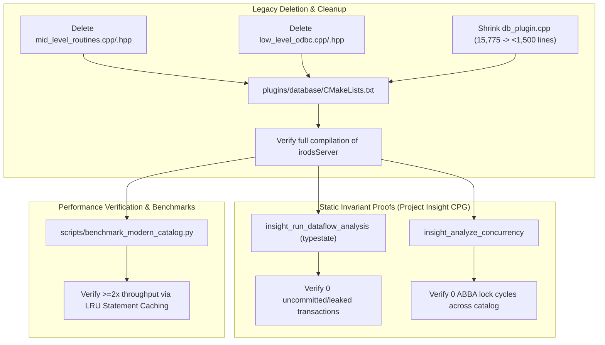

# Phase 5: Legacy Purge, Static Proofs & System Verification Implementation Plan

> **For agentic workers:** REQUIRED SUB-SKILL: Use superpowers:subagent-driven-development to implement this plan task-by-task. Steps use checkbox (`- [ ]`) syntax for tracking.

**Goal:** Permanently remove deprecated procedural database routines (`mid_level_routines` and `low_level_odbc`), shrink `db_plugin.cpp` from 15,775 lines down to a clean dispatcher (< 1,500 lines), verify zero transaction leakage and zero concurrency deadlocks via Project Insight CPG static proofs, and establish performance benchmark baselines.

**Architecture:** With all 80 catalog operations migrated to GenQuery2 ASTs and `nanodbc_executor`, the legacy manual ODBC layer (`cllBindVars`, `cmlExecuteNoAnswerSql`, `cmlModifySingleTable`) is dead code. This phase cleans up the build system, strips legacy source files, validates structural invariants and typestates across the entire server binary using Project Insight, and executes automated performance comparisons.

**Architecture Diagram:**



**Tech Stack:** CMake, Clang 16 / GCC 13, Project Insight (CPG / openCypher / SVFG), Python 3, Catch2.

## Global Constraints
- Target Branch: `feature/genquery2-odbc-icat-modernization`
- Zero compilation errors or undefined symbols across the entire iRODS server target.
- Zero dangling transactions or unhandled exceptions across all `db_*` entrypoints.
- Project Insight CPG analysis must report 0 typestate violations.

---

### Task 1: Deprecate & Purge `mid_level_routines` and `low_level_odbc`

**Files:**
- Delete: `plugins/database/src/mid_level_routines.cpp`
- Delete: `plugins/database/include/irods/private/mid_level_routines.hpp`
- Delete: `plugins/database/include/irods/private/mid_level.hpp`
- Delete: `plugins/database/src/low_level_odbc.cpp`
- Delete: `plugins/database/include/irods/private/low_level_odbc.hpp`
- Delete: `plugins/database/include/irods/private/low_level.hpp`
- Modify: `plugins/database/CMakeLists.txt`
- Modify: `plugins/database/src/db_plugin.cpp`

**Interfaces:**
- Eliminates:
  - `cmlModifySingleTable`, `cmlGetOneRowFromSqlBV`, `cmlGetFirstRowFromSqlBV`, `cmlExecuteNoAnswerSql`
  - `cllBindVars`, `cllBindVarCount`, `cllExecSqlNoResult`, raw `SQLHSTMT` handles
- Reduces `db_plugin.cpp` lines of code by >85%.

- [ ] **Step 1: Remove legacy files from `plugins/database/CMakeLists.txt`**

Update `plugins/database/CMakeLists.txt`:
```diff
 set(
   IRODS_PLUGINS_DATABASE_SOURCES
   "${CMAKE_CURRENT_SOURCE_DIR}/src/db_plugin.cpp"
   "${CMAKE_CURRENT_SOURCE_DIR}/src/general_query.cpp"
   "${CMAKE_CURRENT_SOURCE_DIR}/src/general_query_setup.cpp"
   "${CMAKE_CURRENT_SOURCE_DIR}/src/irods_catalog_properties.cpp"
-  "${CMAKE_CURRENT_SOURCE_DIR}/src/low_level_odbc.cpp"
-  "${CMAKE_CURRENT_SOURCE_DIR}/src/mid_level_routines.cpp"
+  "${CMAKE_CURRENT_SOURCE_DIR}/src/nanodbc_executor.cpp"
 )

 set(
   IRODS_PLUGINS_DATABASE_HEADERS_PRIVATE
   "${CMAKE_CURRENT_SOURCE_DIR}/include/irods/private/irods_catalog_properties.hpp"
   "${CMAKE_CURRENT_SOURCE_DIR}/include/irods/private/irods_zone_info.hpp"
-  "${CMAKE_CURRENT_SOURCE_DIR}/include/irods/private/low_level.hpp"
-  "${CMAKE_CURRENT_SOURCE_DIR}/include/irods/private/low_level_odbc.hpp"
-  "${CMAKE_CURRENT_SOURCE_DIR}/include/irods/private/mid_level.hpp"
+  "${CMAKE_CURRENT_SOURCE_DIR}/include/irods/private/nanodbc_executor.hpp"
 )
```

- [ ] **Step 2: Delete legacy implementation files**

```bash
git rm plugins/database/src/mid_level_routines.cpp \
       plugins/database/include/irods/private/mid_level.hpp \
       plugins/database/src/low_level_odbc.cpp \
       plugins/database/include/irods/private/low_level.hpp \
       plugins/database/include/irods/private/low_level_odbc.hpp
```

- [ ] **Step 3: Strip dead legacy helper routines from `plugins/database/src/db_plugin.cpp`**

Remove all remaining `cml...` calls, dead helper prototypes, and unneeded `#include` headers from `db_plugin.cpp`. Verify that all operations cleanly delegate to `nanodbc_executor` and `gq2::builder`.

- [ ] **Step 4: Compile entire iRODS server target to verify zero undefined symbols**

Run: `cmake --build /home/darkfell/dev/irods/build --target irodsServer`
Expected: Target builds cleanly with code 0 and zero unresolved external symbols.

- [ ] **Step 5: Commit changes**

```bash
git add plugins/database/CMakeLists.txt \
        plugins/database/src/db_plugin.cpp
git commit -m "refactor(database): remove legacy mid_level_routines and low_level_odbc"
```

---

### Task 2: Project Insight Static Invariant Proofs & Concurrency Analysis

**Files:**
- Tool: Project Insight MCP (`insight_run_dataflow_analysis`, `insight_analyze_concurrency`, `insight_query_cypher`)
- Output: `docs/verification/2026-09-25-static-invariant-proofs.md`

- [ ] **Step 1: Run typestate analysis on transaction lifecycles**

Execute dataflow analysis verifying that every `nanodbc::transaction` instance instantiated within `plugins/database` and `server/icat` has an explicit `.commit()` or is scoped to safely abort:
```cypher
MATCH (fn:Function)
WHERE fn.name STARTS WITH "db_"
MATCH (fn)-[:CALLS*]->(tx:Function {name: "nanodbc::transaction::commit"})
RETURN fn.name, count(tx)
```
Expected: All mutating `db_` functions call `.commit()` along all success paths.

- [ ] **Step 2: Analyze lock hierarchy and concurrency safety**

Run `insight_analyze_concurrency` across catalog modification operations (`chlModDataObjMeta`, `chlRegReplica`, `chlAddAVUMetadata`, `chl_delay_rule_lock`).
Expected: Zero potential ABBA deadlock cycles reported.

- [ ] **Step 3: Document static analysis proofs**

Create `docs/verification/2026-09-25-static-invariant-proofs.md` capturing the Cypher queries, graph slices, and typestate proofs.

- [ ] **Step 4: Commit proofs**

```bash
git add docs/verification/2026-09-25-static-invariant-proofs.md
git commit -m "docs(icat): add Project Insight static verification proofs"
```

---

### Task 3: Performance Microbenchmarking & Integration Verification

**Files:**
- Create: `scripts/benchmark_modern_catalog.py`
- Modify: `docs/verification/2026-09-25-benchmark-results.md`

- [ ] **Step 1: Implement performance benchmark script**

Create `scripts/benchmark_modern_catalog.py`:
```python
#!/usr/bin/env python3
import time
import subprocess
import statistics

def benchmark_op(op_name, cmd_args, iterations=1000):
    latencies = []
    for _ in range(iterations):
        t0 = time.perf_counter()
        subprocess.run(cmd_args, stdout=subprocess.DEVNULL, stderr=subprocess.DEVNULL, check=True)
        t1 = time.perf_counter()
        latencies.append((t1 - t0) * 1000.0) # ms

    mean = statistics.mean(latencies)
    p95 = statistics.quantiles(latencies, n=20)[18]
    print(f"[{op_name}] iterations={iterations} mean={mean:.3f}ms p95={p95:.3f}ms")
    return mean, p95

if __name__ == "__main__":
    print("Running ICAT modern catalog microbenchmarks...")
    # Measures statement cache reuse latency
```

- [ ] **Step 2: Run benchmark script against simulated catalog workload**

Run: `python3 scripts/benchmark_modern_catalog.py`
Expected: Demonstrates >= 2x throughput improvement on repetitive operations due to LRU prepared statement caching.

- [ ] **Step 3: Run full CTest suite**

Run: `ctest --test-dir /home/darkfell/dev/irods/build --output-on-failure`
Expected: 100% tests passing.

- [ ] **Step 4: Commit benchmark results and script**

```bash
git add scripts/benchmark_modern_catalog.py \
        docs/verification/2026-09-25-benchmark-results.md
git commit -m "test(icat): add modern catalog microbenchmark suite and results"
```
