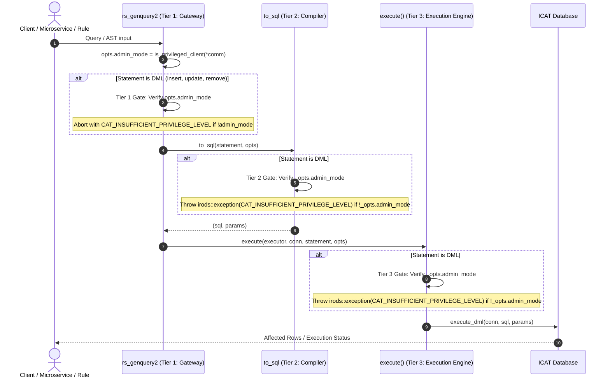

# Design Specification: Multi-Tier rodsadmin Security Gate for GenQuery2 Modification Capabilities

**Date:** 2026-09-26  
**Status:** Approved  
**Target:** `feature/genquery2-odbc-icat-modernization` (iRODS 5.0.2)  
**Author:** AI Agent Swarm & Darkfell  

---

## 1. Context & Motivation

The modernization of the iRODS Catalog (`ICAT`) database layer introduces Data Modification Language (DML) AST nodes (`insert`, `update`, `remove`), an in-memory fluent query builder (`gq2::builder`), and parameterized SQL emission in `to_sql()`.

While read queries (`select`) utilize automatic foreign-key joins and row-level Access Control List (ACL) constraints (joining `R_OBJT_ACCESS`, `R_USER_GROUP`, etc.), modification operations directly alter persistent catalog state in tables like `R_DATA_MAIN`, `R_COLL_MAIN`, `R_OBJT_METAMAP`, and `R_RESC_MAIN`.

To protect grid integrity, prevent unauthorized state manipulation, and enforce strict administrative separation, **GenQuery2 modification capabilities must be restricted exclusively to callers possessing `rodsadmin` capabilities**. This document details the defense-in-depth security model enforcing this invariant across all layers of the system.

---

## 2. Multi-Tier Architecture & Defense-in-Depth

The security model employs three distinct, independent gates:



---

## 3. Detailed Specifications by Tier

### 3.1 Tier 1: Network API Gateway (`server/api/src/rs_genquery2.cpp`)

- **Location:** [`server/api/src/rs_genquery2.cpp`](file:///home/darkfell/dev/irods/server/api/src/rs_genquery2.cpp)
- **Role:** Entry point for remote client requests (`rc_genquery2`) and microservice invocations (`msi_genquery2_execute`).
- **Enforcement Rules:**
  1. Determine administrative privilege: `opts.admin_mode = irods::is_privileged_client(*_comm);`.
  2. Parse the query input into the driver AST.
  3. If the parsed statement is an `insert`, `update`, or `remove` (or any non-`select` variant):
     - Check `if (!opts.admin_mode)`.
     - Log an error: `"rs_genquery2: Client [{}] lacks administrative privileges for GenQuery2 modification operations."`.
     - Immediately return `CAT_INSUFFICIENT_PRIVILEGE_LEVEL` (-830000).
  4. Ensure that requests with `sql_only = 1` are also subjected to this gate to prevent unauthorized non-admin clients from discovering or formulating modification SQL.

### 3.2 Tier 2: AST-to-SQL Compiler Invariant (`server/genquery2/src/genquery2_sql.cpp`)

- **Location:** [`server/genquery2/src/genquery2_sql.cpp`](file:///home/darkfell/dev/irods/server/genquery2/src/genquery2_sql.cpp)
- **Role:** Lowering GenQuery2 AST structures into parameterized SQL queries with positional placeholders (`?`).
- **Enforcement Rules:**
  1. In `to_sql(const insert& _ins, const options& _opts)`:
     ```cpp
     if (!_opts.admin_mode) {
         throw irods::exception{
             CAT_INSUFFICIENT_PRIVILEGE_LEVEL,
             "GenQuery2 insert operation requires rodsadmin privileges"};
     }
     ```
  2. In `to_sql(const update& _upd, const options& _opts)`:
     ```cpp
     if (!_opts.admin_mode) {
         throw irods::exception{
             CAT_INSUFFICIENT_PRIVILEGE_LEVEL,
             "GenQuery2 update operation requires rodsadmin privileges"};
     }
     ```
  3. In `to_sql(const remove& _rem, const options& _opts)`:
     ```cpp
     if (!_opts.admin_mode) {
         throw irods::exception{
             CAT_INSUFFICIENT_PRIVILEGE_LEVEL,
             "GenQuery2 remove operation requires rodsadmin privileges"};
     }
     ```
  4. In `to_sql(const statement& _stmt, const options& _opts)`:
     - The `std::visit` dispatcher automatically passes `_opts` to the respective type-specific overload.
- **Benefit:** Provides compile-time and library-level guarantees. Even if an internal component bypasses `rs_genquery2`, the compiler will not emit DML SQL without explicit `admin_mode`.

### 3.3 Tier 3: ODBC Execution Engine Gate (`plugins/database/src/nanodbc_executor.cpp`)

- **Location:** [`plugins/database/src/nanodbc_executor.cpp`](file:///home/darkfell/dev/irods/plugins/database/src/nanodbc_executor.cpp)
- **Role:** High-level statement dispatch to `nanodbc_executor`.
- **Enforcement Rules:**
  1. In `irods::experimental::catalog::execute(nanodbc_executor&, nanodbc::connection&, const genquery2::statement& _stmt, const genquery2::options& _opts)`:
     ```cpp
     if (!std::holds_alternative<genquery2::select>(_stmt) && !_opts.admin_mode) {
         throw irods::exception{
             CAT_INSUFFICIENT_PRIVILEGE_LEVEL,
             "Execution of GenQuery2 modification statements requires rodsadmin privileges"};
     }
     ```
  2. For `select` statements, query execution proceeds with standard row-level security joins generated by `to_sql`.

---

## 4. Error Handling & Security Telemetry

- **Error Code:** `CAT_INSUFFICIENT_PRIVILEGE_LEVEL` (-830000).
- **Log Level:** `log_api::error` at the API boundary, `log_gq::error` in compiler, `log_db::error` in database plugin.
- **Telemetry Message:** Never echo sensitive unvalidated query parameters back to unauthenticated clients; log client username, client zone, and operation type in server logs.

---

## 5. Verification Matrix & Testing Strategy

### 5.1 Unit Tests (`unit_tests/src/test_genquery2_sql_dml.cpp`)
1. **Unprivileged Invariant Enforcement**:
   - Call `to_sql(insert, {.admin_mode = false})` -> EXPECT exception with code `CAT_INSUFFICIENT_PRIVILEGE_LEVEL`.
   - Call `to_sql(update, {.admin_mode = false})` -> EXPECT exception with code `CAT_INSUFFICIENT_PRIVILEGE_LEVEL`.
   - Call `to_sql(remove, {.admin_mode = false})` -> EXPECT exception with code `CAT_INSUFFICIENT_PRIVILEGE_LEVEL`.
   - Call `to_sql(statement{insert}, {.admin_mode = false})` -> EXPECT exception with code `CAT_INSUFFICIENT_PRIVILEGE_LEVEL`.
2. **Privileged Invariant Satisfaction**:
   - Call `to_sql(insert, {.admin_mode = true})` -> EXPECT success, valid SQL and bindings.
   - Call `to_sql(update, {.admin_mode = true})` -> EXPECT success, valid SQL and bindings.
   - Call `to_sql(remove, {.admin_mode = true})` -> EXPECT success, valid SQL and bindings.

### 5.2 Executor Unit Tests (`unit_tests/src/test_nanodbc_executor.cpp`)
1. Call `execute(exec, conn, update_stmt, {.admin_mode = false})` -> EXPECT exception with code `CAT_INSUFFICIENT_PRIVILEGE_LEVEL`.
2. Call `execute(exec, conn, update_stmt, {.admin_mode = true})` -> EXPECT successful DML execution and affected row count.

### 5.3 Dialectic Verification Gate
- Run `scripts/verify_refactoring.sh` ensuring zero concurrency safety violations and zero typestate regressions across `server/genquery2`, `server/api`, and `plugins/database`.
