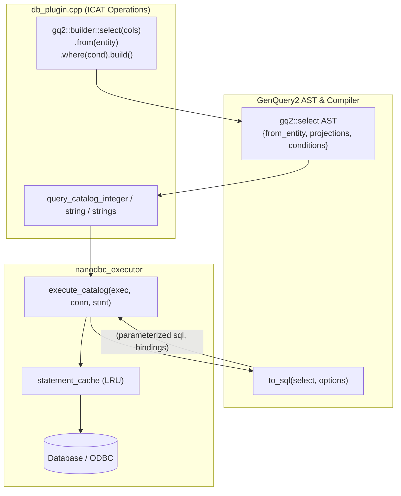

# Design Specification: GenQuery2 SELECT Fluent Builder & Database Plugin Query Modernization

**Date:** 2026-09-26  
**Status:** In Review  
**Target:** `feature/genquery2-odbc-icat-modernization` (iRODS 5.0.2)  
**Author:** AI Pair Programming Assistant & Darkfell  

---

## 1. Context & Motivation

The modernization of the iRODS Catalog (`ICAT`) database plugin has successfully eliminated ~96 raw SQL DML (`execute_dml`) calls, replacing them with typed GenQuery2 AST builders (`gq2::builder::insert_into`, `update`, `remove_from`) and `execute_catalog()`.

However, the catalog plugin still contains **126 raw SQL `SELECT` call sites**:
- **77 `query_integer` calls** (e.g., retrieving `coll_id`, `data_id`, `user_id`, `resc_id`, `zone_id`, `token_id`, `ticket_id`, or `count(data_id)`)
- **30 `query_string` calls** (e.g., resolving `zone_name`, `user_name`, `option_value`, `create_ts`)
- **19 `execute_query` calls** (multi-row cursor iterations over ACLs, replicas, tokens, etc.)

In Section 5.2 of the [Architectural Specification](file:///home/darkfell/dev/irods/docs/architectural_spec_genquery2_odbc_modernization.md#L292-L312), the fluent query builder design specifies:
```cpp
auto stmt = gq2::builder::select("DATA_ID", "DATA_REPL_STATUS", "DATA_PATH")
    .from("DATA_OBJECT")
    .where(col("COLL_NAME") == coll_name && col("DATA_NAME") == data_name)
    .build();
```

Currently, `gq2::select` lacks an explicit `from_entity` field, and `to_sql()` relies on implicit multi-table join graph inference from a predefined `column_name_mappings` table. This design extends `gq2::select` and `gq2::builder::select_builder` with explicit entity targeting and aggregate projections, provides typed catalog query helpers in `nanodbc_executor`, and systematically purges all raw SQL `SELECT` string queries in [`plugins/database/src/db_plugin.cpp`](file:///home/darkfell/dev/irods/plugins/database/src/db_plugin.cpp).

---

## 2. Architecture & Component Design



---

## 3. Detailed Specifications

### 3.1 AST Extension (`server/genquery2/include/irods/private/genquery2_ast_types.hpp`)

Extend `struct select` with `from_entity`:
```cpp
struct select
{
    select() = default;

    select(projections projections, conditions conditions)
        : projections(std::move(projections))
        , conditions(std::move(conditions))
    {
    }

    std::string from_entity; // Explicit target entity (e.g. "DATA_OBJECT", "COLLECTION", "USER", etc.)
    projections projections;
    conditions conditions;
    group_by group_by;
    order_by order_by;
    range range;
    bool distinct = false;
}; // struct select
```

### 3.2 Fluent Builder Extension (`server/genquery2/include/irods/private/genquery2_builder.hpp`)

Extend `select_builder` with `.from(entity)` and projection aggregates:
```cpp
class select_builder
{
public:
    select_builder() = default;

    explicit select_builder(std::vector<std::string> _cols)
    {
        for (auto&& c : _cols) {
            sel_.projections.push_back(column{std::move(c)});
        }
    }

    explicit select_builder(std::vector<projection> _projections)
    {
        sel_.projections = std::move(_projections);
    }

    auto from(std::string_view _entity) -> select_builder&
    {
        sel_.from_entity = std::string{_entity};
        return *this;
    }

    auto distinct(bool _d = true) -> select_builder&
    {
        sel_.distinct = _d;
        return *this;
    }

    auto where(condition_builder _cond) -> select_builder&
    {
        sel_.conditions = std::move(_cond).to_conditions();
        return *this;
    }

    auto order_by(std::vector<std::string> _cols, bool _asc = true) -> select_builder&;
    auto limit(std::string _number_of_rows, std::string _offset = "0") -> select_builder&;

    auto build() const & -> select { return sel_; }
    auto build() && -> select { return std::move(sel_); }

private:
    select sel_;
};
```

Add builder helpers for projections:
```cpp
inline auto count(std::string _col) -> function
{
    return function{"count", {column{std::move(_col)}}};
}

inline auto max(std::string _col) -> function
{
    return function{"max", {column{std::move(_col)}}};
}

inline auto min(std::string _col) -> function
{
    return function{"min", {column{std::move(_col)}}};
}
```

### 3.3 Compiler Lowering (`server/genquery2/src/genquery2_sql.cpp`)

In `to_sql(const select& _select, const options& _opts)`:
1. **Explicit Target Entity Path (`!_select.from_entity.empty()`):**
   - Resolve table name: `const auto table = resolve_table_name(_select.from_entity);`
   - Projection columns are lowered directly using `resolve_column_name()` or column string name, without requiring graph join resolution.
   - Conditions are lowered with parameter placeholders `?` pushed into `state.values`.
   - Distinct, Order By, Limit/Offset are appended.
   - Emits: `SELECT [DISTINCT] col1, col2 FROM table [WHERE cond1 = ? AND cond2 = ?] [ORDER BY ...] [LIMIT ... OFFSET ...]`.
2. **Implicit Multi-Table Path (`_select.from_entity.empty()`):**
   - Preserves existing multi-table graph join algorithm and permission enforcement logic.

### 3.4 Execution Engine Helpers (`plugins/database/include/irods/private/nanodbc_executor.hpp`)

Provide typed execution helpers on `nanodbc_executor`:
```cpp
inline auto query_catalog_integer(
    nanodbc_executor& _exec,
    nanodbc::connection& _conn,
    const genquery2::statement& _stmt) -> std::optional<int64_t>
{
    auto res = execute_catalog(_exec, _conn, _stmt);
    if (res.query_result && res.query_result->next()) {
        if (res.query_result->is_null(0)) {
            return std::nullopt;
        }
        return res.query_result->get<int64_t>(0);
    }
    return std::nullopt;
}

inline auto query_catalog_string(
    nanodbc_executor& _exec,
    nanodbc::connection& _conn,
    const genquery2::statement& _stmt) -> std::optional<std::string>
{
    auto res = execute_catalog(_exec, _conn, _stmt);
    if (res.query_result && res.query_result->next()) {
        if (res.query_result->is_null(0)) {
            return std::nullopt;
        }
        return res.query_result->get<std::string>(0);
    }
    return std::nullopt;
}

inline auto query_catalog_strings(
    nanodbc_executor& _exec,
    nanodbc::connection& _conn,
    const genquery2::statement& _stmt) -> std::vector<std::string>
{
    auto res = execute_catalog(_exec, _conn, _stmt);
    std::vector<std::string> results;
    if (res.query_result) {
        while (res.query_result->next()) {
            results.push_back(res.query_result->is_null(0) ? "" : res.query_result->get<std::string>(0));
        }
    }
    return results;
}
```

---

## 4. Migration Plan for `plugins/database/src/db_plugin.cpp`

The 126 `SELECT` call sites are grouped into 5 batches:

1. **Batch 1: Zones, Users & Credentials** (~25 call sites):
   - `R_ZONE_MAIN`: lookup local zone, lookup zone_id by name, lookup zone_type by name.
   - `R_USER_MAIN`: lookup user_id by name/zone, lookup user_type by name/zone.
   - `R_USER_AUTH`, `R_USER_PASSWORD`: lookup DN auth, lookup rcat_password.
2. **Batch 2: Collections & Data Objects** (~40 call sites):
   - `R_COLL_MAIN`: lookup coll_id by name, coll_id by parent/name, coll existence checks.
   - `R_DATA_MAIN`: lookup data_id by coll_id and name, max repl_num, count(data_id).
3. **Batch 3: Resources & Tokens** (~25 call sites):
   - `R_RESC_MAIN`: lookup resc_id by name, parent resc_id, child resc_ids.
   - `R_TOKN_MAIN`: lookup token_id by namespace/name.
4. **Batch 4: Access Control & Metadata** (~20 call sites):
   - `R_OBJT_ACCESS`: query user_id and access_type_id by object_id.
   - `R_META_MAIN`: lookup meta_id by name/value/unit.
5. **Batch 5: Tickets, Rules, Microservices & Grid Configuration** (~16 call sites):
   - `R_TICKET_MAIN`: lookup ticket_id by string or ID.
   - `R_RULE_*`, `R_MICROSRVC_*`: lookup rule_id, dvm_id, fnm_id, msrvc_id.
   - `R_GRID_CONFIGURATION`: lookup option_value by namespace and option_name.
   - `R_SPECIFIC_QUERY`: lookup create_ts, sqlStr by alias.

---

## 5. Verification Strategy

1. **Unit Tests**:
   - `unit_tests/src/test_genquery2_builder.cpp`: test `.from(entity)`, aggregate projections (`count`, `max`), and AST construction.
   - `unit_tests/src/test_genquery2_sql_dml.cpp` / new test cases: test `to_sql()` lowering of single-entity `select` statements with `.from()`.
   - `unit_tests/src/test_nanodbc_executor.cpp`: test `query_catalog_integer` and `query_catalog_string` execution.
2. **Database Plugin Build**:
   - Compile `irods_database_plugin-postgres` (`libirods_database_plugin.so`) with zero warnings/errors.
3. **Regression Suite**:
   - Execute all 9 test suites (`irods_nanodbc_executor`, `irods_genquery2_sql_dml`, `irods_chl_*`) with 100% pass rate.
4. **Tree Safety Constraint**:
   - Ensure all changes remain unstaged in the working tree until user explicitly requests commit.
